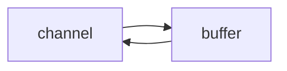
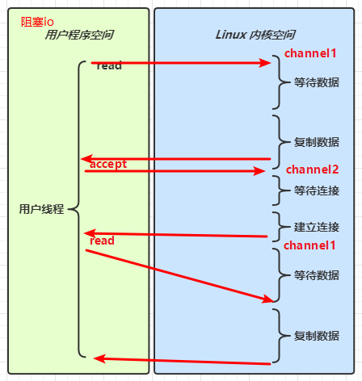

# 一. NIO 基础

non-blocking io 非阻塞 IO

## 1. 三大组件

### 1.1 Channel & Buffer

channel 有一点类似于 stream，它就是读写数据的**双向通道**，可以从 channel 将数据读入 buffer（内存中的），也可以将 buffer 的数据写入 channel，而之前的 stream 要么是输入，要么是输出，channel 比 stream 更为底层



常见的 Channel 有

* FileChannel
* DatagramChannel
* SocketChannel
* ServerSocketChannel


buffer 则用来缓冲读写数据，常见的 buffer 有

* ByteBuffer
  * MappedByteBuffer
  * DirectByteBuffer
  * HeapByteBuffer
* ShortBuffer
* IntBuffer
* LongBuffer
* FloatBuffer
* DoubleBuffer
* CharBuffer


### 1.2 Selector

selector 单从字面意思不好理解，需要结合服务器的设计演化来理解它的用途

#### 多线程版设计

```mermaid
graph TD
subgraph 多线程版
t1(thread) --> s1(socket1)
t2(thread) --> s2(socket2)
t3(thread) --> s3(socket3)
end
```
#### ⚠️ 多线程版缺点

* 内存占用高 一个线程在win占用1M
* 线程上下文切换成本高
* 只适合连接数少的场景


- 每个channel 都会对应一个Buffer；
- Selector 对应一个线程， 一个线程对应多个channel(连接)；
- 该图反应了有三个channel 注册到 Selector；
- 程序切换到哪个channel 是由 事件（Event） 决定的，Event 就是一个重要的概念；
- Selector 会根据不同的事件，在各个通道上切换；
- Buffer 就是一个 内存块 ， 底层是有一个数组；
- 数据的 读取/写入 是通过 Buffer， 这个和BIO不同 , BIO 中 要么是输入流，要么是输出流，不能双向，但是NIO的Buffer 是可以读也可以写，但是需要 flip 方法 切换 读/写 状态；
- channel 是 双向的，可以返回底层操作系统的情况，比如Linux 底层的操作系统通道就是双向的。


**Channel 提供从文件、网络读取数据的渠道，但是读取或写入的数据都必须经由 Buffer**


#### 线程池版设计

```mermaid
graph TD
subgraph 线程池版
t4(thread) --> s4(socket1)
t5(thread) --> s5(socket2)
t4(thread) -.-> s6(socket3)
t5(thread) -.-> s7(socket4)
end
```
#### ⚠️ 线程池版缺点

* 阻塞模式下，某一时刻线程仅能处理一个 socket 连接（图中一个线程只能处理两个socket中的一个）
* 仅适合短连接场景


#### selector 版设计（可以实现解耦）

selector 的作用就是配合一个线程来管理多个 channel，获取这些 channel 上发生的事件，这些 channel 工作在非阻塞模式下，不会让线程吊死在一个 channel 上。适合连接数特别多，但流量低的场景（low traffic）

```mermaid
graph TD
subgraph selector 版
thread --> selector
selector --> c1(channel)
selector --> c2(channel)
selector --> c3(channel)
end
```


调用 selector 的 select() 会阻塞直到 channel 发生了读写就绪事件，这些事件发生，select 方法就会返回这些事件交给 thread 来处理


## 2. ByteBuffer

有一普通文本文件 data.txt，内容为

```
1234567890abcd
```

使用 FileChannel 来读取文件内容

```java
@Slf4j
public class ChannelDemo1 {
    public static void main(String[] args) {
        try (RandomAccessFile file = new RandomAccessFile("helloword/data.txt", "rw")) {
            FileChannel channel = file.getChannel();
            ByteBuffer buffer = ByteBuffer.allocate(10);
            do {
                // 向 buffer 写入
                int len = channel.read(buffer);
                log.debug("读到字节数：{}", len);
                if (len == -1) {
                    break;
                }
                // 切换 buffer 读模式
                buffer.flip();
                while(buffer.hasRemaining()) {
                    log.debug("{}", (char)buffer.get());
                }
                // 切换 buffer 写模式
                buffer.clear();
            } while (true);
        } catch (IOException e) {
            e.printStackTrace();
        }
    }
}
```

输出

```
10:39:03 [DEBUG] [main] c.i.n.ChannelDemo1 - 读到字节数：10
10:39:03 [DEBUG] [main] c.i.n.ChannelDemo1 - 1
10:39:03 [DEBUG] [main] c.i.n.ChannelDemo1 - 2
10:39:03 [DEBUG] [main] c.i.n.ChannelDemo1 - 3
10:39:03 [DEBUG] [main] c.i.n.ChannelDemo1 - 4
10:39:03 [DEBUG] [main] c.i.n.ChannelDemo1 - 5
10:39:03 [DEBUG] [main] c.i.n.ChannelDemo1 - 6
10:39:03 [DEBUG] [main] c.i.n.ChannelDemo1 - 7
10:39:03 [DEBUG] [main] c.i.n.ChannelDemo1 - 8
10:39:03 [DEBUG] [main] c.i.n.ChannelDemo1 - 9
10:39:03 [DEBUG] [main] c.i.n.ChannelDemo1 - 0
10:39:03 [DEBUG] [main] c.i.n.ChannelDemo1 - 读到字节数：4
10:39:03 [DEBUG] [main] c.i.n.ChannelDemo1 - a
10:39:03 [DEBUG] [main] c.i.n.ChannelDemo1 - b
10:39:03 [DEBUG] [main] c.i.n.ChannelDemo1 - c
10:39:03 [DEBUG] [main] c.i.n.ChannelDemo1 - d
10:39:03 [DEBUG] [main] c.i.n.ChannelDemo1 - 读到字节数：-1
```


### 2.1  ByteBuffer 正确使用姿势

1. 向 buffer 写入数据，例如调用 channel.read(buffer)
2. 调用 flip() 切换至**读模式**
3. 从 buffer 读取数据，例如调用 buffer.get()
4. 调用 clear() 或 compact() 切换至**写模式**
5. 重复 1~4 步骤


### 2.2 ByteBuffer 结构

ByteBuffer 有以下重要属性

* capacity
* position
* limit

一开始


写模式下，position 是写入位置，limit 等于容量，下图表示写入了 4 个字节后的状态


flip 动作发生后，position 切换为读取位置，limit 切换为读取限制


读取 4 个字节后，状态


clear 动作发生后，状态


compact 方法，是把未读完的部分向前压缩，然后切换至写模式


#### 💡 调试工具类

```java
public class ByteBufferUtil {
    private static final char[] BYTE2CHAR = new char[256];
    private static final char[] HEXDUMP_TABLE = new char[256 * 4];
    private static final String[] HEXPADDING = new String[16];
    private static final String[] HEXDUMP_ROWPREFIXES = new String[65536 >>> 4];
    private static final String[] BYTE2HEX = new String[256];
    private static final String[] BYTEPADDING = new String[16];

    static {
        final char[] DIGITS = "0123456789abcdef".toCharArray();
        for (int i = 0; i < 256; i++) {
            HEXDUMP_TABLE[i << 1] = DIGITS[i >>> 4 & 0x0F];
            HEXDUMP_TABLE[(i << 1) + 1] = DIGITS[i & 0x0F];
        }

        int i;

        // Generate the lookup table for hex dump paddings
        for (i = 0; i < HEXPADDING.length; i++) {
            int padding = HEXPADDING.length - i;
            StringBuilder buf = new StringBuilder(padding * 3);
            for (int j = 0; j < padding; j++) {
                buf.append("   ");
            }
            HEXPADDING[i] = buf.toString();
        }

        // Generate the lookup table for the start-offset header in each row (up to 64KiB).
        for (i = 0; i < HEXDUMP_ROWPREFIXES.length; i++) {
            StringBuilder buf = new StringBuilder(12);
            buf.append(NEWLINE);
            buf.append(Long.toHexString(i << 4 & 0xFFFFFFFFL | 0x100000000L));
            buf.setCharAt(buf.length() - 9, '|');
            buf.append('|');
            HEXDUMP_ROWPREFIXES[i] = buf.toString();
        }

        // Generate the lookup table for byte-to-hex-dump conversion
        for (i = 0; i < BYTE2HEX.length; i++) {
            BYTE2HEX[i] = ' ' + StringUtil.byteToHexStringPadded(i);
        }

        // Generate the lookup table for byte dump paddings
        for (i = 0; i < BYTEPADDING.length; i++) {
            int padding = BYTEPADDING.length - i;
            StringBuilder buf = new StringBuilder(padding);
            for (int j = 0; j < padding; j++) {
                buf.append(' ');
            }
            BYTEPADDING[i] = buf.toString();
        }

        // Generate the lookup table for byte-to-char conversion
        for (i = 0; i < BYTE2CHAR.length; i++) {
            if (i <= 0x1f || i >= 0x7f) {
                BYTE2CHAR[i] = '.';
            } else {
                BYTE2CHAR[i] = (char) i;
            }
        }
    }

    /**
     * 打印所有内容
     * @param buffer
     */
    public static void debugAll(ByteBuffer buffer) {
        int oldlimit = buffer.limit();
        buffer.limit(buffer.capacity());
        StringBuilder origin = new StringBuilder(256);
        appendPrettyHexDump(origin, buffer, 0, buffer.capacity());
        System.out.println("+--------+-------------------- all ------------------------+----------------+");
        System.out.printf("position: [%d], limit: [%d]\n", buffer.position(), oldlimit);
        System.out.println(origin);
        buffer.limit(oldlimit);
    }

    /**
     * 打印可读取内容
     * @param buffer
     */
    public static void debugRead(ByteBuffer buffer) {
        StringBuilder builder = new StringBuilder(256);
        appendPrettyHexDump(builder, buffer, buffer.position(), buffer.limit() - buffer.position());
        System.out.println("+--------+-------------------- read -----------------------+----------------+");
        System.out.printf("position: [%d], limit: [%d]\n", buffer.position(), buffer.limit());
        System.out.println(builder);
    }

    private static void appendPrettyHexDump(StringBuilder dump, ByteBuffer buf, int offset, int length) {
        if (isOutOfBounds(offset, length, buf.capacity())) {
            throw new IndexOutOfBoundsException(
                    "expected: " + "0 <= offset(" + offset + ") <= offset + length(" + length
                            + ") <= " + "buf.capacity(" + buf.capacity() + ')');
        }
        if (length == 0) {
            return;
        }
        dump.append(
                "         +-------------------------------------------------+" +
                        NEWLINE + "         |  0  1  2  3  4  5  6  7  8  9  a  b  c  d  e  f |" +
                        NEWLINE + "+--------+-------------------------------------------------+----------------+");

        final int startIndex = offset;
        final int fullRows = length >>> 4;
        final int remainder = length & 0xF;

        // Dump the rows which have 16 bytes.
        for (int row = 0; row < fullRows; row++) {
            int rowStartIndex = (row << 4) + startIndex;

            // Per-row prefix.
            appendHexDumpRowPrefix(dump, row, rowStartIndex);

            // Hex dump
            int rowEndIndex = rowStartIndex + 16;
            for (int j = rowStartIndex; j < rowEndIndex; j++) {
                dump.append(BYTE2HEX[getUnsignedByte(buf, j)]);
            }
            dump.append(" |");

            // ASCII dump
            for (int j = rowStartIndex; j < rowEndIndex; j++) {
                dump.append(BYTE2CHAR[getUnsignedByte(buf, j)]);
            }
            dump.append('|');
        }

        // Dump the last row which has less than 16 bytes.
        if (remainder != 0) {
            int rowStartIndex = (fullRows << 4) + startIndex;
            appendHexDumpRowPrefix(dump, fullRows, rowStartIndex);

            // Hex dump
            int rowEndIndex = rowStartIndex + remainder;
            for (int j = rowStartIndex; j < rowEndIndex; j++) {
                dump.append(BYTE2HEX[getUnsignedByte(buf, j)]);
            }
            dump.append(HEXPADDING[remainder]);
            dump.append(" |");

            // Ascii dump
            for (int j = rowStartIndex; j < rowEndIndex; j++) {
                dump.append(BYTE2CHAR[getUnsignedByte(buf, j)]);
            }
            dump.append(BYTEPADDING[remainder]);
            dump.append('|');
        }

        dump.append(NEWLINE +
                "+--------+-------------------------------------------------+----------------+");
    }

    private static void appendHexDumpRowPrefix(StringBuilder dump, int row, int rowStartIndex) {
        if (row < HEXDUMP_ROWPREFIXES.length) {
            dump.append(HEXDUMP_ROWPREFIXES[row]);
        } else {
            dump.append(NEWLINE);
            dump.append(Long.toHexString(rowStartIndex & 0xFFFFFFFFL | 0x100000000L));
            dump.setCharAt(dump.length() - 9, '|');
            dump.append('|');
        }
    }

    public static short getUnsignedByte(ByteBuffer buffer, int index) {
        return (short) (buffer.get(index) & 0xFF);
    }
}
```


### 2.3 ByteBuffer 常见方法

#### 分配空间

可以使用 allocate 方法为 ByteBuffer 分配空间，其它 buffer 类也有该方法

```java
Bytebuffer buf = ByteBuffer.allocate(16);
```


#### 向 buffer 写入数据

有两种办法

* 调用 channel 的 read 方法
* 调用 buffer 自己的 put 方法

```java
int readBytes = channel.read(buf);
```

和

```java
buf.put((byte)127);
```


#### 从 buffer 读取数据

同样有两种办法

* 调用 channel 的 write 方法
* 调用 buffer 自己的 get 方法

```java
int writeBytes = channel.write(buf);
```

和

```java
byte b = buf.get();
```

get 方法会让 position 读指针向后走，如果想重复读取数据

* 可以调用 rewind 方法将 position 重新置为 0
* 或者调用 get(int i) 方法获取索引 i 的内容，它不会移动读指针


#### mark 和 reset

mark 是在读取时，做一个标记。 position记录下来，即使 position 改变，只要调用 reset 将position重置到mark 的位置

> **注意**
>
> rewind 和 flip 都会清除 mark 位置


#### 字符串与 ByteBuffer 互转

```java
ByteBuffer buffer1 = StandardCharsets.UTF_8.encode("你好");
ByteBuffer buffer2 = Charset.forName("utf-8").encode("你好");

debug(buffer1);
debug(buffer2);

CharBuffer buffer3 = StandardCharsets.UTF_8.decode(buffer1);
System.out.println(buffer3.getClass());
System.out.println(buffer3.toString());
```

输出

```
         +-------------------------------------------------+
         |  0  1  2  3  4  5  6  7  8  9  a  b  c  d  e  f |
+--------+-------------------------------------------------+----------------+
|00000000| e4 bd a0 e5 a5 bd                               |......          |
+--------+-------------------------------------------------+----------------+
         +-------------------------------------------------+
         |  0  1  2  3  4  5  6  7  8  9  a  b  c  d  e  f |
+--------+-------------------------------------------------+----------------+
|00000000| e4 bd a0 e5 a5 bd                               |......          |
+--------+-------------------------------------------------+----------------+
class java.nio.HeapCharBuffer
你好
```


#### ⚠️ Buffer 的线程安全

> Buffer 是**非线程安全的**


### 2.4 Scattering Reads

分散读取，有一个文本文件 3parts.txt

```
onetwothree
```

使用如下方式读取，可以将数据填充至多个 buffer

```java
try (RandomAccessFile file = new RandomAccessFile("helloword/3parts.txt", "rw")) {
    FileChannel channel = file.getChannel();
    ByteBuffer a = ByteBuffer.allocate(3);
    ByteBuffer b = ByteBuffer.allocate(3);
    ByteBuffer c = ByteBuffer.allocate(5);
    channel.read(new ByteBuffer[]{a, b, c});
    a.flip();
    b.flip();
    c.flip();
    debug(a);
    debug(b);
    debug(c);
} catch (IOException e) {
    e.printStackTrace();
}
```

结果

```
         +-------------------------------------------------+
         |  0  1  2  3  4  5  6  7  8  9  a  b  c  d  e  f |
+--------+-------------------------------------------------+----------------+
|00000000| 6f 6e 65                                        |one             |
+--------+-------------------------------------------------+----------------+
         +-------------------------------------------------+
         |  0  1  2  3  4  5  6  7  8  9  a  b  c  d  e  f |
+--------+-------------------------------------------------+----------------+
|00000000| 74 77 6f                                        |two             |
+--------+-------------------------------------------------+----------------+
         +-------------------------------------------------+
         |  0  1  2  3  4  5  6  7  8  9  a  b  c  d  e  f |
+--------+-------------------------------------------------+----------------+
|00000000| 74 68 72 65 65                                  |three           |
+--------+-------------------------------------------------+----------------+
```


### 2.5 Gathering Writes

使用如下方式写入，可以将多个 buffer 的数据填充至 channel

```java
try (RandomAccessFile file = new RandomAccessFile("helloword/3parts.txt", "rw")) {
    FileChannel channel = file.getChannel();
    ByteBuffer d = ByteBuffer.allocate(4);
    ByteBuffer e = ByteBuffer.allocate(4);
    channel.position(11);

    d.put(new byte[]{'f', 'o', 'u', 'r'});
    e.put(new byte[]{'f', 'i', 'v', 'e'});
    d.flip();
    e.flip();
    debug(d);
    debug(e);
    channel.write(new ByteBuffer[]{d, e});
} catch (IOException e) {
    e.printStackTrace();
}
```

输出

```
         +-------------------------------------------------+
         |  0  1  2  3  4  5  6  7  8  9  a  b  c  d  e  f |
+--------+-------------------------------------------------+----------------+
|00000000| 66 6f 75 72                                     |four            |
+--------+-------------------------------------------------+----------------+
         +-------------------------------------------------+
         |  0  1  2  3  4  5  6  7  8  9  a  b  c  d  e  f |
+--------+-------------------------------------------------+----------------+
|00000000| 66 69 76 65                                     |five            |
+--------+-------------------------------------------------+----------------+
```

文件内容

```
onetwothreefourfive
```


### 2.6 练习

网络上有多条数据发送给服务端，数据之间使用 \n 进行分隔
但由于某种原因这些数据在接收时，被进行了重新组合，例如原始数据有3条为

* Hello,world\n
* I'm zhangsan\n
* How are you?\n

变成了下面的两个 byteBuffer (黏包，半包)

* Hello,world\nI'm zhangsan\nHo
* w are you?\n

现在要求你编写程序，将错乱的数据恢复成原始的按 \n 分隔的数据

```java
public static void main(String[] args) {
    ByteBuffer source = ByteBuffer.allocate(32);
    //                     11            24
    source.put("Hello,world\nI'm zhangsan\nHo".getBytes());
    split(source);

    source.put("w are you?\nhaha!\n".getBytes());
    split(source);
}

private static void split(ByteBuffer source) {
    source.flip();
    int oldLimit = source.limit();
    for (int i = 0; i < oldLimit; i++) {
        if (source.get(i) == '\n') {//TODO 遍历寻找换行符
            System.out.println(i);
            //TODO 换行符的位置+1 -起始位置 = 这个消息的长度
            //TODO 把消息存入新的ByteBuffer
            ByteBuffer target = ByteBuffer.allocate(i + 1 - source.position());
            // 0 ~ limit
            source.limit(i + 1);
            target.put(source); // 从source 读，向 target 写
            debugAll(target);
            source.limit(oldLimit);
        }
    }
    source.compact();//TODO 不用clear的原因 buffer中会有剩余未读的部分 这个部分是"\n"之后的部分
}
```


## 3. 文件编程

### 3.1 FileChannel

#### ⚠️ FileChannel 工作模式

> FileChannel 只能工作在阻塞模式下


#### 获取

不能直接打开 FileChannel，必须通过 FileInputStream、FileOutputStream 或者 RandomAccessFile 来获取 FileChannel，它们都有 getChannel 方法

* 通过 FileInputStream 获取的 channel 只能读
* 通过 FileOutputStream 获取的 channel 只能写
* 通过 RandomAccessFile 是否能读写根据构造 RandomAccessFile 时的读写模式决定


#### 读取

会从 channel 读取数据填充 ByteBuffer，返回值表示读到了多少字节，-1 表示到达了文件的末尾

```java
int readBytes = channel.read(buffer);
```


#### 写入

写入的正确姿势如下， SocketChannel

```java
ByteBuffer buffer = ...;
buffer.put(...); // 存入数据
buffer.flip();   // 切换读模式

while(buffer.hasRemaining()) {
    channel.write(buffer);
}
```

在 while 中调用 channel.write 是因为 write 方法并不能保证一次将 buffer 中的内容全部写入 channel


#### 关闭

channel 必须关闭，不过调用了 FileInputStream、FileOutputStream 或者 RandomAccessFile 的 close 方法会间接地调用 channel 的 close 方法


#### 位置

获取当前位置

```java
long pos = channel.position();
```

设置当前位置

```java
long newPos = ...;
channel.position(newPos);
```

设置当前位置时，如果设置为文件的末尾

* 这时读取会返回 -1 
* 这时写入，会追加内容，但要注意如果 position 超过了文件末尾，再写入时在新内容和原末尾之间会有空洞（00）


#### 大小

使用 size 方法获取文件的大小


#### 强制写入

操作系统出于性能的考虑，会将数据缓存，不是立刻写入磁盘。可以调用 force(true)  方法将文件内容和元数据（文件的权限等信息）立刻写入磁盘


### 3.2 两个 Channel 传输数据

```java
String FROM = "helloword/data.txt";
String TO = "helloword/to.txt";
long start = System.nanoTime();
try (FileChannel from = new FileInputStream(FROM).getChannel();
     FileChannel to = new FileOutputStream(TO).getChannel();
    ) {
    from.transferTo(0, from.size(), to);
} catch (IOException e) {
    e.printStackTrace();
}
long end = System.nanoTime();
System.out.println("transferTo 用时：" + (end - start) / 1000_000.0);
```

输出

```
transferTo 用时：8.2011
```


超过 2g 大小的文件传输

```java
public class TestFileChannelTransferTo {
    public static void main(String[] args) {
        try (
                FileChannel from = new FileInputStream("data.txt").getChannel();
                FileChannel to = new FileOutputStream("to.txt").getChannel();
        ) {
            // 效率高，底层会利用操作系统的零拷贝进行优化 最大2g数据传输
            long size = from.size();
            //TODO 用循环多次传输
            // left 变量代表还剩余多少字节
            for (long left = size; left > 0; ) {
                //TODO from.transferTo返回的是实际传输了多少字节 一开始从0开始传 后来是size-left位置开始传
                System.out.println("position:" + (size - left) + " left:" + left);
                left -= from.transferTo((size - left), left, to);
            }
        } catch (IOException e) {
            e.printStackTrace();
        }
    }
}
```

实际传输一个超大文件

```
position:0 left:7769948160
position:2147483647 left:5622464513
position:4294967294 left:3474980866
position:6442450941 left:1327497219
```


#### 应用实例1 - 本地文件写数据


```java
public class NIOFileChannel {
    public static void main(String[] args) throws IOException {
        String str = "hello world";

        // 创建一个输出流
        FileOutputStream fileOutputStream = new FileOutputStream("d:\\file01.txt");

        // 通过fileOutputStream 获取对应的 FileChannel
        // 注意：是 fileOutputStream 中包裹了 FileChannel
        FileChannel channel = fileOutputStream.getChannel();

        // 创建Buffer(缓冲区)
        ByteBuffer byteBuffer = ByteBuffer.allocate(1024);

        // 将 str 放入 byteBuffer
        byteBuffer.put(str.getBytes());

        // 切换 byteBuffer 为 write 模式
        byteBuffer.flip();

        // 将 byteBuffer 中的数据写入到 fileChannel
        channel.write(byteBuffer);

        fileOutputStream.close();
    }

```

####  应用实例2- 本地文件的拷贝


```java
public class NIOFileChannel03 {
    public static void main(String[] args) throws IOException {
        String str = "hello world";

        // 创建一个输入流
        File file = new File("d:\\file01.txt");
        FileInputStream fileInputStream = new FileInputStream(file);

        // 创建一个输出流
        FileOutputStream fileOutputStream = new FileOutputStream("d:\\file02.txt");

        // 通过 fileInputStream 获取对应的 FileChannel
        FileChannel channel01 = fileInputStream.getChannel();

        // 通过 fileOutputStream 获取对应的 FileChannel
        FileChannel channel02 = fileOutputStream.getChannel();


        // 创建Buffer(缓冲区)
        ByteBuffer byteBuffer = ByteBuffer.allocate(512);

        while (true) {
            // 一次可能读不完，所以清空 byteBuffer
            byteBuffer.clear();

            int read = channel01.read(byteBuffer);
            if (read == -1) {
                break;
            }
            byteBuffer.flip();
            channel02.write(byteBuffer);
        }

        fileInputStream.close();
        fileOutputStream.close();
    }
}

```


### 3.3 Path

jdk7 引入了 Path 和 Paths 类

* Path 用来表示文件路径
* Paths 是工具类，用来获取 Path 实例

```java
Path source = Paths.get("1.txt"); // 相对路径 使用 user.dir 环境变量来定位 1.txt

Path source = Paths.get("d:\\1.txt"); // 绝对路径 代表了  d:\1.txt

Path source = Paths.get("d:/1.txt"); // 绝对路径 同样代表了  d:\1.txt

Path projects = Paths.get("d:\\data", "projects"); // 代表了  d:\data\projects
```

* `.` 代表了当前路径
* `..` 代表了上一级路径

例如目录结构如下

```
d:
	|- data
		|- projects
			|- a
			|- b
```

代码

```java
Path path = Paths.get("d:\\data\\projects\\a\\..\\b");
System.out.println(path);
System.out.println(path.normalize()); // 正常化路径
```

会输出

```
d:\data\projects\a\..\b
d:\data\projects\b
```


### 3.4 Files

检查文件是否存在

```java
Path path = Paths.get("helloword/data.txt");
System.out.println(Files.exists(path));
```


创建一级目录

```java
Path path = Paths.get("helloword/d1");
Files.createDirectory(path);
```

* 如果目录已存在，会抛异常 FileAlreadyExistsException
* 不能一次创建多级目录，否则会抛异常 NoSuchFileException


创建多级目录用

```java
Path path = Paths.get("helloword/d1/d2");
Files.createDirectories(path);
```


拷贝文件

```java
Path source = Paths.get("helloword/data.txt");
Path target = Paths.get("helloword/target.txt");

Files.copy(source, target);
```

* 如果文件已存在，会抛异常 FileAlreadyExistsException

如果希望用 source 覆盖掉 target，需要用 StandardCopyOption 来控制

```java
Files.copy(source, target, StandardCopyOption.REPLACE_EXISTING);
```


移动文件

```java
Path source = Paths.get("helloword/data.txt");
Path target = Paths.get("helloword/data.txt");

Files.move(source, target, StandardCopyOption.ATOMIC_MOVE);
```

* StandardCopyOption.ATOMIC_MOVE 保证文件移动的原子性


删除文件

```java
Path target = Paths.get("helloword/target.txt");

Files.delete(target);
```

* 如果文件不存在，会抛异常 NoSuchFileException


删除目录

```java
Path target = Paths.get("helloword/d1");

Files.delete(target);
```

* 如果目录还有内容，会抛异常 DirectoryNotEmptyException


遍历目录文件

```java
public static void main(String[] args) throws IOException {
    Path path = Paths.get("C:\\Program Files\\Java\\jdk1.8.0_91");
    AtomicInteger dirCount = new AtomicInteger();
    AtomicInteger fileCount = new AtomicInteger();
    Files.walkFileTree(path, new SimpleFileVisitor<Path>(){
        //TODO 在进入文件夹之前所要执行的操作
        @Override
        public FileVisitResult preVisitDirectory(Path dir, BasicFileAttributes attrs) 
            throws IOException {
            System.out.println(dir);
            dirCount.incrementAndGet();
            return super.preVisitDirectory(dir, attrs);
        }
		//TODO 在进入文件夹后对每一个文件所要执行的操作
        @Override
        public FileVisitResult visitFile(Path file, BasicFileAttributes attrs) 
            throws IOException {
            System.out.println(file);
            fileCount.incrementAndGet();
            return super.visitFile(file, attrs);
        }
    });
    System.out.println(dirCount); // 133
    System.out.println(fileCount); // 1479
}
```


统计 jar 的数目

```java
Path path = Paths.get("C:\\Program Files\\Java\\jdk1.8.0_91");
AtomicInteger fileCount = new AtomicInteger();
Files.walkFileTree(path, new SimpleFileVisitor<Path>(){
    @Override
    public FileVisitResult visitFile(Path file, BasicFileAttributes attrs) 
        throws IOException {
        if (file.toFile().getName().endsWith(".jar")) {
            fileCount.incrementAndGet();
        }
        return super.visitFile(file, attrs);
    }
});
System.out.println(fileCount); // 724
```


删除多级目录

```java
Path path = Paths.get("d:\\a");
Files.walkFileTree(path, new SimpleFileVisitor<Path>(){
    //TODO 在进入文件夹后对每一个文件所要执行的操作
    @Override
    public FileVisitResult visitFile(Path file, BasicFileAttributes attrs) 
        throws IOException {
        Files.delete(file);
        return super.visitFile(file, attrs);
    }
	//TODO 在退出文件夹之前所要执行的操作
    @Override
    public FileVisitResult postVisitDirectory(Path dir, IOException exc) 
        throws IOException {
        Files.delete(dir);
        return super.postVisitDirectory(dir, exc);
    }
});
```


#### ⚠️ 删除很危险

> 删除是危险操作，确保要递归删除的文件夹没有重要内容


拷贝多级目录

```java
long start = System.currentTimeMillis();
String source = "D:\\Snipaste-1.16.2-x64";
String target = "D:\\Snipaste-1.16.2-x64aaa";

Files.walk(Paths.get(source)).forEach(path -> {
    try {
        String targetName = path.toString().replace(source, target);
        // 是目录
        if (Files.isDirectory(path)) {
            Files.createDirectory(Paths.get(targetName));
        }
        // 是普通文件
        else if (Files.isRegularFile(path)) {
            Files.copy(path, Paths.get(targetName));
        }
    } catch (IOException e) {
        e.printStackTrace();
    }
});
long end = System.currentTimeMillis();
System.out.println(end - start);
```


## 4. 网络编程

### 4.1 非阻塞 vs 阻塞

#### 阻塞

* 阻塞模式下，相关方法都会导致线程暂停
  * ServerSocketChannel.accept 会在没有连接建立时让线程暂停
  * SocketChannel.read 会在没有数据可读时让线程暂停
  * 阻塞的表现其实就是线程暂停了，暂停期间不会占用 cpu，但线程相当于闲置
* 单线程下，阻塞方法之间相互影响，几乎不能正常工作，需要多线程支持
* 但多线程下，有新的问题，体现在以下方面
  * 32 位 jvm 一个线程 320k，64 位 jvm 一个线程 1024k，如果连接数过多，必然导致 OOM，并且线程太多，反而会因为频繁上下文切换导致性能降低
  * 可以采用线程池技术来减少线程数和线程上下文切换，但治标不治本，如果有很多连接建立，但长时间 inactive，会阻塞线程池中所有线程，因此不适合长连接，只适合短连接


服务器端

```java
// 使用 nio 来理解阻塞模式, 单线程
// 0. ByteBuffer
ByteBuffer buffer = ByteBuffer.allocate(16);
// 1. 创建了服务器 本质就是创建一个服务端socket的文件
ServerSocketChannel ssc = ServerSocketChannel.open();

// 2. 绑定监听端口
ssc.bind(new InetSocketAddress(8080));

// 3. 连接集合
List<SocketChannel> channels = new ArrayList<>();
while (true) {
    // 4. accept 建立与客户端tcp连接， SocketChannel 用来与客户端之间通信
    log.debug("connecting...");
    //TODO socketChannel是数据读写的通道 与客户端通信
    SocketChannel sc = ssc.accept(); // 阻塞方法，线程停止运行 除非client建立连接
    log.debug("connected... {}", sc);
    channels.add(sc);
    for (SocketChannel channel : channels) {
        // 5. 接收客户端发送的数据
        log.debug("before read... {}", channel);
        //TODO 从数据读写的通道中读取数据
        channel.read(buffer); // 阻塞方法，线程停止运行
        buffer.flip();//TODO 缓冲切换成读模式
        debugRead(buffer);
        buffer.clear();
        log.debug("after read...{}", channel);
    }
}
```

客户端

```java
SocketChannel sc = SocketChannel.open();
sc.connect(new InetSocketAddress("localhost", 8080));
System.out.println("waiting...");
```


#### 非阻塞

* 非阻塞模式下，相关方法都会不会让线程暂停
  * 在 ServerSocketChannel.accept 在没有连接建立时，会返回 null，继续运行
  * SocketChannel.read 在没有数据可读时，会返回 0，但线程不必阻塞，可以去执行其它 SocketChannel 的 read 或是去执行 ServerSocketChannel.accept 
  * 写数据时，线程只是等待数据写入 Channel 即可，无需等 Channel 通过网络把数据发送出去
* 但非阻塞模式下，即使没有连接建立，和可读数据，线程仍然在不断运行，白白浪费了 cpu
* 数据复制过程中，线程实际还是阻塞的（AIO 改进的地方）


服务器端，客户端代码不变

```java
// 使用 nio 来理解非阻塞模式, 单线程
// 0. ByteBuffer
ByteBuffer buffer = ByteBuffer.allocate(16);
// 1. 创建了服务器
ServerSocketChannel ssc = ServerSocketChannel.open();
ssc.configureBlocking(false); // 非阻塞模式
// 2. 绑定监听端口
ssc.bind(new InetSocketAddress(8080));
// 3. 连接集合
List<SocketChannel> channels = new ArrayList<>();
while (true) {
    // 4. accept 建立与客户端tcp建立连接， SocketChannel是数据读写的通道 用来与客户端之间通信
    SocketChannel sc = ssc.accept(); // 非阻塞，线程还会继续运行，如果没有连接建立，但sc是null
    if (sc != null) {
        log.debug("connected... {}", sc);
        sc.configureBlocking(false); // 非阻塞模式
        channels.add(sc);
    }
    for (SocketChannel channel : channels) {
        //TODO 从数据读写的通道中读取数据
        // 5. 接收客户端发送的数据
        int read = channel.read(buffer);// 非阻塞，线程仍然会继续运行，如果没有读到数据，read 返回 0
        if (read > 0) {
            buffer.flip();//TODO 缓冲切换成读模式
            debugRead(buffer);
            buffer.clear();
            log.debug("after read...{}", channel);
        }
    }
}
```


#### 多路复用

单线程可以配合 Selector 完成对多个 Channel 可读写事件的监控，这称之为多路复用

* 多路复用仅针对网络 IO、普通文件 IO 没法利用多路复用
* 如果不用 Selector 的非阻塞模式，线程大部分时间都在做无用功，而 Selector 能够保证
  * 有可连接事件时才去连接
  * 有可读事件才去读取
  * 有可写事件才去写入
    * 限于网络传输能力，Channel 未必时时可写，一旦 Channel 可写，会触发 Selector 的可写事件


### 4.2 Selector

Java NIO非堵塞技术实际是采取Reactor模式，或者说是Observer模式为我们监察I/O端口，假如有内容进来，会自动通知我们，这样，我们就不必开启多个线程死等。

Selector就是观察者，观察 Server 端的ServerSocketChannel  和 Client 端的 SocketChannel ；前提是它们需要先注册到 同一个Selector，即观察者中；

NIO 有一个主要的类Selector,这个类似一个观察者，只要我们把需要探知的socketchannel告诉Selector,我们接着做别的事情，当有事件发生时，他会通知我们，传回一组SelectionKey,我们读取这些Key,就会获得我们刚刚注册过的socketchannel,然后，我们从这个Channel中读取数据，放心，包准能够读到，接着我们可以处理这些数据。**Selector内部原理实际是在做一个对所注册的Channel（SocketChannel）的轮询访问，不断的轮询(目前就这一个算法)，一旦轮询到一个channel有所注册的事情发生，比如数据来了，它就会站起来报告，交出一把钥匙，让我们通过这把钥匙来读取这个channel的内容。**


好处

* 一个线程配合 selector 就可以监控多个 channel 的事件，事件发生线程才去处理。避免非阻塞模式下所做无用功
* 让这个线程能够被充分利用
* 节约了线程的数量
* 减少了线程上下文切换


[(77条消息) Java NIO 编程：Buffer、Channel、Selector原理详解_一个小码农的进阶之旅的博客-CSDN博客](https://lish98.blog.csdn.net/article/details/124233851?spm=1001.2101.3001.6650.2&utm_medium=distribute.pc_relevant.none-task-blog-2~default~CTRLIST~Rate-2-124233851-blog-125069342.topnsimilarv1&depth_1-utm_source=distribute.pc_relevant.none-task-blog-2~default~CTRLIST~Rate-2-124233851-blog-125069342.topnsimilarv1&utm_relevant_index=5)

Selector 类是一个抽象类, 常用方法和说明如下：

```java
public abstract class Selector implements Closeable {
	// 得到一个选择器对象
	public static Selector open();
	// 监控所有注册的通道，当其中有 IO 操作可以进行时，将对应的 SelectionKey 
	// 加入到内部集合中并返回，参数用来设置超时时间
	public int select(long timeout);
	// 从内部集合中得到所有的 SelectionKey
	public Set<SelectionKey> selectedKeys();
	// 唤醒selector
	selector.wakeup();
	// 不阻塞，立马返还
	selector.selectNow();
}

```


SelectionKey 作用：Selector 对象调用 select() 方法会返回一个 SelectionKey 集合，根据 SelectionKey 获取到对应的channel，然后处理channel中发生的事件。

select() 或 select(long timeout)

- select() ：调用它会一直阻塞，直到获取注册到的Selector中的channel至少有一个channel发生它所关心的事件才返回，返回的是发生事件的channel的SelectionKey。
- select(long timeout)：指定阻塞事件，到时见即使没有监听到任何事件也会返回。


**SelectionKey相关方法**

```java
public abstract class SelectionKey {
	public abstract Selector selector();//得到与之关联的 Selector 对象
	public abstract SelectableChannel channel();//得到与之关联的通道
	public final Object attachment();//得到与之关联的共享数据
	public abstract SelectionKey interestOps(int ops);//设置或改变监听事件
	public final boolean isAcceptable();//是否可以 accept
	public final boolean isReadable();//是否可以读
	public final boolean isWritable();//是否可以写
}
```

- 是一个抽象类,表示selectableChannel在Selector中注册的标识.每个Channel向Selector注册时,都将会创建一个selectionKey
- **选择键将Channel与Selector建立了关系,并维护了channel事件.**
- 可以通过cancel方法取消键,取消的键不会立即从selector中移除,而是添加到cancelledKeys中,在下一次select操作时移除它.所以在调用某个key时,需要使用isValid进行校验.


**SelectionKey这个对象保存表示通道注册的数据。**

**它包含一些重要的属性，我们必须很好地理解这些属性才能在通道上使用选择器**


**SelectionKey的主要目的是保存选择器应监视通道的通道操作的“兴趣集”，以及选择器已确定准备在通道上继续进行的操作的“就绪集”**


**ServerSocketChannel 在服务器端监听新的客户端 Socket 连接**

```java
public abstract class ServerSocketChannel 
		extends AbstractSelectableChannel implements NetworkChannel{
	// 得到一个 ServerSocketChannel 通道
	public static ServerSocketChannel open()
	// 设置服务器端端口号
	public final ServerSocketChannel bind(SocketAddress local)
	// 设置阻塞或非阻塞模式，取值 false 表示采用非阻塞模式
	public final SelectableChannel configureBlocking(boolean block)
	// 接受一个连接，返回代表这个连接的通道对象 ☆☆☆☆☆☆
	public SocketChannel accept()
	// 注册一个选择器并设置监听事件
	public final SelectionKey register(Selector sel, int ops)
}

```


**SocketChannel，网络 IO 通道，具体负责进行读写操作。NIO 把缓冲区的数据写入通道，或者把通道里的数据读到缓冲区。**

```java
public abstract class SocketChannel
		extends AbstractSelectableChannel
		implements ByteChannel, ScatteringByteChannel, GatheringByteChannel,NetworkChannel{
	// 得到一个 SocketChannel 通道
	public static SocketChannel open();
	// 设置阻塞或非阻塞模式，取值 false 表示采用非阻塞模式
	public final SelectableChannel configureBlocking(boolean block);
	// 连接服务器
	public boolean connect(SocketAddress remote);
	// 如果上面的方法连接失败，接下来就要通过该方法完成连接操作
	public boolean finishConnect();
	// 往通道里写数据
	public int write(ByteBuffer src);
	// 从通道里读数据
	public int read(ByteBuffer dst);
	// 注册一个选择器并设置监听事件，最后一个参数可以设置共享数据
	public final SelectionKey register(Selector sel, int ops, Object att);
	// 关闭通道
	public final void close();
}

```

**Selector、SelectionKey、ServerScoketChannel、SocketChannel关系梳理（重要 重要）**


- 当客户端连接时，会通过 ServerSocketChannel （ServerSocketChannel也需要注册到selector上）得到 SocketChannel

- Selector 进行监听 ，通过 select() 方法, 返回有事件发生的通道的个数；

- socketChannel调用 register(Selector sel, int ops) 方法，注册到Selector上，一个selector上可以注册多个SocketChannel；

- socketChannel注册成功后会返回一个 SelectionKey，用于和该Selector 关联，多个socketChannel注册成功后就会有一个 SelectionKey 集合；

- Selector 通过 select() 方法，返回有事件发生的channel的个数；

- 进一步得到各个 SelectionKey (有事件发生的channel的SelectionKey )；

- 再通过 SelectionKey 反向获取 SocketChannel （通过 channel() 方法）；

- 可以通过 得到的 channel，完成业务处理。

  


#### 创建

```java
Selector selector = Selector.open();
```


##### 绑定 Channel 事件

也称之为注册事件，绑定的事件 selector 才会关心 


```java
channel.configureBlocking(false);
SelectionKey key = channel.register(selector, 绑定事件);
```

* channel 必须工作在非阻塞模式

* FileChannel 没有非阻塞模式，因此不能配合 selector 一起使用

* 绑定的事件类型可以有

  * connect - 客户端连接成功时触发

  * accept - 服务器端成功接受连接时触发

  * read - 数据可读入时触发，有因为接收能力弱，数据暂不能读入的情况

  * write - 数据可写出时触发，有因为发送能力弱，数据暂不能写出的情况

    

只要ServerSocketChannel及SocketChannel向Selector注册了特定的事件，**Selector就会监控这些事件是否发生**。


[(77条消息) Java NIO Selector , SelectionKey , SocketChannel , ServerSocketChannel_罗纳尔迪尼宏斌的博客-CSDN博客](https://blog.csdn.net/qq_36962144/article/details/81056618)

###### 1. ServerChanel 向 Selector 中注册

为了将Channel和Selector配合使用，必须将channel注册到selector上。

通过SelectableChannel。register()方法来实现。

**与Selector一起使用时，Channel必须处于非阻塞模式下。**这意味着FIleChannel与Selector不能一起使用。

```java
channel.configureBlocking(false);

SelectionKey key = channel.register(selector, SelectionKey.OP_READ);
```

  注意register()方法的第二个参数，这是一个”interest集合“，意思是在通过Selector监听Channel时对什么事件感兴趣。

可以监听四种不同类型的事件：

- Connect
- Accept
- Read
- Write

通道触发了一个事件意思是该事件已经就绪。所以，某个channel成功连接到另一个服务器称为”**连接就绪**“。一个server [socket](https://so.csdn.net/so/search?q=socket&spm=1001.2101.3001.7020) channel准备号接收新进入的连接称为”**接收就绪**“。一个有数据可读的通道可以说是”**读就绪**“。等代写数据的通道可以说是”**写就绪**“。

这四种事件用SelectionKey的四个常量来表示：

- SelectionKey.OP_CONNECT
- SelectionKey.OP_ACCEPT
- SelectionKey.OP_READ
- SelectionKey.OP_WRITE


###### 2. **register()返回值 —— SelectionKey,  Selector中的SelectionKey集合**

 SelectableChannel的register()方法返回一个**SelectionKey对象，该对象是用于跟踪这些被注册事件的句柄（标识符）**。

一个Selector对象会包含3种类型的SelectionKey集合：

- all-keys集合 —— 当前所有向Selector注册的SelectionKey的集合，Selector的keys()方法返回该集合
- selected-keys集合 —— 相关事件已经被Selector捕获的SelectionKey的集合，Selector的selectedKeys()方法返回该集合
- cancelled-keys集合 —— 已经被取消的SelectionKey的集合，Selector没有提供访问这种集合的方法


***当register()方法执行时，新建一个SelectioKey，并把它加入Selector的all-keys集合中。***

- selectionKey手动关闭 remove() 或cancel()
  如果关闭了与SelectionKey对象关联的Channel对象，或者调用了SelectionKey对象的cancel方法，这个SelectionKey对象就会被加入到cancelled-keys集合中，表示这个SelectionKey对象已经被取消。
  
  
  
- 在执行Selector的select()方法时，如果与SelectionKey相关的事件发生了，这个SelectionKey就被加入到selected-keys集合中，程序直接调用selected-keys集合的remove()方法，或者调用它的iterator的remove()方法，都可以从selected-keys集合中删除一个SelectionKey对象。


###### 3. SelectionKey：SelectableChannel 在 Selector 中的注册的标记/句柄。

register()方法返回一个SelectinKey对象，这个对象包含一些你感兴趣的属性：

- interest集合 感兴趣的事件集合，可以通过SelectionKey读写interest集合

- ready集合  是通道已经准备就绪的操作的集合，在一个选择后，你会是首先访问这个ready set

- Channel

- Selector

- 附加的对象

  

  通过调用某个SelectionKey的cancel()方法，关闭其通道，或者通过关闭其选择器来取消该Key之前，它一直保持有效。

取消某个Key之后不会立即从Selector中移除它，相反，会将该Key添加到Selector的已取消key set，以便在下一次进行选择操作的时候移除它。


从SelectionKey中获取Channel和Selector：

**`SelectionKey.channel()`方法返回的Channel需要转换成你具体要处理的类型，比如是ServerSocketChannel或者SocketChannel等等。**

- Channel channel = selectionKey.channel();
- Selector selector = selectionKey.selector();

**附加的对象 —— 可以将一个对象或者更多的信息附着到SelectionKey上，这样就能方便的识别某个给定的通道。例如，可以附加与通道一起使用的Buffer，或是包含聚集数据的某个对象**

- selectionKey.attach(theObject);
- Object attachedObj = selectionKey.attachment();


###### 4.通过Selector选择就绪的通道

一旦向Selector注册了一个或多个通道，就可以调用几个重载的select()方法。

这些方法返回你所感兴趣的事件（连接，接受，读或写）已经准备就绪的那些通道。换句话说，如果你对”读就绪“的通道感兴趣，select()方法会返回读事件已经就绪的那些通道。

- select() —— 阻塞到至少有一个通道在你注册的事件上就绪了
- select(long timeout) —— 和select()一样，除了最长会阻塞timeout毫秒
- selectNow() —— 不会阻塞，不管什么通道就绪都立刻返回；此方法执行非阻塞的选择操作，如果自从上一次选择操作后，没有通道变成可选择的，则此方法直接返回0
- select()方法返回的Int值表示多少通道就绪。

**一旦调用了select()方法，并且返回值表明有一个或更多个通道就绪了，然后可以通过调用selector的selectorKeys()方法，访问”已选择键集“中的就绪通道**

```java
Set selectedKeys = selector.selectedKeys();
```


#### 监听 Channel 事件

可以通过下面三种方法来监听是否有事件发生，方法的返回值代表有多少 channel 发生了事件

select方法的解释：

Selects a set of keys whose corresponding channels are ready for I/O operations.

***选择一组键，其对应的通道已准备好进行 I/O 操作。***


在执行Selector的select()方法时，如果与SelectionKey相关的事件发生了，这个SelectionKey就被加入到selected-keys集合中，程序直接调用selected-keys集合的remove()方法，或者调用它的iterator的remove()方法，都可以从selected-keys集合中删除一个SelectionKey对象。


方法1，阻塞直到绑定事件发生

```java
int count = selector.select();
```


方法2，阻塞直到绑定事件发生，或是超时（时间单位为 ms）

```java
int count = selector.select(long timeout);
```


方法3，不会阻塞，也就是不管有没有事件，立刻返回，自己根据返回值检查是否有事件

```java
int count = selector.selectNow();
```


#### 💡 select 何时不阻塞

> * 事件发生时
>   * 客户端发起连接请求，会触发 accept 事件
>   * 客户端发送数据过来，客户端正常、异常关闭时，都会触发 read 事件，另外如果发送的数据大于 buffer 缓冲区，会触发多次读取事件
>   * channel 可写，会触发 write 事件
>   * 在 linux 下 nio bug 发生时
> * 调用 selector.wakeup()
> * 调用 selector.close()
> * selector 所在线程 interrupt


### 4.3 处理 accept 事件

客户端代码为

```java
public class Client {
    public static void main(String[] args) {
        try (Socket socket = new Socket("localhost", 8080)) {
            System.out.println(socket);
            socket.getOutputStream().write("world".getBytes());
            System.in.read();
        } catch (IOException e) {
            e.printStackTrace();
        }
    }
}
```


服务器端代码为

```java
@Slf4j
public class ChannelDemo6 {
    public static void main(String[] args) {
        try (ServerSocketChannel channel = ServerSocketChannel.open()) {
            channel.bind(new InetSocketAddress(8080));
            System.out.println(channel);
            //TODO 创建selector 管理多个channel
            Selector selector = Selector.open();
            //TODO 设置成非阻塞模式
            channel.configureBlocking(false);
                    /*
        * TODO 把 serverSocketChannel注册到selector
        *   => 会创建一个相应的key 并放入到selector的集合all-keys中
        *   selectionKey可以得到事件的相关信息
        * */
            channel.register(selector, SelectionKey.OP_ACCEPT);

            while (true) {
            //TODO select 在事件未处理的时候 线程不会阻塞 但是事件发生后 一定要被处理/取消
             /*
            *TODO
            *  select 在事件未处理的时候 线程不会阻塞 但是事件发生后 一定要被处理/取消
            *  select()方法会返回所感兴趣的事件已经就绪的那些通道
            *  在执行Selector的select()方法时，如果与SelectionKey相关的事件发生了，
            *  这个SelectionKey就被加入到selected-keys集合中
            * */
                int count = selector.select();//TODO 返回的Int值表示多少通道就绪。
//                int count = selector.selectNow();
                log.debug("select count: {}", count);
//                if(count <= 0) {
//                    continue;
//                }

                // 获取所有事件
                Set<SelectionKey> keys = selector.selectedKeys();

                // 遍历所有事件，逐一处理
                Iterator<SelectionKey> iter = keys.iterator();
                while (iter.hasNext()) {
                    SelectionKey key = iter.next();
                    // 判断事件类型
                    if (key.isAcceptable()) {
                         //TODO 通过key 得到触发事件的channel
                        ServerSocketChannel c = (ServerSocketChannel) key.channel();
                        // 必须处理
                        //接受与此通道的套接字建立的连接。
                        SocketChannel sc = c.accept();
                        log.debug("{}", sc);
                    }
                    // 处理完毕，必须将事件移除
                    //TODO 对应key放入到集合selectedKey后 需要手动删除 否则下次处理会有问题
                    iter.remove();
                }
            }
        } catch (IOException e) {
            e.printStackTrace();
        }
    }
}
```


#### 💡 事件发生后能否不处理

> 事件发生后，要么处理，要么取消（cancel），不能什么都不做，否则下次该事件仍会触发，这是因为 nio 底层使用的是水平触发


### 4.4 处理 read 事件

```java
@Slf4j
public class ChannelDemo6 {
    public static void main(String[] args) {
        //TODO 创建selector 管理多个channel
        try (ServerSocketChannel channel = ServerSocketChannel.open()) {
            channel.bind(new InetSocketAddress(8080));
            System.out.println(channel);
            //TODO 1.创建一个服务器
            Selector selector = Selector.open();
             //TODO 设置成非阻塞模式
            channel.configureBlocking(false);
         /*
        * TODO 把 serverSocketChannel注册到selector
        *   => 会创建一个相应的key 并放入到selector的集合all-keys中
        *   selectionKey可以得到事件的相关信息
        *  这里关心连接事件
        * */
            channel.register(selector, SelectionKey.OP_ACCEPT);

            while (true) {
             /*TODO
            *  select 在事件未处理的时候 线程不会阻塞 但是事件发生后 一定要被处理/取消
            *  select()方法会返回所感兴趣的事件已经就绪的那些通道
            *  在执行Selector的select()方法时，如果与SelectionKey相关的事件发生了，
            *  这个SelectionKey就被加入到selected-keys集合中
            * */
                int count = selector.select();//TODO 返回的Int值表示多少通道就绪。
//                int count = selector.selectNow();
                log.debug("select count: {}", count);
//                if(count <= 0) {
//                    continue;
//                }

                // 获取所有事件
                Set<SelectionKey> keys = selector.selectedKeys();

                // 遍历所有事件，逐一处理
                Iterator<SelectionKey> iter = keys.iterator();
                while (iter.hasNext()) {
                    SelectionKey key = iter.next();
                    // 判断事件类型
                    if (key.isAcceptable()) {
                        //TODO 通过key 得到触发事件的channel
                        ServerSocketChannel c = (ServerSocketChannel) key.channel();
                    //TODO 发生事件（和客户端建立连接） 把对应key放入到集合selectedKey 表示事件已处理
                    //TODO 如果没有连接的话 accept()会返回null 并向下执行
                         //接受与此通道的套接字建立的连接。
                        SocketChannel sc = c.accept();
                         //TODO 设置成非阻塞模式
                        sc.configureBlocking(false);
                        //TODO 让key 只关注 READ事件
                        sc.register(selector, SelectionKey.OP_READ);
                        log.debug("连接已建立: {}", sc);
                    } else if (key.isReadable()) {
                         //TODO 通过key 得到触发事件的channel
                        SocketChannel sc = (SocketChannel) key.channel();
                        ByteBuffer buffer = ByteBuffer.allocate(128);
                        int read = sc.read(buffer);
                        if(read == -1) {
                            key.cancel();
                            sc.close();
                        } else {
                            buffer.flip();
                            debug(buffer);
                        }
                    }
                    // 处理完毕，必须将事件移除
                    iter.remove();
                }
            }
        } catch (IOException e) {
            e.printStackTrace();
        }
    }
}
```

开启两个客户端，修改一下发送文字，输出

```
sun.nio.ch.ServerSocketChannelImpl[/0:0:0:0:0:0:0:0:8080]
21:16:39 [DEBUG] [main] c.i.n.ChannelDemo6 - select count: 1
21:16:39 [DEBUG] [main] c.i.n.ChannelDemo6 - 连接已建立: java.nio.channels.SocketChannel[connected local=/127.0.0.1:8080 remote=/127.0.0.1:60367]
21:16:39 [DEBUG] [main] c.i.n.ChannelDemo6 - select count: 1
         +-------------------------------------------------+
         |  0  1  2  3  4  5  6  7  8  9  a  b  c  d  e  f |
+--------+-------------------------------------------------+----------------+
|00000000| 68 65 6c 6c 6f                                  |hello           |
+--------+-------------------------------------------------+----------------+
21:16:59 [DEBUG] [main] c.i.n.ChannelDemo6 - select count: 1
21:16:59 [DEBUG] [main] c.i.n.ChannelDemo6 - 连接已建立: java.nio.channels.SocketChannel[connected local=/127.0.0.1:8080 remote=/127.0.0.1:60378]
21:16:59 [DEBUG] [main] c.i.n.ChannelDemo6 - select count: 1
         +-------------------------------------------------+
         |  0  1  2  3  4  5  6  7  8  9  a  b  c  d  e  f |
+--------+-------------------------------------------------+----------------+
|00000000| 77 6f 72 6c 64                                  |world           |
+--------+-------------------------------------------------+----------------+
```

另一个例子

[(85条消息) JAVA 培训(二) NIO_former87的博客-CSDN博客](https://blog.csdn.net/hannuotayouxi/article/details/79111698)

```java
public class MultiPortEcho {
 private int ports[];
 private ByteBuffer echoBuffer = ByteBuffer.allocate(1024);
 public MultiPortEcho(int ports[]) throws IOException {
      this.ports = ports;
      go();
 }
 private void go() throws IOException {
      // 1. 创建一个selector，select是NIO中的核心对象
      // 它用来监听各种感兴趣的IO事件
      Selector selector = Selector.open();
      // 为每个端口打开一个监听, 并把这些监听注册到selector中
      for (int i = 0; i < ports.length; ++i) {
           //2. 打开一个ServerSocketChannel
           //其实我们没监听一个端口就需要一个channel
           ServerSocketChannel ssc = ServerSocketChannel.open();
           ssc.configureBlocking(false);//设置为非阻塞
           ServerSocket ss = ssc.socket();
           InetSocketAddress address = new InetSocketAddress(ports[i]);
           ss.bind(address);//监听一个端口
           //3. 注册到selector
           //register的第一个参数永远都是selector
           //第二个参数是我们要监听的事件
           //OP_ACCEPT是新建立连接的事件
           //也是适用于ServerSocketChannel的唯一事件类型
           SelectionKey key = ssc.register(selector, SelectionKey.OP_ACCEPT);
           System.out.println("Going to listen on " + ports[i]);
      }
      //4. 开始循环，我们已经注册了一些IO兴趣事件
      while (true) {
           //这个方法会阻塞，直到至少有一个已注册的事件发生。当一个或者更多的事件发生时
           // select() 方法将返回所发生的事件的数量。
           int num = selector.select();
           //返回发生了事件的 SelectionKey 对象的一个 集合
           Set selectedKeys = selector.selectedKeys();
           //我们通过迭代 SelectionKeys 并依次处理每个 SelectionKey 来处理事件
           //对于每一个 SelectionKey，您必须确定发生的是什么 I/O 事件，以及这个事件影响哪些 I/O 对象。
           Iterator it = selectedKeys.iterator();
           while (it.hasNext()) {
                SelectionKey key = (SelectionKey) it.next();
                //5. 监听新连接。程序执行到这里，我们仅注册了 ServerSocketChannel
                //并且仅注册它们“接收”事件。为确认这一点
                //我们对 SelectionKey 调用 readyOps() 方法，并检查发生了什么类型的事件
                if ((key.readyOps() & SelectionKey.OP_ACCEPT) == SelectionKey.OP_ACCEPT) {
                     //6. 接收了一个新连接。因为我们知道这个服务器套接字上有一个传入连接在等待
                     //所以可以安全地接受它；也就是说，不用担心 accept() 操作会阻塞
                     ServerSocketChannel ssc = (ServerSocketChannel) key.channel();
                     SocketChannel sc = ssc.accept();
                     sc.configureBlocking(false);
                     // 7. 讲新连接注册到selector。将新连接的 SocketChannel 配置为非阻塞的
                     //而且由于接受这个连接的目的是为了读取来自套接字的数据，所以我们还必须将 SocketChannel 注册到 Selector上
                     SelectionKey newKey = sc.register(selector,SelectionKey.OP_READ);
                     it.remove();
                     System.out.println("Got connection from " + sc);
                } else if ((key.readyOps() & SelectionKey.OP_READ) == SelectionKey.OP_READ) {
                     // Read the data
                     SocketChannel sc = (SocketChannel) key.channel();
                     // Echo data
                     int bytesEchoed = 0;
                     while (true) {
                          echoBuffer.clear();
                          int r = sc.read(echoBuffer);
                          if (r <= 0) {
                               break;
                          }
                          echoBuffer.flip();
                          sc.write(echoBuffer);
                          bytesEchoed += r;
                     }
                     System.out.println("Echoed " + bytesEchoed + " from " + sc);
                     it.remove();
                }
           }
           // System.out.println( "going to clear" );
           // selectedKeys.clear();
           // System.out.println( "cleared" );
      }
 }
 static public void main(String args2[]) throws Exception {
      String args[]={"9001","9002","9003"};
      if (args.length <= 0) {
           System.err.println("Usage: java MultiPortEcho port [port port ...]");
           System.exit(1);
      }
      int ports[] = new int[args.length];
      for (int i = 0; i < args.length; ++i) {
           ports[i] = Integer.parseInt(args[i]);
      }
      new MultiPortEcho(ports);
 }
 }
```

其他例子

[Nio-Socket-SelectionKey_11093019的技术博客_51CTO博客](https://blog.51cto.com/u_11103019/3770117)

1：selectionKey.channel()方法返回的  channel是ServerSocketChannel还是SocketChannel是由前边注册这个key时是注册channel确定的。

2：基本处理流程

```java
服务器端先注册接收Key
serverSocketChannel.register(selector,SelectionKey.OP_ACCEPT)
 
while(true){
selector.select();
Set<SelectionKey> keys=selector.selectedKeys();
Iterator it=keys.iterator();
 
while(it.hasNext()){
    SelectionKey key=it.next();
    it.remove();
    
    处理key
 
}
```

3：一般ServerSocketChannel只注册accept事件，对于read和write事件是注册到accept的SocketChannel中的

public class NIOServer {

```java
/*标识数字*/
private  int flag = 0;
/*缓冲区大小*/
private  int BLOCK = 4096;
/*接受数据缓冲区*/
private  ByteBuffer sendbuffer = ByteBuffer.allocate(BLOCK);
/*发送数据缓冲区*/
private  ByteBuffer receivebuffer = ByteBuffer.allocate(BLOCK);
private  Selector selector;

public NIOServer(int port) throws IOException {
    // 打开服务器套接字通道
    ServerSocketChannel serverSocketChannel = ServerSocketChannel.open();
    // 服务器配置为非阻塞
    serverSocketChannel.configureBlocking(false);
    // 检索与此通道关联的服务器套接字
    ServerSocket serverSocket = serverSocketChannel.socket();
    // 进行服务的绑定
    serverSocket.bind(new InetSocketAddress(port));
    // 通过open()方法找到Selector
    selector = Selector.open();
    // 注册到selector，等待连接
    serverSocketChannel.register(selector, SelectionKey.OP_ACCEPT);
    System.out.println("Server Start----8888:");
}
```
监听

```java
private void listen() throws IOException {
    while (true) {
        // 选择一组键，并且相应的通道已经打开
        selector.select();
        // 返回此选择器的已选择键集。
        Set<SelectionKey> selectionKeys = selector.selectedKeys();
        Iterator<SelectionKey> iterator = selectionKeys.iterator();
        while (iterator.hasNext()) {
            SelectionKey selectionKey = iterator.next();
            iterator.remove();
            handleKey(selectionKey);
        }
    }
}
```
处理请求

```java
  private void handleKey(SelectionKey selectionKey) throws IOException {
        // 接受请求
        ServerSocketChannel server = null;
        SocketChannel client = null;
        String receiveText;
        String sendText;
        int count=0;
        // 测试此键的通道是否已准备好接受新的套接字连接。
        if (selectionKey.isAcceptable()) {
            // 返回为之创建此键的通道。
            server = (ServerSocketChannel) selectionKey.channel();
            // 接受到此通道套接字的连接。
            // 此方法返回的套接字通道（如果有）将处于阻塞模式。
            client = server.accept();
            // 配置为非阻塞
            client.configureBlocking(false);
            // 注册到selector，等待连接
            client.register(selector, SelectionKey.OP_READ);
        } else if (selectionKey.isReadable()) {
            // 返回为之创建此键的通道。
            client = (SocketChannel) selectionKey.channel();
            //将缓冲区清空以备下次读取
            receivebuffer.clear();
            //读取服务器发送来的数据到缓冲区中
            count = client.read(receivebuffer);
            if (count > 0) {
                receiveText = new String( receivebuffer.array(),0,count);
                System.out.println("服务器端接受客户端数据--:"+receiveText);
                client.register(selector, SelectionKey.OP_WRITE);
            }
        } else if (selectionKey.isWritable()) {
            //将缓冲区清空以备下次写入
            sendbuffer.clear();
            // 返回为之创建此键的通道。
            client = (SocketChannel) selectionKey.channel();
            sendText="message from server--" + flag++;
            //向缓冲区中输入数据
            sendbuffer.put(sendText.getBytes());
             //将缓冲区各标志复位,因为向里面put了数据标志被改变要想从中读取数据发向服务器,就要复位
            sendbuffer.flip();
            //输出到通道
            client.write(sendbuffer);
            System.out.println("服务器端向客户端发送数据--："+sendText);
            client.register(selector, SelectionKey.OP_READ);
        }
    }
```


#### 💡 为何要 iter.remove()

> 因为 select 在事件发生后，就会将相关的 key 放入 selectedKeys 集合，但不会在处理完后从 selectedKeys 集合中移除，需要我们自己编码删除。例如
>
> * 第一次触发了 ssckey 上的 accept 事件，没有移除 ssckey 
> * 第二次触发了 sckey 上的 read 事件，但这时 selectedKeys 中还有上次的 ssckey ，在处理时因为没有真正的 serverSocket 连上了，就会导致空指针异常


#### 💡 cancel 的作用

> cancel 会取消注册在 selector 上的 channel，并从 keys 集合中删除 key 后续不会再监听事件


#### ⚠️  不处理边界的问题

以前有同学写过这样的代码，思考注释中两个问题，以 bio 为例，其实 nio 道理是一样的

```java
public class Server {
    public static void main(String[] args) throws IOException {
        ServerSocket ss=new ServerSocket(9000);
        while (true) {
            Socket s = ss.accept();
            InputStream in = s.getInputStream();
            // 这里这么写，有没有问题
            byte[] arr = new byte[4];
            while(true) {
                int read = in.read(arr);
                // 这里这么写，有没有问题
                if(read == -1) {
                    break;
                }
                System.out.println(new String(arr, 0, read));
            }
        }
    }
}
```

客户端

```java
public class Client {
    public static void main(String[] args) throws IOException {
        Socket max = new Socket("localhost", 9000);
        OutputStream out = max.getOutputStream();
        out.write("hello".getBytes());
        out.write("world".getBytes());
        out.write("你好".getBytes());
        max.close();
    }
}
```

输出

```
hell
owor
ld�
�好

```

为什么？


#### 处理消息的边界


* 一种思路是固定消息长度，数据包大小一样，服务器按预定长度读取，缺点是浪费带宽
* 另一种思路是按分隔符拆分，缺点是效率低
* TLV 格式，即 Type 类型、Length 长度、Value 数据，类型和长度已知的情况下，就可以方便获取消息大小，分配合适的 buffer，缺点是 buffer 需要提前分配，如果内容过大，则影响 server 吞吐量
  * Http 1.1 是 TLV 格式
  * Http 2.0 是 LTV 格式

```mermaid
sequenceDiagram 
participant c1 as 客户端1
participant s as 服务器
participant b1 as ByteBuffer1
participant b2 as ByteBuffer2
c1 ->> s: 发送 01234567890abcdef3333\r
s ->> b1: 第一次 read 存入 01234567890abcdef
s ->> b2: 扩容
b1 ->> b2: 拷贝 01234567890abcdef
s ->> b2: 第二次 read 存入 3333\r
b2 ->> b2: 01234567890abcdef3333\r
```




服务器端

```java
private static void split(ByteBuffer source) {
    source.flip();
    for (int i = 0; i < source.limit(); i++) {
        // 找到一条完整消息 遍历寻找换行符
        if (source.get(i) == '\n') {
            //TODO 换行符的位置+1 -起始位置 = 这个消息的长度
            int length = i + 1 - source.position();
            // 把这条完整消息存入新的 ByteBuffer
            ByteBuffer target = ByteBuffer.allocate(length);
            // 从 source 读，向 target 写
            for (int j = 0; j < length; j++) {
                target.put(source.get());
            }
            debugAll(target);
        }
    }
    //TODO 不用clear的原因 buffer中会有剩余未读的部分 这个部分是"\n"之后的部分
   /*
    * TODO 一开始掉这个方法 因为收到的数据太长没有"\n" 那就compact之后没有变化
    *  01234567890abcdef  也就是说 => position和limit没有变化且相等
   * */
    source.compact(); // 0123456789abcdef  position 16 limit 16
}

public static void main(String[] args) throws IOException {
    // 1. 创建 selector, 管理多个 channel
    Selector selector = Selector.open();
    //TODO 1.创建一个服务器
    ServerSocketChannel ssc = ServerSocketChannel.open();
    ssc.configureBlocking(false);
    // 2. 建立 selector 和 channel 的联系（注册） => 会创建一个相应的key 并放入到selector的集合all-keys中
    // SelectionKey 就是将来事件发生后，通过它可以知道事件和哪个channel的事件
    // 0表示不关心任何事件
    SelectionKey sscKey = ssc.register(selector, 0, null);
    // key 只关注 accept 事件
    sscKey.interestOps(SelectionKey.OP_ACCEPT);
    log.debug("sscKey:{}", sscKey);
    ssc.bind(new InetSocketAddress(8080));
    while (true) {
        // 3. select 方法, 没有事件发生，线程阻塞，有事件，线程才会恢复运行
        // select 在事件未处理时，它不会阻塞, 事件发生后要么处理，要么取消，不能置之不理
        /*
        *TODO
        *  select 在事件未处理的时候 线程不会阻塞 但是事件发生后 一定要被处理/取消
        *  select()方法会返回所感兴趣的事件已经就绪的那些通道
        *  在执行Selector的select()方法时，如果与SelectionKey相关的事件发生了，
        *  这个SelectionKey就被加入到selected-keys集合中
        * */
        selector.select();//TODO 返回的Int值表示多少通道就绪。
        // 4. 处理事件, selectedKeys 内部包含了所有发生的事件
        Iterator<SelectionKey> iter = selector.selectedKeys().iterator(); // accept, read
        while (iter.hasNext()) {
            SelectionKey key = iter.next();
            // 处理key 时，要从 selectedKeys 集合中删除，否则下次处理就会有问题
            iter.remove();
            log.debug("key: {}", key);
            // 5. 区分事件类型
            if (key.isAcceptable()) { // 如果是 accept
                //TODO 通过key 得到触发事件的channel
                ServerSocketChannel channel = (ServerSocketChannel) key.channel();
                SocketChannel sc = channel.accept();
                sc.configureBlocking(false);
                ByteBuffer buffer = ByteBuffer.allocate(16); // attachment
                // 将一个 byteBuffer 作为附件关联到 selectionKey 上
                //TODO buffer 和socketChannel 和key关联
                // TODO 每个socketChannel应该独有一个buffer  所以利用附件attachment
                SelectionKey scKey = sc.register(selector, 0, buffer);
                //TODO 让key 只关注 READ事件
                scKey.interestOps(SelectionKey.OP_READ);
                log.debug("{}", sc);
                log.debug("scKey:{}", scKey);
            } else if (key.isReadable()) { // 如果是 read
                try {
                    SocketChannel channel = (SocketChannel) key.channel(); // 拿到触发事件的channel
                    // 获取 selectionKey 上关联的附件
                    ByteBuffer buffer = (ByteBuffer) key.attachment();
                    int read = channel.read(buffer); // 如果是正常断开，read 的方法的返回值是 -1
                    /*
                    * TODO client正常断开的话  read = -1 但是还是有读事件
                    *  所以从集合selectedKey（这个集合 存的是已经处理完事件对应的key） 删除
                    * */
                    if(read == -1) {
                        key.cancel();
                    } else {
                        split(buffer);
                        // 需要扩容
                        if (buffer.position() == buffer.limit()) {
                            ByteBuffer newBuffer = ByteBuffer.allocate(buffer.capacity() * 2);
                            buffer.flip();
                            newBuffer.put(buffer); // 0123456789abcdef3333\n
                            key.attach(newBuffer);//TODO 新的buffer作为附件
                        }
                    }

                } catch (IOException e) {
                    e.printStackTrace();
                    /*
                    * TODO 如果client异常断开的话 那么就会报异常
                    *  读事件相当于没有处理
                    *  所以从集合selectedKey（这个集合 存的是已经处理完事件对应的key） 删除
                    *  重新回到集合1里面
                    * */
                    key.cancel();  // 因为客户端断开了,因此需要将 key 取消（从 selector 的 keys 集合中真正删除 key）
                }
            }
        }
    }
}
```

客户端

```java
SocketChannel sc = SocketChannel.open();
sc.connect(new InetSocketAddress("localhost", 8080));
SocketAddress address = sc.getLocalAddress();
// sc.write(Charset.defaultCharset().encode("hello\nworld\n"));
sc.write(Charset.defaultCharset().encode("0123\n456789abcdef"));
sc.write(Charset.defaultCharset().encode("0123456789abcdef3333\n"));
System.in.read();
```


#### ByteBuffer 大小分配

* 每个 channel 都需要记录可能被切分的消息，因为 ByteBuffer 不能被多个 channel 共同使用，因此需要为每个 channel 维护一个独立的 ByteBuffer
* ByteBuffer 不能太大，比如一个 ByteBuffer 1Mb 的话，要支持百万连接就要 1Tb 内存，因此需要设计大小可变的 ByteBuffer
  * 一种思路是首先分配一个较小的 buffer，例如 4k，如果发现数据不够，再分配 8k 的 buffer，将 4k buffer 内容拷贝至 8k buffer，优点是消息连续容易处理，缺点是数据拷贝耗费性能，参考实现 [http://tutorials.jenkov.com/java-performance/resizable-array.html](http://tutorials.jenkov.com/java-performance/resizable-array.html)
  * 另一种思路是用多个数组组成 buffer，一个数组不够，把多出来的内容写入新的数组，与前面的区别是消息存储不连续解析复杂，优点是避免了拷贝引起的性能损耗


### 4.5 处理 write 事件


#### 一次无法写完例子

* 非阻塞模式下，无法保证把 buffer 中所有数据都写入 channel，因此需要追踪 write 方法的返回值（代表实际写入字节数）
* 用 selector 监听所有 channel 的可写事件，每个 channel 都需要一个 key 来跟踪 buffer，但这样又会导致占用内存过多，就有两阶段策略
  * 当消息处理器第一次写入消息时，才将 channel 注册到 selector 上
  * selector 检查 channel 上的可写事件，如果所有的数据写完了，就取消 channel 的注册
  * 如果不取消，会每次可写均会触发 write 事件


```java
public class WriteServer {

    public static void main(String[] args) throws IOException {
        ServerSocketChannel ssc = ServerSocketChannel.open();
        ssc.configureBlocking(false);
        ssc.bind(new InetSocketAddress(8080));

        Selector selector = Selector.open();
        ssc.register(selector, SelectionKey.OP_ACCEPT);

        while(true) {
            selector.select();

            Iterator<SelectionKey> iter = selector.selectedKeys().iterator();
            while (iter.hasNext()) {
                SelectionKey key = iter.next();
                iter.remove();
                if (key.isAcceptable()) {
                    //TODO 通过key 得到触发事件的channel
                    SocketChannel sc = ssc.accept();
                    sc.configureBlocking(false);
                    SelectionKey sckey = sc.register(selector, SelectionKey.OP_READ);
                    // 1. 向客户端发送内容
                    StringBuilder sb = new StringBuilder();
                    for (int i = 0; i < 3000000; i++) {
                        sb.append("a");
                    }
                    ByteBuffer buffer = Charset.defaultCharset().encode(sb.toString());
                     //TODO 返回实际写入的字节数
                    // TODO 因为一次写不完 所以需要多次写 ☆☆☆☆☆☆☆☆☆
                    int write = sc.write(buffer);
                    // 3. write 表示实际写了多少字节
                    System.out.println("实际写入字节:" + write);
                    // 4. 如果有剩余未读字节，才需要关注写事件
                    if (buffer.hasRemaining()) {
                        // read 1  write 4
                        // 在原有关注事件的基础上，多关注 写事件
                        // 防止之前的关注读事件冲突 所以之前的和现在的相加 
                        sckey.interestOps(sckey.interestOps() + SelectionKey.OP_WRITE);
                        // 把未写完的buffer 作为附件加入 sckey
                        sckey.attach(buffer);
                    }
                } else if (key.isWritable()) {//TODO 就是上面判断是否有剩余内容的后续
                    ByteBuffer buffer = (ByteBuffer) key.attachment();
                    SocketChannel sc = (SocketChannel) key.channel();
                    int write = sc.write(buffer);
                    System.out.println("实际写入字节:" + write);
                    if (!buffer.hasRemaining()) { // 写完了
						//TODO 让key不用再关注可写事件 已经写完了
                        key.interestOps(key.interestOps() - SelectionKey.OP_WRITE);
                        key.attach(null);//TODO 让原先关联的附件清空
                    }
                }
            }
        }
    }
}
```

客户端

```java
public class WriteClient {
    public static void main(String[] args) throws IOException {
        Selector selector = Selector.open();
        SocketChannel sc = SocketChannel.open();
        sc.configureBlocking(false);
        //TODO 绑定 socketChannel和selector 并指定监听的事件
        sc.register(selector, SelectionKey.OP_CONNECT | SelectionKey.OP_READ);
        sc.connect(new InetSocketAddress("localhost", 8080));
        int count = 0;
        while (true) {
            selector.select();
            Iterator<SelectionKey> iter = selector.selectedKeys().iterator();
            while (iter.hasNext()) {
                SelectionKey key = iter.next();
                iter.remove();
                if (key.isConnectable()) {//TODO 表示监听到连接事件
                    System.out.println(sc.finishConnect());
                } else if (key.isReadable()) {//TODO 表示监听到刻度时间
                    ByteBuffer buffer = ByteBuffer.allocate(1024 * 1024);
                    count += sc.read(buffer);//TODO 得到每次读到的数据量
                    buffer.clear();//TODO 清空buffer
                    System.out.println(count);
                }
            }
        }
    }
}
```


#### 💡 write 为何要取消

只要向 channel 发送数据时，socket 缓冲可写，这个事件会频繁触发，因此应当只在 socket 缓冲区写不下时再关注可写事件，数据写完之后再取消关注


```
@Slf4j
public class NIOSelectorNonblockingWriteServer {

    private final static int MESSAGE_LENGTH = 1024 * 1024 * 100;

    public static void main(String[] args) throws Exception {
        ServerSocketChannel serverSocketChannel = ServerSocketChannel.open();
        serverSocketChannel.configureBlocking(false);
        serverSocketChannel.bind(new InetSocketAddress("127.0.0.1", 8080), 50);
        Selector selector = Selector.open();
        SelectionKey serverSocketKey = serverSocketChannel.register(selector, SelectionKey.OP_ACCEPT);
        while (true) {
            int count = selector.select();
            log.info("select event count:" + count);
            Set<SelectionKey> selectionKeys = selector.selectedKeys();
            Iterator<SelectionKey> iterator = selectionKeys.iterator();
            while (iterator.hasNext()) {
                SelectionKey selectionKey = iterator.next();
                // 有客户端请求建立连接
                if (selectionKey.isAcceptable()) {
                    handleAccept(selectionKey);
                }
                // 有客户端发送数据
                else if (selectionKey.isReadable()) {
                    handleRead(selectionKey);
                }
                // 可以向客户端发送数据
                else if (selectionKey.isWritable()) {
                    handleWrite(selectionKey);
                }
                iterator.remove();
            }
        }
    }

    private static void handleAccept(SelectionKey selectionKey) throws IOException {
        ServerSocketChannel serverSocketChannel = (ServerSocketChannel) selectionKey.channel();
        SocketChannel socketChannel = serverSocketChannel.accept();
        if (Objects.nonNull(socketChannel)) {
            log.info("receive connection from client. client:{}", socketChannel.getRemoteAddress());
            // 设置客户端Channel为非阻塞模式，否则在执行socketChannel.read()时会阻塞
            socketChannel.configureBlocking(false);
            Selector selector = selectionKey.selector();
            socketChannel.register(selector, SelectionKey.OP_READ);
        }
    }

    private static void handleRead(SelectionKey selectionKey) throws IOException {
        SocketChannel socketChannel = (SocketChannel) selectionKey.channel();
        ByteBuffer readBuffer = ByteBuffer.allocate(MESSAGE_LENGTH);
        int length = 0;
        while (length < MESSAGE_LENGTH) {
            length += socketChannel.read(readBuffer);
        }
        log.info("receive message from client. client:{} message length:{}", socketChannel.getRemoteAddress(), readBuffer.position());

        ByteBuffer writeBuffer = ByteBuffer.allocate(readBuffer.position());
        readBuffer.flip();
        writeBuffer.put(readBuffer);
        // 读完数据后，为 SelectionKey 注册可写事件
        if (!isInterest(selectionKey, SelectionKey.OP_WRITE)) {
            selectionKey.interestOps(selectionKey.interestOps() + SelectionKey.OP_WRITE);
        }
        writeBuffer.flip();
        selectionKey.attach(writeBuffer);
    }

    // 服务端可能是为每个Channel维护一块缓冲区，当向某个Channel写数据时缓冲区满了，还可以向其他Channel写数据
    private static void handleWrite(SelectionKey selectionKey) throws IOException {
        SocketChannel socketChannel = (SocketChannel) selectionKey.channel();
        ByteBuffer writeBuffer = (ByteBuffer) selectionKey.attachment();
        int writeLength = socketChannel.write(writeBuffer);
        log.info("send message to client. client:{} message length:{}", socketChannel.getRemoteAddress(), writeLength);
        if (!writeBuffer.hasRemaining()) {
            // 写完数据后，要把写事件取消，否则当写缓冲区有剩余空间时，会一直触发写事件
            selectionKey.interestOps(selectionKey.interestOps() - SelectionKey.OP_WRITE);
            // socketChannel.shutdownOutput(); // channel调用shutdownOutput()后，会停止触发写事件
        }
    }

    // 判断 SelectionKey 对某个事件是否感兴趣
    private static boolean isInterest(SelectionKey selectionKey, int event) {
        int interestSet = selectionKey.interestOps();
        boolean isInterest = (interestSet & event) == event;
        return isInterest;
    }
    
}

```


### 4.6 更进一步


#### 💡 利用多线程优化

> 现在都是多核 cpu，设计时要充分考虑别让 cpu 的力量被白白浪费


前面的代码只有一个选择器，没有充分利用多核 cpu，如何改进呢？

分两组选择器

* 单线程配一个选择器，专门处理 accept 事件
* 创建 cpu 核心数的线程，每个线程配一个选择器，轮流处理 read 事件


```java
public class ChannelDemo7 {
    public static void main(String[] args) throws IOException {
        new BossEventLoop().register();
    }


    @Slf4j
    static class BossEventLoop implements Runnable {
        private Selector boss;
        private WorkerEventLoop[] workers;
        private volatile boolean start = false;
        AtomicInteger index = new AtomicInteger();

        public void register() throws IOException {
            if (!start) {
                ServerSocketChannel ssc = ServerSocketChannel.open();
                ssc.bind(new InetSocketAddress(8080));
                ssc.configureBlocking(false);
                boss = Selector.open();
                SelectionKey ssckey = ssc.register(boss, 0, null);
                ssckey.interestOps(SelectionKey.OP_ACCEPT);
                workers = initEventLoops();
                new Thread(this, "boss").start();
                log.debug("boss start...");
                start = true;
            }
        }

        public WorkerEventLoop[] initEventLoops() {
//        EventLoop[] eventLoops = new EventLoop[Runtime.getRuntime().availableProcessors()];
             //TODO 创建固定数量的worker
            WorkerEventLoop[] workerEventLoops = new WorkerEventLoop[2];
            for (int i = 0; i < workerEventLoops.length; i++) {
                workerEventLoops[i] = new WorkerEventLoop(i);
            }
            return workerEventLoops;
        }

        @Override
        public void run() {
            while (true) {
                try {
                    boss.select();
                    Iterator<SelectionKey> iter = boss.selectedKeys().iterator();
                    while (iter.hasNext()) {
                        SelectionKey key = iter.next();
                        iter.remove();
                        if (key.isAcceptable()) {//TODO 接受客户端连接
                            ServerSocketChannel c = (ServerSocketChannel) key.channel();
                            SocketChannel sc = c.accept();
                            sc.configureBlocking(false);
                            log.debug("{} connected", sc.getRemoteAddress());
             /*
             * TODO
             *  这个3个方法的执行顺序
             *  需要确保  register方法要在select()方法之前 但是 select()方法不能阻塞 所以需要wakeup
             *  selector.wakeup();
             *  socketChannel.register(this.selector, SelectionKey.OP_READ, null);
             *  selector.select();
             * */
            //TODO 实现轮询算法 worker0 -> worker1 -> worker2
            //TODO 2.boss线程执行  关联 worker的selector  这个方法被放到了worker.register(socketChannel)里面
                            workers[index.getAndIncrement() % workers.length].register(sc);
                        }
                    }
                } catch (IOException e) {
                    e.printStackTrace();
                }
            }
        }
    }
    
	//TODO 用来关注读写事件的线程
    @Slf4j
    static class WorkerEventLoop implements Runnable {
        private Selector worker;
        private volatile boolean start = false;//TODO 还没有初始化
        private int index;

        private final ConcurrentLinkedQueue<Runnable> tasks = new ConcurrentLinkedQueue<>();

        public WorkerEventLoop(int index) {
            this.index = index;
        }
		//TODO 初始化线程和selector  这个方法是boss线程调用
        public void register(SocketChannel sc) throws IOException {
            if (!start) {
                worker = Selector.open(); //TODO 创建selector
                new Thread(this, "worker-" + index).start();//TODO 启动该线程
                start = true;
            }
            //TODO 向队列添加任务 但这个任务没有被执行
            tasks.add(() -> {
                try {
                    //TODO 把socketChannel和selector关联起来
                    SelectionKey sckey = sc.register(worker, 0, null);
                    sckey.interestOps(SelectionKey.OP_READ);
                    worker.selectNow();
                } catch (IOException e) {
                    e.printStackTrace();
                }
            });
            //TODO 唤醒selector
            worker.wakeup();
        }
        
		// TODO 这个是worker线程执行的
        @Override
        public void run() {
            while (true) {
                try {
                     /*
                     * TODO 因为一开始 没有事件 所以select()方法在这里会阻塞 需要人工唤醒
                     *  这里的事件是在线程启动后添加的 原因查看register()方法
                     * */
                    worker.select();
                    Runnable task = tasks.poll();
                    if (task != null) {
 /*
 * TODO 这里执行了socketChannel.register(this.selector, SelectionKey.OP_READ, null);
 *  也就是能实现 worker线程 保证了 register和select的执行顺序 也能保证2个方法都是worker线程执行了 ☆☆☆☆☆
*/
                        task.run();
                    }
                    Set<SelectionKey> keys = worker.selectedKeys();
                    Iterator<SelectionKey> iter = keys.iterator();
                    while (iter.hasNext()) {
                        SelectionKey key = iter.next();
                        if (key.isReadable()) {
                            SocketChannel sc = (SocketChannel) key.channel();
                            ByteBuffer buffer = ByteBuffer.allocate(128);
                            try {
                                int read = sc.read(buffer);
                                if (read == -1) {
                                    key.cancel();
                                    sc.close();
                                } else {
                                    buffer.flip();
                                    log.debug("{} message:", sc.getRemoteAddress());
                                    debugAll(buffer);
                                }
                            } catch (IOException e) {
                                e.printStackTrace();
                                key.cancel();
                                sc.close();
                            }
                        }
                        iter.remove();
                    }
                } catch (IOException e) {
                    e.printStackTrace();
                }
            }
        }
    }
}
```


#### 💡 如何拿到 cpu 个数

> * Runtime.getRuntime().availableProcessors() 如果工作在 docker 容器下，因为容器不是物理隔离的，会拿到物理 cpu 个数，而不是容器申请时的个数
> * 这个问题直到 jdk 10 才修复，使用 jvm 参数 UseContainerSupport 配置， 默认开启


### 4.7 UDP

* UDP 是无连接的，client 发送数据不会管 server 是否开启
* server 这边的 receive 方法会将接收到的数据存入 byte buffer，但如果数据报文超过 buffer 大小，多出来的数据会被默默抛弃

首先启动服务器端

```java
public class UdpServer {
    public static void main(String[] args) {
        try (DatagramChannel channel = DatagramChannel.open()) {
            channel.socket().bind(new InetSocketAddress(9999));
            System.out.println("waiting...");
            ByteBuffer buffer = ByteBuffer.allocate(32);
            channel.receive(buffer);
            buffer.flip();
            debug(buffer);
        } catch (IOException e) {
            e.printStackTrace();
        }
    }
}
```

输出

```
waiting...
```


运行客户端

```java
public class UdpClient {
    public static void main(String[] args) {
        try (DatagramChannel channel = DatagramChannel.open()) {
            ByteBuffer buffer = StandardCharsets.UTF_8.encode("hello");
            InetSocketAddress address = new InetSocketAddress("localhost", 9999);
            channel.send(buffer, address);
        } catch (Exception e) {
            e.printStackTrace();
        }
    }
}
```

接下来服务器端输出

```
         +-------------------------------------------------+
         |  0  1  2  3  4  5  6  7  8  9  a  b  c  d  e  f |
+--------+-------------------------------------------------+----------------+
|00000000| 68 65 6c 6c 6f                                  |hello           |
+--------+-------------------------------------------------+----------------+
```


### 4.8图解原理——selector的用完key后为什么要删除

[(81条消息) 关于Seletor中的Set＜SelectionKey＞需要remove的问题_winyinghouse的博客-CSDN博客](https://blog.csdn.net/wawalker/article/details/123189230?spm=1001.2101.3001.6661.1&utm_medium=distribute.pc_relevant_t0.none-task-blog-2~default~CTRLIST~Rate-1-123189230-blog-122301441.pc_relevant_default&depth_1-utm_source=distribute.pc_relevant_t0.none-task-blog-2~default~CTRLIST~Rate-1-123189230-blog-122301441.pc_relevant_default&utm_relevant_index=1)

Set<SelectionKey>必须把遍历过的对象remove，否则下次再拿到用过的key，得到的SocketChannel sc = channel.accept()是null。因此在Selector中注册事件激活以后，如果不手动移除key，他会一直存在。


**SocketChannel可以重用，但socket不能重用！**=》

**在Seletor中就是指“选择键Key”不能重复使用，用完要移除，否则下次遍历再拿到旧Key，但里面已经没有Socket连接了（给取走过.getChannel），因此再调用getChannel返回null。**此时会报java.lang.NullPointerException: Cannot invoke "java.nio.channels.SocketChannel.configureBlocking(boolean)" because "sc" is null


[(81条消息) 图解原理——selector的用完key后为什么要删除_一定会去到彩虹海的麦当的博客-CSDN博客](https://blog.csdn.net/weixin_65349299/article/details/122301441)

```java
public class Server {

    public static void main(String[] args) throws IOException {
        // 1. 创建 selector, 管理多个 channel
        Selector selector = Selector.open();
        ServerSocketChannel ssc = ServerSocketChannel.open();
        ssc.configureBlocking(false);
        // 2. 建立 selector 和 channel 的联系（注册）
        // SelectionKey 就是将来事件发生后，通过它可以知道事件和哪个channel的事件
        SelectionKey sscKey = ssc.register(selector, 0, null);
        // key 只关注 accept 事件
        sscKey.interestOps(SelectionKey.OP_ACCEPT);
        log.debug("sscKey:{}", sscKey);
        ssc.bind(new InetSocketAddress(8080));
        while (true) {
            // 3. select 方法, 没有事件发生，线程阻塞，有事件，线程才会恢复运行
            // select 在事件未处理时，它不会阻塞, 事件发生后要么处理，要么取消，不能置之不理
            selector.select();
            // 4. 处理事件, selectedKeys 内部包含了所有发生的事件
            Iterator<SelectionKey> iter = selector.selectedKeys().iterator(); // accept, read
            while (iter.hasNext()) {
                SelectionKey key = iter.next();
                // 处理key 时，要从 selectedKeys 集合中删除，否则下次处理就会有问题
                iter.remove();
                log.debug("key: {}", key);
                // 5. 区分事件类型
                if (key.isAcceptable()) { // 如果是 accept
                    ServerSocketChannel channel = (ServerSocketChannel) key.channel();
                    SocketChannel sc = channel.accept();
                    sc.configureBlocking(false);

                    SelectionKey scKey = sc.register(selector, 0, null);
                    scKey.interestOps(SelectionKey.OP_READ);
                    log.debug("{}", sc);
                    log.debug("scKey:{}", scKey);
                } else if (key.isReadable()) { // 如果是 read
                    try {
                        SocketChannel channel = (SocketChannel) key.channel(); // 拿到触发事件的channel
                        ByteBuffer buffer = ByteBuffer.allocate(4);
                        int read = channel.read(buffer); // 如果是正常断开，read 的方法的返回值是 -1
                        if(read == -1) {
                            key.cancel();
                        } else {
                            buffer.flip();
//                            debugAll(buffer);
                            System.out.println(Charset.defaultCharset().decode(buffer));
                        }
                    } catch (IOException e) {
                        e.printStackTrace();
                        key.cancel();  // 因为客户端断开了,因此需要将 key 取消（从 selector 的 keys 集合中真正删除 key）
                    }
                }
            }
        }
    }
}


```

具体分析

        // SelectionKey 就是将来事件发生后，通过它可以知道事件和哪个channel的事件
        SelectionKey sscKey = ssc.register(selector, 0, null);
        // key 只关注 accept 事件
        sscKey.interestOps(SelectionKey.OP_ACCEPT);


```
 selector.select();
 // 4. 处理事件, selectedKeys 内部包含了所有发生的事件
 Iterator<SelectionKey> iter = selector.selectedKeys().iterator(); // accept, read
```

当客户端发起连接请求，会触发 accept 事件，此时
会创建一个selecedKeys集合，里面包含了所有发生的事件，把ssckey@1的引用也放进去

**注意此时的ssckey@1跟ssckey@1的对象是同一个，只是放在了两个不同的集合中**


```
ServerSocketChannel channel = (ServerSocketChannel) key.channel();
SocketChannel sc = channel.accept();
```

对ssckey@1处理，获取对应的SocketChannel，但没有从selectedKeys中删除掉ssckey@1，而是把其对应的accept去掉而已


4、将SocketChannel也放入selector中管理


```
 selector.select();
 // 4. 处理事件, selectedKeys 内部包含了所有发生的事件
```

客户端发起读请求，触发read事件


```
Iterator<SelectionKey> iter = selector.selectedKeys().iterator(); // accept, read
```

但是因为之前的那个ssckey@1没有删除，这时拿到是那个没有accept标志的ssckey，这会导致判断这次连接是accept连接

```
ServerSocketChannel channel = (ServerSocketChannel) key.channel();
SocketChannel sc = channel.accept();
```

可实际调用accept方法，却没有，这时就会报空指针异常。


## 5. NIO vs BIO

### 5.1 stream vs channel

* stream 不会自动缓冲数据，channel 会利用系统提供的发送缓冲区、接收缓冲区（更为底层）
* stream 仅支持阻塞 API，channel 同时支持阻塞、非阻塞 API，网络 channel 可配合 selector 实现多路复用
* 二者均为全双工，即读写可以同时进行


### 5.2 IO 模型

同步阻塞、同步非阻塞、同步多路复用、异步阻塞（没有此情况）、异步非阻塞

* 同步：线程自己去获取结果（一个线程）
* 异步：线程自己不去获取结果，而是由其它线程送结果（至少两个线程）


当调用一次 channel.read 或 stream.read 后，会切换至操作系统内核态来完成真正数据读取，而读取又分为两个阶段，分别为：

* 等待数据阶段
* 复制数据阶段


* 阻塞 IO

  

* 非阻塞  IO

  

* 多路复用（select方法 然后阻塞 ，等到有事件就绪 再操作）

  

* 信号驱动

* 异步 IO

  

* 阻塞 IO vs 多路复用 线程执行accept操作的时候阻塞，阻塞的过程中 channel1又发来数据的话，就不能执行read操作了了，必须等channel2建立连接之后，才能执行read操作

  

  现在多路复用，select监听多个channel的事件，select可以一次得到多个channel的多个事件，然后一次处理，
  
  也就是说多个事件所需要的阻塞等待，只需要一次等待就可以了，linux内核空间不需要多次等待数据，不要多次等待连接，直接操作
  
  

#### 🔖 参考

UNIX 网络编程 - 卷 I


### 5.3 零拷贝

#### 传统 IO 问题

传统的 IO 将一个文件通过 socket 写出

```java
File f = new File("helloword/data.txt");
RandomAccessFile file = new RandomAccessFile(file, "r");

byte[] buf = new byte[(int)f.length()];
file.read(buf);

Socket socket = ...;
socket.getOutputStream().write(buf);
```

内部工作流程是这样的：


1. java 本身并不具备 IO 读写能力，因此 read 方法调用后，要从 java 程序的**用户态**切换至**内核态**，去调用操作系统（Kernel）的读能力，将数据读入**内核缓冲区**。这期间用户线程阻塞，操作系统使用 DMA（Direct Memory Access）来实现文件读，其间也不会使用 cpu

   > DMA 也可以理解为硬件单元，用来解放 cpu 完成文件 IO

2. 从**内核态**切换回**用户态**，将数据从**内核缓冲区**读入**用户缓冲区**（即 byte[] buf），这期间 cpu 会参与拷贝，无法利用 DMA

3. 调用 write 方法，这时将数据从**用户缓冲区**（byte[] buf）写入 **socket 缓冲区**，cpu 会参与拷贝

4. 接下来要向网卡写数据，这项能力 java 又不具备，因此又得从**用户态**切换至**内核态**，调用操作系统的写能力，使用 DMA 将 **socket 缓冲区**的数据写入网卡，不会使用 cpu


可以看到中间环节较多，java 的 IO 实际不是物理设备级别的读写，而是缓存的复制，底层的真正读写是操作系统来完成的

* 用户态与内核态的切换发生了 3 次，这个操作比较重量级
* 数据拷贝了共 4 次


#### NIO 优化

通过 DirectByteBuf 

* ByteBuffer.allocate(10)  HeapByteBuffer 使用的还是 java 内存
* ByteBuffer.allocateDirect(10)  DirectByteBuffer 使用的是操作系统内存


大部分步骤与优化前相同，不再赘述。唯有一点：java 可以使用 DirectByteBuf 将堆外内存映射到 jvm 内存中来直接访问使用

* 这块内存不受 jvm 垃圾回收的影响，因此内存地址固定，有助于 IO 读写
* java 中的 DirectByteBuf 对象仅维护了此内存的虚引用，内存回收分成两步
  * DirectByteBuf 对象被垃圾回收，将虚引用加入引用队列
  * 通过专门线程访问引用队列，根据虚引用释放堆外内存
* 减少了一次数据拷贝，用户态与内核态的切换次数没有减少


进一步优化（底层采用了 linux 2.1 后提供的 sendFile 方法），java 中对应着两个 channel 调用 transferTo/transferFrom 方法拷贝数据


1. java 调用 transferTo 方法后，要从 java 程序的**用户态**切换至**内核态**，使用 DMA将数据读入**内核缓冲区**，不会使用 cpu
2. 数据从**内核缓冲区**传输到 **socket 缓冲区**，cpu 会参与拷贝
3. 最后使用 DMA 将 **socket 缓冲区**的数据写入网卡，不会使用 cpu

可以看到

* 只发生了一次用户态与内核态的切换
* 数据拷贝了 3 次


进一步优化（linux 2.4）


1. java 调用 transferTo 方法后，要从 java 程序的**用户态**切换至**内核态**，使用 DMA将数据读入**内核缓冲区**，不会使用 cpu
2. 只会将一些 offset 和 length 信息拷入 **socket 缓冲区**，几乎无消耗
3. 使用 DMA 将 **内核缓冲区**的数据写入网卡，不会使用 cpu

整个过程仅只发生了一次用户态与内核态的切换，数据拷贝了 2 次。所谓的【零拷贝】，并不是真正无拷贝，而是在不会拷贝重复数据到 jvm 内存中，零拷贝的优点有

* 更少的用户态与内核态的切换
* 不利用 cpu 计算，减少 cpu 缓存伪共享
* 零拷贝适合小文件传输


### 5.3 AIO

AIO 用来解决数据复制阶段的阻塞问题

* 同步意味着，在进行读写操作时，线程需要等待结果，还是相当于闲置
* 异步意味着，在进行读写操作时，线程不必等待结果，而是将来由操作系统来通过回调方式由另外的线程来获得结果

> 异步模型需要底层操作系统（Kernel）提供支持
>
> * Windows 系统通过 IOCP 实现了真正的异步 IO
> * Linux 系统异步 IO 在 2.6 版本引入，但其底层实现还是用多路复用模拟了异步 IO，性能没有优势


#### 文件 AIO

先来看看 AsynchronousFileChannel

```java
@Slf4j
public class AioDemo1 {
    public static void main(String[] args) throws IOException {
        try{
            AsynchronousFileChannel s = 
                AsynchronousFileChannel.open(
                	Paths.get("1.txt"), StandardOpenOption.READ);
            ByteBuffer buffer = ByteBuffer.allocate(2);
            log.debug("begin...");
            s.read(buffer, 0, null, new CompletionHandler<Integer, ByteBuffer>() {
                @Override
                public void completed(Integer result, ByteBuffer attachment) {
                    log.debug("read completed...{}", result);
                    buffer.flip();
                    debug(buffer);
                }

                @Override
                public void failed(Throwable exc, ByteBuffer attachment) {
                    log.debug("read failed...");
                }
            });

        } catch (IOException e) {
            e.printStackTrace();
        }
        log.debug("do other things...");
        System.in.read();
    }
}
```

输出

```
13:44:56 [DEBUG] [main] c.i.aio.AioDemo1 - begin...
13:44:56 [DEBUG] [main] c.i.aio.AioDemo1 - do other things...
13:44:56 [DEBUG] [Thread-5] c.i.aio.AioDemo1 - read completed...2
         +-------------------------------------------------+
         |  0  1  2  3  4  5  6  7  8  9  a  b  c  d  e  f |
+--------+-------------------------------------------------+----------------+
|00000000| 61 0d                                           |a.              |
+--------+-------------------------------------------------+----------------+
```

可以看到

* 响应文件读取成功的是另一个线程 Thread-5
* 主线程并没有 IO 操作阻塞


#### 💡 守护线程

默认文件 AIO 使用的线程都是守护线程，所以最后要执行 `System.in.read()` 以避免守护线程意外结束


#### 网络 AIO

```java
public class AioServer {
    public static void main(String[] args) throws IOException {
        AsynchronousServerSocketChannel ssc = AsynchronousServerSocketChannel.open();
        ssc.bind(new InetSocketAddress(8080));
        ssc.accept(null, new AcceptHandler(ssc));
        System.in.read();
    }

    private static void closeChannel(AsynchronousSocketChannel sc) {
        try {
            System.out.printf("[%s] %s close\n", Thread.currentThread().getName(), sc.getRemoteAddress());
            sc.close();
        } catch (IOException e) {
            e.printStackTrace();
        }
    }

    private static class ReadHandler implements CompletionHandler<Integer, ByteBuffer> {
        private final AsynchronousSocketChannel sc;

        public ReadHandler(AsynchronousSocketChannel sc) {
            this.sc = sc;
        }

        @Override
        public void completed(Integer result, ByteBuffer attachment) {
            try {
                if (result == -1) {
                    closeChannel(sc);
                    return;
                }
                System.out.printf("[%s] %s read\n", Thread.currentThread().getName(), sc.getRemoteAddress());
                attachment.flip();
                System.out.println(Charset.defaultCharset().decode(attachment));
                attachment.clear();
                // 处理完第一个 read 时，需要再次调用 read 方法来处理下一个 read 事件
                sc.read(attachment, attachment, this);
            } catch (IOException e) {
                e.printStackTrace();
            }
        }

        @Override
        public void failed(Throwable exc, ByteBuffer attachment) {
            closeChannel(sc);
            exc.printStackTrace();
        }
    }

    private static class WriteHandler implements CompletionHandler<Integer, ByteBuffer> {
        private final AsynchronousSocketChannel sc;

        private WriteHandler(AsynchronousSocketChannel sc) {
            this.sc = sc;
        }

        @Override
        public void completed(Integer result, ByteBuffer attachment) {
            // 如果作为附件的 buffer 还有内容，需要再次 write 写出剩余内容
            if (attachment.hasRemaining()) {
                sc.write(attachment);
            }
        }

        @Override
        public void failed(Throwable exc, ByteBuffer attachment) {
            exc.printStackTrace();
            closeChannel(sc);
        }
    }

    private static class AcceptHandler implements CompletionHandler<AsynchronousSocketChannel, Object> {
        private final AsynchronousServerSocketChannel ssc;

        public AcceptHandler(AsynchronousServerSocketChannel ssc) {
            this.ssc = ssc;
        }

        @Override
        public void completed(AsynchronousSocketChannel sc, Object attachment) {
            try {
                System.out.printf("[%s] %s connected\n", Thread.currentThread().getName(), sc.getRemoteAddress());
            } catch (IOException e) {
                e.printStackTrace();
            }
            ByteBuffer buffer = ByteBuffer.allocate(16);
            // 读事件由 ReadHandler 处理
            sc.read(buffer, buffer, new ReadHandler(sc));
            // 写事件由 WriteHandler 处理
            sc.write(Charset.defaultCharset().encode("server hello!"), ByteBuffer.allocate(16), new WriteHandler(sc));
            // 处理完第一个 accpet 时，需要再次调用 accept 方法来处理下一个 accept 事件
            ssc.accept(null, this);
        }

        @Override
        public void failed(Throwable exc, Object attachment) {
            exc.printStackTrace();
        }
    }
}
```


