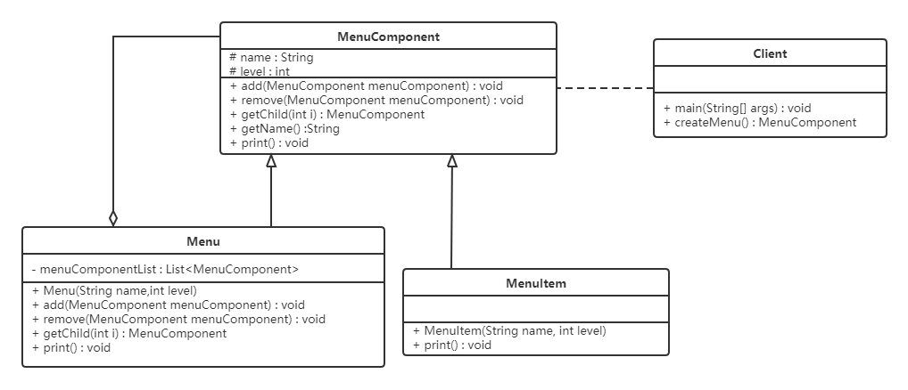

# 5，结构型模式

## 5.6 组合模式

### 5.6.1 概述


​	对于这个图片肯定会非常熟悉，上图我们可以看做是一个文件系统，对于这样的结构我们称之为树形结构。在树形结构中可以通过调用某个方法来遍历整个树，当我们找到某个叶子节点后，就可以对叶子节点进行相关的操作。可以将这颗树理解成一个大的容器，容器里面包含很多的成员对象，这些成员对象即可是容器对象也可以是叶子对象。但是由于容器对象和叶子对象在功能上面的区别(EG:文件夹可以有子文件和子文件夹，但是不能进行数据上的读写)，使得我们在使用的过程中必须要区分容器对象和叶子对象，但是这样就会给客户带来不必要的麻烦，作为客户而已，它始终希望能够一致的对待容器对象和叶子对象。

**定义：**

​	又名部分整体模式，是用于把一组相似的对象当作一个单一的对象。组合模式依据树形结构来组合对象，用来表示部分以及整体层次。这种类型的设计模式属于结构型模式，它创建了对象组的树形结构。


### 5.6.2 结构

组合模式主要包含三种角色：

* 抽象根节点（Component）：定义系统各层次对象的共有方法和属性，可以预先定义一些默认行为和属性。
* 树枝节点（Composite）：定义树枝节点的行为，存储子节点，组合树枝节点和叶子节点形成一个树形结构。
* 叶子节点（Leaf）：叶子节点对象，其下再无分支，是系统层次遍历的最小单位。


### 5.6.3 案例实现

【例】软件菜单

如下图，我们在访问别的一些管理系统时，经常可以看到类似的菜单。一个菜单可以包含菜单项（菜单项是指不再包含其他内容的菜单条目），也可以包含带有其他菜单项的菜单，因此使用组合模式描述菜单就很恰当，我们的需求是针对一个菜单，打印出其包含的所有菜单以及菜单项的名称。


要实现该案例，我们先画出类图：



**代码实现：**

不管是菜单还是菜单项，都应该继承自统一的接口，这里姑且将这个统一的接口称为菜单组件。

```java
/**
 * @version v1.0
 * @ClassName: MenuComponent
 * @Description: 菜单组件 ： 属于抽象根节点
 * @Author: 黑马程序员
 */

//菜单组件  不管是菜单还是菜单项，都应该继承该类 
public abstract class MenuComponent {
    //菜单组件的名称  这是菜单和菜单项的共有属性
    protected String name;
    //菜单组件的层级  这是菜单和菜单项的共有属性
    protected int level;

    //添加子菜单  这是菜单的方法  
    public void add(MenuComponent menuComponent) {
        throw new UnsupportedOperationException();
    }

    //移除子菜单  这是菜单的方法 
    public void remove(MenuComponent menuComponent) {
        throw new UnsupportedOperationException();
    }

    //获取指定的子菜单  这是菜单的方法
    public MenuComponent getChild(int index) {
        throw new UnsupportedOperationException();
    }
  
    //获取菜单或者菜单项的名称  这是菜单和菜单项的共有方法
    public String getName() {
        return name;
    }

    //打印菜单名称的方法（包含子菜单和字菜单项）  这是菜单和菜单项的共有方法
    public abstract void print();
}

```

这里的MenuComponent定义为抽象类，因为有一些共有的属性和行为要在该类中实现，Menu和MenuItem类就可以只覆盖自己感兴趣的方法，而不用搭理不需要或者不感兴趣的方法，举例来说，Menu类可以包含子菜单，因此需要覆盖add()、remove()、getChild()方法，但是MenuItem就不应该有这些方法。这里给出的默认实现是抛出异常，你也可以根据自己的需要改写默认实现。

```java
/**
 * @version v1.0
 * @ClassName: Menu
 * @Description: 菜单类  ： 属于树枝节点
 * @Author: 黑马程序员
 */
public class Menu extends MenuComponent {

    //一个菜单可以有多个子菜单或者子菜单项
    private List<MenuComponent> menuComponentList = new ArrayList<MenuComponent>();

    //构造方法
    public Menu(String name,int level) {
        this.name = name;
        this.level = level;
    }

    @Override
    public void add(MenuComponent menuComponent) {
        menuComponentList.add(menuComponent);
    }

    @Override
    public void remove(MenuComponent menuComponent) {
        menuComponentList.remove(menuComponent);
    }

    @Override
    public MenuComponent getChild(int index) {
        return menuComponentList.get(index);
    }

    @Override
    public void print() {
        //打印当前菜单名称
        for(int i = 0; i < level; i++) {
            System.out.print("--");
        }
        System.out.println(name);

        //打印当前菜单的子菜单或者子菜单项名称
        for (MenuComponent component : menuComponentList) {
            component.print();
        }
    }
}
```

Menu类已经实现了除了getName方法的其他所有方法，因为Menu类具有添加菜单，移除菜单和获取子菜单的功能。

```java
/**
 * @version v1.0
 * @ClassName: MenuItem
 * @Description: 菜单项类 ： 属于叶子节点 不会有子菜单和子菜单项
 * @Author: 黑马程序员
 */
public class MenuItem extends MenuComponent {

    public MenuItem(String name,int level) {
        this.name = name;
        this.level = level;
    }

    public void print() {
        //打印当前菜单项的名称
        for(int i = 0; i < level; i++) {
            System.out.print("--");
        }
        System.out.println(name);
    }
}

```

MenuItem是菜单项，不能再有子菜单，所以添加菜单，移除菜单和获取子菜单的功能并不能实现。

Client

```java
/**
 * @version v1.0
 * @ClassName: Client
 * @Description: TODO(一句话描述该类的功能)
 * @Author: 黑马程序员
 */
public class Client {
    public static void main(String[] args) {
        //创建菜单树
        MenuComponent menu1 = new Menu("菜单管理",2);
        menu1.add(new MenuItem("页面访问",3));
        menu1.add(new MenuItem("展开菜单",3));
        menu1.add(new MenuItem("编辑菜单",3));
        menu1.add(new MenuItem("删除菜单",3));
        menu1.add(new MenuItem("新增菜单",3));

        MenuComponent menu2 = new Menu("权限管理",2);
        menu2.add(new MenuItem("页面访问",3));
        menu2.add(new MenuItem("提交保存",3));

        MenuComponent menu3 = new Menu("角色管理",2);
        menu3.add(new MenuItem("页面访问",3));
        menu3.add(new MenuItem("新增角色",3));
        menu3.add(new MenuItem("修改角色",3));

        //创建一级菜单
        MenuComponent component = new Menu("系统管理",1);
        //将二级菜单添加到一级菜单中
        component.add(menu1);
        component.add(menu2);
        component.add(menu3);


        //打印菜单名称(如果有子菜单一块打印)
        component.print();
    }
}

--系统管理
----菜单管理
------页面访问
------展开菜单
------编辑菜单
------删除菜单
------新增菜单
----权限管理
------页面访问
------提交保存
----角色管理
------页面访问
------新增角色
------修改角色
```


尚硅谷案例：

把一组相似的对象当作一个单一的对象。如：树形菜单


Menu

```java
/**
 * 使用组合模式，组织层级结构的数据
 */
@Data
public class Menu {

    private Integer id;
    private String name;

    public Menu(Integer id,String name){
        this.id = id;
        this.name = name;
    }

    //TODO 组合模式关注点
    private List<Menu> childs = new ArrayList<>();

    //TODO 提供添加层级的方法
    void addChildMenu(Menu menu){
        childs.add(menu);
    }

    //TODO 层级遍历方法
    void printMenu(){
        System.out.print("-");
        System.out.println(name);//TODO 打印当前被遍历的节点
        //TODO 打印被遍历到的节点的子节点
        if(childs.size() > 0){
            for (Menu child : childs) {
                child.printMenu();
            }
        }
    }

}
```

MainTest

```java
public class MainTest {

    public static void main(String[] args) {
        Menu root = new Menu(1, "系统管理");
        Menu 角色管理 = new Menu(2, "角色管理");
        root.addChildMenu(角色管理);
        角色管理.addChildMenu(new Menu(6,"固定角色"));
        角色管理.addChildMenu(new Menu(7,"临时授予"));


        Menu 用户管理 = new Menu(3, "用户管理");
        root.addChildMenu(用户管理);


        用户管理.addChildMenu(new Menu(4,"临时用户"));
        用户管理.addChildMenu(new Menu(5,"注册用户"));


        //按照不同层级展示
        root.printMenu();
    }
}
```

### 5.6.4 组合模式的分类

在使用组合模式时，根据抽象构件类的定义形式，我们可将组合模式分为透明组合模式和安全组合模式两种形式。

* 透明组合模式

  透明组合模式中，抽象根节点角色中声明了所有用于管理成员对象的方法，比如在示例中 `MenuComponent` 声明了 `add`、`remove` 、`getChild` 方法，这样做的好处是确保所有的构件类都有相同的接口。透明组合模式也是组合模式的标准形式。

  透明组合模式的缺点是不够安全，因为叶子对象和容器对象在本质上是有区别的，叶子对象不可能有下一个层次的对象，即不可能包含成员对象，因此为其提供 add()、remove() 等方法是没有意义的，这在编译阶段不会出错，但在运行阶段如果调用这些方法可能会出错（如果没有提供相应的错误处理代码）

* 安全组合模式

  在安全组合模式中，**在抽象构件角色中没有声明任何用于管理成员对象的方法**，而是在树枝节点 `Menu` 类中声明并实现这些方法。安全组合模式的缺点是不够透明，因为叶子构件和容器构件具有不同的方法，且容器构件中那些用于管理成员对象的方法没有在抽象构件类中定义，因此**客户端不能完全针对抽象编程，必须有区别地对待叶子构件和容器构件。**

  


### 5.6.5 优点

* 组合模式可以清楚地定义分层次的复杂对象，表示对象的全部或部分层次，它让客户端忽略了层次的差异，方便对整个层次结构进行控制。
* 客户端可以一致地使用一个组合结构或其中单个对象，不必关心处理的是单个对象还是整个组合结构，简化了客户端代码。
* 在组合模式中增加新的树枝节点和叶子节点都很方便，无须对现有类库进行任何修改，符合“开闭原则”。
* 组合模式为树形结构的面向对象实现提供了一种灵活的解决方案，通过叶子节点和树枝节点的递归组合，可以形成复杂的树形结构，但对树形结构的控制却非常简单。


### 5.6.6 使用场景

组合模式正是应树形结构而生，所以组合模式的使用场景就是出现树形结构的地方。比如：文件目录显示，多级目录呈现等树形结构数据的操作。


什么场景用到？

- 层级结构
- 部门组织结构
- 组合了别的对象还是组合模式吗？
- ......


## 5.7 享元模式

### 5.7.1 概述

**定义：**

​	运用共享技术来有效地支持大量细粒度对象的复用。**它通过共享已经存在的对象来大幅度减少需要创建的对象数量、避免大量相似对象的开销，从而提高系统资源的利用率**。


### 5.7.2 结构

享元（Flyweight ）模式中存在以下两种状态：

1. 内部状态，即不会随着环境的改变而改变的可共享部分。（谁使用都一样）
2. 外部状态，指随环境改变而改变的不可以共享的部分。享元模式的实现要领就是区分应用中的这两种状态，并将外部状态外部化。（组合这些外部状态）

享元模式的主要有以下角色：

* 抽象享元角色（Flyweight）：通常是一个接口或抽象类，在抽象享元类中声明了具体享元类公共的方法，这些方法可以向外界提供享元对象的内部数据（内部状态），同时也可以通过这些方法来设置外部数据（外部状态）。
* 具体享元（Concrete Flyweight）角色 ：它实现了抽象享元类，称为享元对象；在具体享元类中为内部状态提供了存储空间。通常我们可以结合单例模式来设计具体享元类，为每一个具体享元类提供唯一的享元对象。
* 非享元（Unsharable Flyweight)角色（外部状态） ：并不是所有的抽象享元类的子类都需要被共享，不能被共享的子类可设计为非共享具体享元类；当需要一个非共享具体享元类的对象时可以直接通过实例化创建。
* 享元工厂（Flyweight Factory）角色 ：负责创建和管理享元角色。当客户对象请求一个享元对象时，享元工厂检査系统中是否存在符合要求的享元对象，如果存在则提供给客户；如果不存在的话，则创建一个新的享元对象。


### 5.7.3 案例实现

【例】俄罗斯方块

下面的图片是众所周知的俄罗斯方块中的一个个方块，如果在俄罗斯方块这个游戏中，每个不同的方块都是一个实例对象，这些对象就要占用很多的内存空间，下面利用享元模式进行实现。


**先来看类图：**


**代码如下：**

俄罗斯方块有不同的形状，我们可以对这些形状向上抽取出AbstractBox，用来定义共性的属性和行为。

**而颜色就是外部状态**

```java
/**
 * @version v1.0
 * @ClassName: AbstractBox
 * @Description: 抽象享元角色
 * @Author: 黑马程序员
 */
public abstract class AbstractBox {

    //获取图形的方法
    public abstract String getShape();

    //显示图形及颜色
    public void display(String color) {
        System.out.println("方块形状：" + getShape() + ", 颜色：" + color);
    }
}
```

接下来就是定义不同的形状了，IBox类、LBox类、OBox类等。

```java
/**
 * @version v1.0
 * @ClassName: IBox
 * @Description: I图形类(具体享元角色)
 * @Author: 黑马程序员
 */
public class IBox extends AbstractBox {

    public String getShape() {
        return "I";
    }
}
```

 LBox

```java
/**
 * @version v1.0
 * @ClassName: IBox
 * @Description: L图形类(具体享元角色)
 * @Author: 黑马程序员
 */
public class LBox extends AbstractBox {

    public String getShape() {
        return "L";
    }
}
```

OBox

```java
/**
 * @version v1.0
 * @ClassName: IBox
 * @Description: O图形类(具体享元角色)
 * @Author: 黑马程序员
 */
public class OBox extends AbstractBox {

    public String getShape() {
        return "O";
    }
}
```

提供了一个工厂类（BoxFactory），用来管理享元对象（也就是AbstractBox子类对象），该工厂类对象只需要一个，所以可以使用单例模式。并给工厂类提供一个获取形状的方法。

```java
/**
 * @version v1.0
 * @ClassName: BoxFactory
 * @Description: 工厂类，将该类设计为单例
 * @Author: 黑马程序员
 */
public class BoxFactory {

    private HashMap<String,AbstractBox> map;

    //在构造方法中进行初始化操作
    private BoxFactory() {
        map = new HashMap<String, AbstractBox>();
        map.put("I",new IBox());
        map.put("L",new LBox());
        map.put("O",new OBox());
    }

    //提供一个方法获取该工厂类对象
    public static BoxFactory getInstance() {
        return factory;
    }

    private static BoxFactory factory = new BoxFactory();

    //根据名称获取图形对象
    public AbstractBox getShape(String name) {
        return map.get(name);
    }
}
```

Client

```java
/**
 * @version v1.0
 * @ClassName: Client
 * @Description: TODO(一句话描述该类的功能)
 * @Author: 黑马程序员
 */
public class Client {
    public static void main(String[] args) {
        //获取I图形对象
        AbstractBox box1 = BoxFactory.getInstance().getShape("I");
        box1.display("灰色");

        //获取L图形对象
        AbstractBox box2 = BoxFactory.getInstance().getShape("L");
        box2.display("绿色");

        //获取O图形对象
        AbstractBox box3 = BoxFactory.getInstance().getShape("O");
        box3.display("灰色");

        //获取O图形对象
        AbstractBox box4 = BoxFactory.getInstance().getShape("O");
        box4.display("红色");

        System.out.println("两次获取到的O图形对象是否是同一个对象：" + (box3 == box4));
    }
}

方块形状：I, 颜色：灰色
方块形状：L, 颜色：绿色
方块形状：O, 颜色：灰色
方块形状：O, 颜色：红色
两次获取到的O图形对象是否是同一个对象：true
```


尚硅谷案例

享元模式(Flyweight Pattern)，运用共享技术有效地支持大量细粒度对象的复用。系统只使用少量的对象，而这些对象都很相似，状态变化很小，可以实现对象的多次复用。对象结构型

在享元模式中可以共享的相同内容称为内部状态(IntrinsicState)，而那些需要外部环境来设置的不能共享的内容称为外部状态(Extrinsic State)，由于区分了内部状态和外部状态，因此可以通过设置不同的外部状态使得相同的对象可以具有一些不同的特征，而相同的内部状态是可以共享的。

在享元模式中通常会出现工厂模式，需要创建一个享元工厂来负责维护一个享元池(Flyweight Pool)用于存储具有相同内部状态的享元对象。


享元模式包含如下角色：

- Flyweight: 抽象享元类  Connection
- ConcreteFlyweight: 具体享元类  ConnectionImpl（user,pwd,url）
- UnsharedConcreteFlyweight: 非共享具体享元类ConnectionImpl（state）
- FlyweightFactory: 享元工厂类；简单工厂，产品就一个Connection


```java
/**
 * TODO 享元模式的核心： 可共享和不可共享状态
 */
public abstract class AbstractWaitressFlyweight {

    boolean canService = true;//能否服务

    //TODO 正在服务。   享元的不可共享属性留给外部进行改变的接口
    abstract void service();
    //TODO 服务完成。   享元的不可共享属性留给外部进行改变的接口
    abstract void end();

    public boolean isCanService() {
        return canService;
    }
}
```

ZuDao

```java
/**
 *TODO
 *  足道店：这相当于享元工厂
 *      店里面很多服务员。
 *TODO
 * 享元和原型
 * 1、享元返回的是这个本人。
 * 2、原型返回的是克隆人。
 *
 */
public class ZuDao {

    private static Map<String,AbstractWaitressFlyweight> pool = new HashMap<>();
    //TODO 享元，池子中有对象
    static {
        //TODO 实现池子里面 一开始有对象
        BeautifulWaitress waitress =
                new BeautifulWaitress("1111","张三",18);


        BeautifulWaitress waitress2 =
                new BeautifulWaitress("9527","李四",20);


        pool.put(waitress.id,waitress);
        pool.put(waitress2.id,waitress2);
    }
    //TODO 添加服务员
    public void addWaitress(AbstractWaitressFlyweight waitressFlyweight){
        pool.put(UUID.randomUUID().toString(),waitressFlyweight);
    }
    //TODO 得到服务员
    public static AbstractWaitressFlyweight getWaitress(String name){
        AbstractWaitressFlyweight flyweight = pool.get(name);
        if(flyweight == null){
            for (AbstractWaitressFlyweight value : pool.values()) {
                //TODO 享元模式的核心： 当前共享对象能否使用
                if(value.isCanService()){
                    return value;
                }
            };
            return null;
        }

        return flyweight;
    }

}
```

BeautifulWaitress

```java
/**
 * 具体享元类 也就是池子里面放的东西
 */
@AllArgsConstructor
public class BeautifulWaitress extends AbstractWaitressFlyweight{
    //TODO 这些属性是不变的
    String id;//工号
    String name;//名字
    int age;//年龄

    @Override
    void service() {
        System.out.println("工号："+id+"；"+name+" "+age+" 正在为您服务...");
        //TODO 改变外部状态
        this.canService = false;
    }

    @Override
    void end() {
        System.out.println("工号："+id+"；"+name+" "+age+" 服务结束...请给五星好评");
        //TODO 改变外部状态
        this.canService = true;
    }
}
```

 MainTest

```java
public class MainTest {

    public static void main(String[] args) {

        //1、我
        AbstractWaitressFlyweight waitress = ZuDao.getWaitress("");
        waitress.service();
        System.out.println(waitress);
        //2、佟老师
        AbstractWaitressFlyweight waitress1 = ZuDao.getWaitress("");
        waitress1.service();
        System.out.println(waitress1);

        waitress1.end();
        //3、刘佳林
        AbstractWaitressFlyweight waitress2 = ZuDao.getWaitress("");
        System.out.println(waitress2);

    }
}
```

### 5.7.5 优缺点和使用场景

**1，优点**

- 极大减少内存中相似或相同对象数量，节约系统资源，提供系统性能
- 享元模式中的外部状态相对独立，且不影响内部状态

**2，缺点：**

为了使对象可以共享，需要将享元对象的部分状态外部化，分离内部状态和外部状态，使程序逻辑复杂

**3，使用场景：**

- 一个系统有大量相同或者相似的对象，造成内存的大量耗费。
- 对象的大部分状态都可以外部化，可以将这些外部状态传入对象中。
- 在使用享元模式时需要维护一个存储享元对象的享元池，而这需要耗费一定的系统资源，因此，应当在需要多次重复使用享元对象时才值得使用享元模式。


什么场景用到？

- 典型的代表：数据库连接池
- 所有的池化技术
- 享元和原型模式有什么区别？享元是预先准备好的对象进行复用，原型没法确定预先有哪些
- ......


### 5.7.6 JDK源码解析

Integer类使用了享元模式。我们先看下面的例子：

```java
public class Demo {
    public static void main(String[] args) {
        Integer i1 = 127;
        Integer i2 = 127;

        System.out.println("i1和i2对象是否是同一个对象？" + (i1 == i2));

        Integer i3 = 128;
        Integer i4 = 128;

        System.out.println("i3和i4对象是否是同一个对象？" + (i3 == i4));
    }
}
```

运行上面代码，结果如下：


为什么第一个输出语句输出的是true，第二个输出语句输出的是false？通过反编译软件进行反编译，代码如下：

```java
public class Demo {
    public static void main(String[] args) {
        Integer i1 = Integer.valueOf((int)127);
        Integer i2 Integer.valueOf((int)127);
        System.out.println((String)new StringBuilder().append((String)"i1\u548ci2\u5bf9\u8c61\u662f\u5426\u662f\u540c\u4e00\u4e2a\u5bf9\u8c61\uff1f").append((boolean)(i1 == i2)).toString());
        Integer i3 = Integer.valueOf((int)128);
        Integer i4 = Integer.valueOf((int)128);
        System.out.println((String)new StringBuilder().append((String)"i3\u548ci4\u5bf9\u8c61\u662f\u5426\u662f\u540c\u4e00\u4e2a\u5bf9\u8c61\uff1f").append((boolean)(i3 == i4)).toString());
    }
}
```

上面代码可以看到，直接给Integer类型的变量赋值基本数据类型数据的操作底层使用的是 `valueOf()` ，所以只需要看该方法即可

```java
public final class Integer extends Number implements Comparable<Integer> {
    
	public static Integer valueOf(int i) {
        if (i >= IntegerCache.low && i <= IntegerCache.high)
            return IntegerCache.cache[i + (-IntegerCache.low)];
        return new Integer(i);
    }
    
    private static class IntegerCache {
        static final int low = -128;
        static final int high;
        static final Integer cache[];

        static {
            int h = 127;
            String integerCacheHighPropValue =
                sun.misc.VM.getSavedProperty("java.lang.Integer.IntegerCache.high");
            if (integerCacheHighPropValue != null) {
                try {
                    int i = parseInt(integerCacheHighPropValue);
                    i = Math.max(i, 127);
                    // Maximum array size is Integer.MAX_VALUE
                    h = Math.min(i, Integer.MAX_VALUE - (-low) -1);
                } catch( NumberFormatException nfe) {
                }
            }
            high = h;
            cache = new Integer[(high - low) + 1];
            int j = low;
            for(int k = 0; k < cache.length; k++)
                cache[k] = new Integer(j++);
            // range [-128, 127] must be interned (JLS7 5.1.7)
            assert IntegerCache.high >= 127;
        }

        private IntegerCache() {}
    }
}
```

可以看到 `Integer` 默认先创建并缓存 `-128 ~ 127` 之间数的 `Integer` 对象，当调用 `valueOf` 时如果参数在 `-128 ~ 127` 之间则计算下标并从缓存中返回，否则创建一个新的 `Integer` 对象。


# 6，行为型模式

行为型模式用于描述程序在运行时复杂的流程控制，即描述多个类或对象之间怎样相互协作共同完成单个对象都无法单独完成的任务，它涉及算法与对象间职责的分配。

行为型模式分为类行为模式和对象行为模式，前者采用继承机制来在类间分派行为，后者采用组合或聚合在对象间分配行为。由于组合关系或聚合关系比继承关系耦合度低，满足“合成复用原则”，所以对象行为模式比类行为模式具有更大的灵活性。

行为型模式分为：

* 模板方法模式
* 策略模式
* 命令模式
* 职责链模式
* 状态模式
* 观察者模式
* 中介者模式
* 迭代器模式
* 访问者模式
* 备忘录模式
* 解释器模式

以上 11 种行为型模式，除了模板方法模式和解释器模式是类行为型模式，其他的全部属于对象行为型模式。


## 6.1 模板方法模式

### 6.1.1 概述

在面向对象程序设计过程中，程序员常常会遇到这种情况：**设计一个系统时知道了算法所需的关键步骤，而且确定了这些步骤的执行顺序，但某些步骤的具体实现还未知，或者说某些步骤的实现与具体的环境相关。**

例如，去银行办理业务一般要经过以下4个流程：取号、排队、办理具体业务、对银行工作人员进行评分等，其中取号、排队和对银行工作人员进行评分的业务对每个客户是一样的，可以在父类中实现，但是办理具体业务却因人而异，它可能是存款、取款或者转账等，可以延迟到子类中实现。

**定义：**

定义一个操作中的算法骨架，而将算法的一些步骤延迟到子类中，使得子类可以不改变该算法结构的情况下重定义该算法的某些特定步骤。


###  6.1.2 结构

模板方法（Template Method）模式包含以下主要角色：

* 抽象类（Abstract Class）：负责给出一个算法的轮廓和骨架。它由一个模板方法和若干个基本方法构成。

  * 模板方法：定义了算法的骨架，按某种顺序调用其包含的基本方法。

  * 基本方法：是实现算法各个步骤的方法，是模板方法的组成部分。基本方法又可以分为三种：

    * 抽象方法(Abstract Method) ：一个抽象方法由抽象类声明、由其具体子类实现。

    * 具体方法(Concrete Method) ：一个具体方法由一个抽象类或具体类声明并实现，其子类可以进行覆盖也可以直接继承。

    * 钩子方法(Hook Method) ：在抽象类中已经实现，包括用于判断的逻辑方法和需要子类重写的空方法两种。

      一般钩子方法是用于判断的逻辑方法，这类方法名一般为isXxx，返回值类型为boolean类型。

* 具体子类（Concrete Class）：实现抽象类中所定义的抽象方法和钩子方法，它们是一个顶级逻辑的组成步骤。


### 6.1.3 案例实现

【例】炒菜

炒菜的步骤是固定的，分为倒油、热油、倒蔬菜、倒调料品、翻炒等步骤。现通过模板方法模式来用代码模拟。类图如下：


代码如下：

```java
/**
 * @version v1.0
 * @ClassName: AbstractClass
 * @Description: 抽象类（定义模板方法和基本方法）
 * @Author: 黑马程序员
 */
public abstract class AbstractClass {

    //模板方法定义
    public final void cookProcess() {//TODO final 不让子类重写
        pourOil();
        heatOil();
        pourVegetable();
        pourSauce();
        fry();
    }

    public void pourOil() {
        System.out.println("倒油");
    }

    //第二步：热油是一样的，所以直接实现
    public void heatOil() {
        System.out.println("热油");
    }

    //第三步：倒蔬菜是不一样的（一个下包菜，一个是下菜心）
    public abstract void pourVegetable();

    //第四步：倒调味料是不一样
    public abstract void pourSauce();


    //第五步：翻炒是一样的，所以直接实现
    public void fry(){
        System.out.println("炒啊炒啊炒到熟啊");
    }
}
```

ConcreteClass_BaoCai 

```java
/**
 * @version v1.0
 * @ClassName: ConcreteClass_BaoCai
 * @Description: 炒包菜类
 * @Author: 黑马程序员
 */
public class ConcreteClass_BaoCai extends AbstractClass {

    public void pourVegetable() {
        System.out.println("下锅的蔬菜是包菜");
    }

    public void pourSauce() {
        System.out.println("下锅的酱料是辣椒");
    }
}
```

ConcreteClass_CaiXin

```java
/**
 * @version v1.0
 * @ClassName: ConcreteClass_BaoCai
 * @Description: 炒菜心类
 * @Author: 黑马程序员
 */
public class ConcreteClass_CaiXin extends AbstractClass {

    public void pourVegetable() {
        System.out.println("下锅的蔬菜是菜心");
    }

    public void pourSauce() {
        System.out.println("下锅的酱料是蒜蓉");
    }
}
```

 Client

```java
public class Client {
    public static void main(String[] args) {
        //炒手撕包菜
        ConcreteClass_BaoCai baoCai = new ConcreteClass_BaoCai();
        baoCai.cookProcess();

        //炒蒜蓉菜心
        ConcreteClass_CaiXin caiXin = new ConcreteClass_CaiXin();
        caiXin.cookProcess();
    }
}
```

> **注意：为防止恶意操作，一般模板方法都加上 final 关键词**。


尚硅谷案例：

在模板模式（Template Pattern）中，一个抽象类公开定义了执行它的方法的方式模板。它的子类可以按需要重写方法实现，但调用将以抽象类中定义的方式进行。


模板方法（Template Method）包含两个角色

- 抽象类/抽象模板（Abstract Class）
- 具体子类/具体实现（Concrete Class）


```java
/**
 * 1、定义模板
 *TODO  定义父类抽象类  调用者调用父类 实际上调用子类实现类
 */
public abstract class CookTemplate {

    /**
     *TODO
     *  定义算法：  定义好了模板
     * 父类可以实现某些步骤
     * 留关键给子类
     */
    public void cook(){
        //定义算法步骤
        heating();   //v
        addfood();
        addsalt();
        stirfry();   //v
        end();      //v
    }

    //加热方法
    public void heating(){
        System.out.println("开火...");
    };

    //添加食物
    public abstract void addfood();

    //加盐
    public abstract void addsalt();

    //翻炒
    public  void stirfry(){
        System.out.println("翻炒中...");
    };

    //出锅
    public  void end(){
        System.out.println("出锅....");
    };


}
```

AutoCookMachine

```java
public class AutoCookMachine extends CookTemplate{

    @Override
    public void addfood() {
        System.out.println("放了三个小白菜");
    }

    @Override
    public void addsalt() {
        System.out.println("放了三勺盐");
    }
}
```

MainTest 

```java
public class MainTest {

    public static void main(String[] args) {

        AutoCookMachine cookMachine = new AutoCookMachine();

        cookMachine.cook();

    }
}
```

### 6.1.3 优缺点

**优点：**

* 提高代码复用性

  将相同部分的代码放在抽象的父类中，而将不同的代码放入不同的子类中。

* 实现了反向控制

  通过一个父类调用其子类的操作，通过对子类的具体实现扩展不同的行为，实现了反向控制 ，并符合“开闭原则”。

**缺点：**

* 对每个不同的实现都需要定义一个子类，这会导致类的个数增加，系统更加庞大，设计也更加抽象。
* 父类中的抽象方法由子类实现，子类执行的结果会影响父类的结果，这导致一种反向的控制结构，它提高了代码阅读的难度。


### 6.1.4 适用场景

* 算法的整体步骤很固定，但其中个别部分易变时，这时候可以使用模板方法模式，将容易变的部分抽象出来，供子类实现。
* 需要通过子类来决定父类算法中某个步骤是否执行，实现子类对父类的反向控制。


什么场景用到？

- Spring的整个继承体系都基本用到模板方法;
- BeanFactory.getBean(1,2,3,4)--A1---A2---A3---A4（全部被完成）
- JdbcTemplate、RedisTemplate都允许我们再扩展.....
- 我们自己的系统也应该使用模板方法组织类结构
- ......


### 6.1.5 JDK源码解析

InputStream类就使用了模板方法模式。在InputStream类中定义了多个 `read()` 方法，如下：

```java
public abstract class InputStream implements Closeable {
    //抽象方法，要求子类必须重写
    public abstract int read() throws IOException;

    public int read(byte b[]) throws IOException {
        return read(b, 0, b.length);
    }

    public int read(byte b[], int off, int len) throws IOException {
        if (b == null) {
            throw new NullPointerException();
        } else if (off < 0 || len < 0 || len > b.length - off) {
            throw new IndexOutOfBoundsException();
        } else if (len == 0) {
            return 0;
        }

        int c = read(); //调用了无参的read方法，该方法是每次读取一个字节数据
        if (c == -1) {
            return -1;
        }
        b[off] = (byte)c;

        int i = 1;
        try {
            for (; i < len ; i++) {
                c = read();
                if (c == -1) {
                    break;
                }
                b[off + i] = (byte)c;
            }
        } catch (IOException ee) {
        }
        return i;
    }
}
```

从上面代码可以看到，无参的 `read()` 方法是抽象方法，要求子类必须实现。而 `read(byte b[])` 方法调用了 `read(byte b[], int off, int len)` 方法，所以在此处重点看的方法是带三个参数的方法。 

在该方法中第18行、27行，可以看到调用了无参的抽象的 `read()` 方法。

总结如下： 在InputStream父类中已经定义好了读取一个字节数组数据的方法是每次读取一个字节，并将其存储到数组的第一个索引位置，读取len个字节数据。具体如何读取一个字节数据呢？由子类实现。


## 6.2 策略模式

### 6.2.1 概述

先看下面的图片，我们去旅游选择出行模式有很多种，可以骑自行车、可以坐汽车、可以坐火车、可以坐飞机。


作为一个程序猿，开发需要选择一款开发工具，当然可以进行代码开发的工具有很多，可以选择Idea进行开发，也可以使用eclipse进行开发，也可以使用其他的一些开发工具。


**定义：**

​	该模式定义了一系列算法，并将每个算法封装起来，使它们可以相互替换，且算法的变化不会影响使用算法的客户。策略模式属于对象行为模式，它通过对算法进行封装，把使用算法的责任和算法的实现分割开来，并委派给不同的对象**对这些算法进行管理(环境类)**。


### 6.2.2 结构

策略模式的主要角色如下：

* 抽象策略（Strategy）类：这是一个抽象角色，通常由一个接口或抽象类实现。此角色给出所有的具体策略类所需的接口。
* 具体策略（Concrete Strategy）类：实现了抽象策略定义的接口，提供具体的算法实现或行为。
* 环境（Context）类：持有一个策略类的引用，最终给客户端调用。


### 6.2.3 案例实现

【例】促销活动

一家百货公司在定年度的促销活动。针对不同的节日（春节、中秋节、圣诞节）推出不同的促销活动，由促销员将促销活动展示给客户。类图如下：


代码如下：

定义百货公司所有促销活动的共同接口

```java
/**
 * @version v1.0
 * @ClassName: Strategy
 * @Description: 抽象策略类
 * @Author: 黑马程序员
 */
public interface Strategy {

    void show();
}
```

定义具体策略角色（Concrete Strategy）：每个节日具体的促销活动

```java
/**
 * @version v1.0
 * @ClassName: StrategyA
 * @Description: 具体策略类，封装算法
 * @Author: 黑马程序员
 */
public class StrategyA implements Strategy {//为春节准备的促销活动A

    public void show() {
        System.out.println("买一送一");
    }
}
```

StrategyB

```jjavaava
/**
 * @version v1.0
 * @ClassName: StrategyB
 * @Description: 具体策略类，封装算法
 * @Author: 黑马程序员
 */
public class StrategyB implements Strategy {//为中秋准备的促销活动B

    public void show() {
        System.out.println("满200元减50元");
    }
}
```

StrategyC

```java
//为圣诞准备的促销活动C
public class StrategyC implements Strategy {

    public void show() {
        System.out.println("满1000元加一元换购任意200元以下商品");
    }
}
```

定义环境角色（Context）：用于连接上下文，即把促销活动推销给客户，这里可以理解为销售员

```java
/**
 * @version v1.0
 * @ClassName: SalesMan
 * @Description: 促销员(环境类)
 * @Author: 黑马程序员
 */
public class SalesMan {

    //聚合策略类对象
    private Strategy strategy;

    public SalesMan(Strategy strategy) {
        this.strategy = strategy;
    }

    public Strategy getStrategy() {
        return strategy;
    }

    public void setStrategy(Strategy strategy) {
        this.strategy = strategy;
    }

    //由促销员展示促销活动给用户
    public void salesManShow() {
        this.strategy.show();
    }
}

```

Client

```java
/**
 * @version v1.0
 * @ClassName: Client
 * @Description: TODO(一句话描述该类的功能)
 * @Author: 黑马程序员
 */
public class Client {
    public static void main(String[] args) {
        //春节来了，使用春节促销活动
        SalesMan salesMan = new SalesMan(new StrategyA());
        //展示促销活动
        salesMan.salesManShow();

        System.out.println("==============");
        //中秋节到了，使用中秋节的促销活动
        salesMan.setStrategy(new StrategyB());
        //展示促销活动
        salesMan.salesManShow();

        System.out.println("==============");
        //圣诞节到了，使用圣诞节的促销活动
        salesMan.setStrategy(new StrategyC());
        //展示促销活动
        salesMan.salesManShow();
    }
}
买一送一
==============
满200元减50元
==============
满1000元加一元换购任意200元以下商品
```


尚硅谷案例：

策略（Strategy）模式定义了一系列算法，并将每个算法封装起来，使它们可以相互替换，且算法的变化不会影响使用算法的客户。属于对象行为模式。


策略模式的主要角色如下。

- 抽象策略（Strategy）类：公共接口，各种不同的算法以不同的方式实现这个接口，环境角色使用这个接口调用不同的算法，一般使用接口或抽象类实现。
- 具体策略（Concrete Strategy）类：实现了抽象策略定义的接口，提供具体的算法实现。
- 环境（Context）类：持有一个策略类的引用，最终给客户端调用。

GameStrategy 

```java
/**
 * 游戏策略
 */
public interface GameStrategy {

    //TODO 战斗策略 因为有很多策略 多以定义抽象类
    void warStrategy();

}
```

RandomStrategy

```java
//TODO 策略的实现类
public class RandomStrategy implements GameStrategy{

    @Override
    public void warStrategy() {
        System.out.println("大乱斗...");
    }

}
```

SteadyStrategy

```java
//TODO 策略的实现类 稳健运营策略
public class SteadyStrategy implements GameStrategy {
    @Override
    public void warStrategy() {
        System.out.println("各路小心...及时支援...");
    }
}
```

TeamGNR

```java
/**
 * 环境类
 */
public class TeamGNR {

    //TODO 把对象组合进来  抽取游戏策略算法，并进行引用
    private GameStrategy gameStrategy;

    public void setGameStrategy(GameStrategy gameStrategy) {
        this.gameStrategy = gameStrategy;
    }

    public void startGame(){
        System.out.println("游戏开始.....");
        //游戏策略
        gameStrategy.warStrategy();
        System.out.println("win......");
    }
}
```

UziStrategy

```java
//TODO 策略的实现类 冲锋向前策略
public class UziStrategy implements GameStrategy{
    @Override
    public void warStrategy() {
        System.out.println("uzi.....");
    }
}
```

MainTest

```java
public class MainTest {

    public static void main(String[] args) {

        TeamGNR gnr = new TeamGNR();

        gnr.setGameStrategy(new RandomStrategy());
        gnr.startGame();
    }
}
```

### 6.2.4 优缺点

**1，优点：**

* 策略类之间可以自由切换

  **由于策略类都实现同一个接口，所以使它们之间可以自由切换。**

* 易于扩展

  增加一个新的策略只需要添加一个具体的策略类即可，基本不需要改变原有的代码，符合“开闭原则“

* 避免使用多重条件选择语句（if else），充分体现面向对象设计思想。

**2，缺点：**

* 客户端必须知道所有的策略类，并自行决定使用哪一个策略类。
* 策略模式将造成产生很多策略类，可以通过使用享元模式在一定程度上减少对象的数量。


### 6.2.5 使用场景

* 一个系统需要动态地在几种算法中选择一种时，可将每个算法封装到策略类中。
* 一个类定义了多种行为，并且这些行为在这个类的操作中以多个条件语句的形式出现，可将每个条件分支移入它们各自的策略类中以代替这些条件语句。
* 系统中各算法彼此完全独立，且要求对客户隐藏具体算法的实现细节时。
* 系统要求使用算法的客户不应该知道其操作的数据时，可使用策略模式来隐藏与算法相关的数据结构。
* 多个类只区别在表现行为不同，可以使用策略模式，在运行时动态选择具体要执行的行为。


什么场景用到？

- 使用策略模式可以避免使用多重条件语句，如 if...else 语句、switch...case 语句
- 什么是Spring的 InstantiationStrategy
- 线程池拒绝策略
  ......


### 6.2.6 JDK源码解析

`Comparator` 中的策略模式。在Arrays类中有一个 `sort()` 方法，如下：

```java
public class Arrays{
    public static <T> void sort(T[] a, Comparator<? super T> c) {
        if (c == null) {
            sort(a);
        } else {
            if (LegacyMergeSort.userRequested)
                legacyMergeSort(a, c);
            else
                TimSort.sort(a, 0, a.length, c, null, 0, 0);
        }
    }
}
```

Arrays就是一个环境角色类，这个sort方法可以传一个新策略让Arrays根据这个策略来进行排序。就比如下面的测试类。

```java
public class demo {
    public static void main(String[] args) {

        Integer[] data = {12, 2, 3, 2, 4, 5, 1};
        // 实现降序排序
        Arrays.sort(data, new Comparator<Integer>() {
            public int compare(Integer o1, Integer o2) {
                return o2 - o1;
            }
        });
        System.out.println(Arrays.toString(data)); //[12, 5, 4, 3, 2, 2, 1]
    }
}
```

这里我们在调用Arrays的sort方法时，第二个参数传递的是Comparator接口的子实现类对象。所以Comparator充当的是抽象策略角色，而具体的子实现类充当的是具体策略角色。环境角色类（Arrays）应该持有抽象策略的引用来调用。那么，Arrays类的sort方法到底有没有使用Comparator子实现类中的 `compare()` 方法吗？让我们继续查看TimSort类的 `sort()` 方法，代码如下：

```java
class TimSort<T> {
    static <T> void sort(T[] a, int lo, int hi, Comparator<? super T> c,
                         T[] work, int workBase, int workLen) {
        assert c != null && a != null && lo >= 0 && lo <= hi && hi <= a.length;

        int nRemaining  = hi - lo;
        if (nRemaining < 2)
            return;  // Arrays of size 0 and 1 are always sorted

        // If array is small, do a "mini-TimSort" with no merges
        if (nRemaining < MIN_MERGE) {
            int initRunLen = countRunAndMakeAscending(a, lo, hi, c);
            binarySort(a, lo, hi, lo + initRunLen, c);
            return;
        }
        ...
    }   
        
    private static <T> int countRunAndMakeAscending(T[] a, int lo, int hi,Comparator<? super T> c) {
        assert lo < hi;
        int runHi = lo + 1;
        if (runHi == hi)
            return 1;

        // Find end of run, and reverse range if descending
        if (c.compare(a[runHi++], a[lo]) < 0) { // Descending
            while (runHi < hi && c.compare(a[runHi], a[runHi - 1]) < 0)
                runHi++;
            reverseRange(a, lo, runHi);
        } else {                              // Ascending
            while (runHi < hi && c.compare(a[runHi], a[runHi - 1]) >= 0)
                runHi++;
        }

        return runHi - lo;
    }
}
```

上面的代码中最终会跑到 `countRunAndMakeAscending()` 这个方法中。我们可以看见，只用了compare方法，所以在调用Arrays.sort方法只传具体compare重写方法的类对象就行，这也是Comparator接口中必须要子类实现的一个方法。


## 6.3 命令模式

### 6.3.1 概述

日常生活中，我们出去吃饭都会遇到下面的场景。


**定义：**

将一个请求封装为一个对象，使发出请求的责任和执行请求的责任分割开(厨师和服务员的分割)。这样两者之间通过命令对象进行沟通，这样方便将命令对象进行存储、传递、调用、增加与管理。


### 6.3.2 结构

命令模式包含以下主要角色：

* 抽象命令类（Command）角色： 定义命令的接口，声明执行的方法。
* 具体命令（Concrete  Command）角色：具体的命令，实现命令接口；通常会持有接收者，并调用接收者的功能来完成命令要执行的操作。
* 实现者/接收者（Receiver）角色： 接收者，真正执行命令的对象。任何类都可能成为一个接收者，只要它能够实现命令要求实现的相应功能。
* 调用者/请求者（Invoker）角色： 要求命令对象执行请求，通常会持有命令对象，可以持有很多的命令对象。这个是客户端真正触发命令并要求命令执行相应操作的地方，也就是说相当于使用命令对象的入口。


### 6.3.3 案例实现

将上面的案例用代码实现，那我们就需要分析命令模式的角色在该案例中由谁来充当。

服务员： 就是调用者角色，由她来发起命令。

资深大厨： 就是接收者角色，真正命令执行的对象。

订单： 命令中包含订单。

类图如下：


代码如下：

```java
/**
 * @version v1.0
 * @ClassName: Command
 * @Description: 抽象命令类
 * @Author: 黑马程序员
 */
public interface Command {

    void execute();
}
```

OrderCommand

```java
/**
 * @version v1.0
 * @ClassName: OrderCommand
 * @Description: 具体的命令类
 * @Author: 黑马程序员
 */
public class OrderCommand implements Command {

    //持有接收者对象
    private SeniorChef receiver;
    private Order order;

    public OrderCommand(SeniorChef receiver, Order order) {
        this.receiver = receiver;
        this.order = order;
    }

    public void execute() {
        System.out.println(order.getDiningTable() + "桌的订单：");
        Map<String, Integer> foodDir = order.getFoodDir();
        //遍历map集合
        Set<String> keys = foodDir.keySet();
        for (String foodName : keys) {
            receiver.makeFood(foodName, foodDir.get(foodName));
        }

        System.out.println(order.getDiningTable() + "桌的饭准备完毕！！！");
    }
}
```

Order

```java
/**
 * @version v1.0
 * @ClassName: Order
 * @Description: 订单类
 * @Author: 黑马程序员
 */
public class Order {
    //餐桌号码
    private int diningTable;

    //所下的餐品及份数
    private Map<String,Integer> foodDir = new HashMap<String, Integer>();

    public int getDiningTable() {
        return diningTable;
    }

    public void setDiningTable(int diningTable) {
        this.diningTable = diningTable;
    }

    public Map<String, Integer> getFoodDir() {
        return foodDir;
    }

    public void setFood(String name,int num) {
        foodDir.put(name,num);
    }
}
```

Waitor

```java
/**
 * @version v1.0
 * @ClassName: Waitor
 * @Description: 服务员类（属于请求者角色）
 * @Author: 黑马程序员
 */
public class Waitor {

    //持有多个命令对象
    private List<Command> commands = new ArrayList<Command>();

    public void setCommand(Command cmd) {
        //将cmd对象存储到list集合中
        commands.add(cmd);
    }

    //发起命令功能  喊 订单来了
    public void orderUp() {
        System.out.println("美女服务员：大厨，新订单来了。。。。");
        //遍历list集合
        for (Command command : commands) {
           if(command != null) {
               command.execute();
           }
        }
    }
}
```

SeniorChef 

```java
/**
 * @version v1.0
 * @ClassName: SeniorChef
 * @Description: 厨师类
 * @Author: 黑马程序员
 */
public class SeniorChef {

    public void makeFood(String name,int num) {
        System.out.println(num + "份" + name);
    }
}
```

 Client 

```java
/**
 * @version v1.0
 * @ClassName: Client
 * @Description: TODO(一句话描述该类的功能)
 * @Author: 黑马程序员
 */
public class Client {
    public static void main(String[] args) {
        //创建第一个订单对象
        Order order1 = new Order();
        order1.setDiningTable(1);
        order1.setFood("西红柿鸡蛋面",1);
        order1.setFood("小杯可乐",2);

        //创建第二个订单对象
        Order order2 = new Order();
        order2.setDiningTable(2);
        order2.setFood("尖椒肉丝盖饭",1);
        order2.setFood("小杯雪碧",1);

        //创建厨师对象
        SeniorChef receiver = new SeniorChef();
        //创建命令对象
        OrderCommand cmd1 = new OrderCommand(receiver,order1);
        OrderCommand cmd2 = new OrderCommand(receiver,order2);

        //创建调用者（服务员对象）
        Waitor invoke = new Waitor();
        invoke.setCommand(cmd1);
        invoke.setCommand(cmd2);

        //让服务员发起命令
        invoke.orderUp();
    }
}
美女服务员：大厨，新订单来了。。。。
1桌的订单：
1份西红柿鸡蛋面
2份小杯可乐
1桌的饭准备完毕！！！
2桌的订单：
1份尖椒肉丝盖饭
1份小杯雪碧
2桌的饭准备完毕！！！
```

尚硅谷案例：

命令（Command）模式：将一个请求封装为一个对象，使发出请求的责任和执行请求的责任分割开。这样两者之间通过命令对象进行沟通，这样方便将命令对象进行储存、传递、调用、增加与管理。


命令模式包含以下主要角色。

抽象命令类（Command）角色：

声明执行命令的接口，拥有执行命令的抽象方法 execute()。

具体命令类（Concrete Command）角色：

是抽象命令类的具体实现类，它拥有接收者对象，并通过调用接收者的功能来完成命令要执行的操作。

实现者/接收者（Receiver）角色：

执行命令功能的相关操作，是具体命令对象业务的真正实现者。

调用者/请求者（Invoker）角色：

是请求的发送者，它通常拥有很多的命令对象，并通过访问命令对象来执行相关请求，它不直接访问接收者。


 Command

```java
/**
 * TODO 抽象命令类
 *  eg：Controller、Service、Dao接口
 */
public interface  Command {

    /**
     * 命令的执行方法
     */
    void execute();

}
```

OnlineCommand 

```java
/**
 * 线上课命令
 *
 * Controller {
 *     xxService
 *     aaService
 *
 *
 *     //宏命令
 *     order(){
 *         //结账
 *         //扣库存
 *         //出账单
 *         ....
 *     }
 *
 * }
 */
public class OnlineCommand implements Command{

    //TODO 命令的执行者（接受者）
    private LeiReceiver receiver = new LeiReceiver();
    @Override
    public void execute() {
        System.out.println("要去上（吹）课（牛）....");
        receiver.online();
    }
}
```

 WuHanTravelCommand

```java
/**
 * 武汉出（旅）差（游）命令
 */
public class WuHanTravelCommand implements Command{
    //TODO 命令的执行者（接受者）
    private LeiReceiver receiver = new LeiReceiver();

    @Override
    public void execute() {
        System.out.println("我要出（旅）差（游）....");
        receiver.travel();
    }
}
```

LeiReceiver

```java
/**
 * TODO 命令接受者（执行者）。
 */
public class LeiReceiver {

    public void online(){
        System.out.println("leifengyang 在线上直播大厂课......");
    }
    
    public void travel(){
        System.out.println("leifengyang 出差.....");
    }
}
```

TeacherTongInvoker

```java
/**
 * TODO 命令调用者（发起者）
 */
@Data
@AllArgsConstructor
@NoArgsConstructor
public class TeacherTongInvoker {
    //TODO 把命令组合进来
    Command command;

    public void call(){
        //TODO 命令执行
        this.command.execute();
    }
    
}
```

 MainTest 

```java
public class MainTest {

    public static void main(String[] args) {

        TeacherTongInvoker invoker = new TeacherTongInvoker();
        //TODO 设置命令
        invoker.setCommand(new OnlineCommand());
        //TODO 命令的调用
        invoker.call();
    }
}
```

### 6.3.4 优缺点

**1，优点：**

* 降低系统的耦合度。命令模式能将调用操作的对象与实现该操作的对象解耦。
* 增加或删除命令非常方便。采用命令模式增加与删除命令不会影响其他类，它满足“开闭原则”，对扩展比较灵活。
* 可以实现宏命令。命令模式可以与组合模式结合，将多个命令装配成一个组合命令，即宏命令。
* 方便实现 Undo 和 Redo 操作。命令模式可以与后面介绍的备忘录模式结合，实现命令的撤销与恢复。

**2，缺点：**

* 使用命令模式可能会导致某些系统有过多的具体命令类。
* 系统结构更加复杂。


### 6.3.5 使用场景

* 系统需要将请求调用者和请求接收者解耦，使得调用者和接收者不直接交互。
* 系统需要在不同的时间指定请求、将请求排队和执行请求。
* 系统需要支持命令的撤销(Undo)操作和恢复(Redo)操作。


### 6.3.6 JDK源码解析

**Runable是一个典型命令模式，Runnable担当命令的角色，Thread充当的是调用者，start方法就是其执行方法**

```java
//命令接口(抽象命令角色)
public interface Runnable {
	public abstract void run();
}

//调用者
public class Thread implements Runnable {
    //命令对象 组合进来
    private Runnable target;
    //调用 会执行 start() 命令对象的方法
    public synchronized void start() {
        if (threadStatus != 0)
            throw new IllegalThreadStateException();

        group.add(this);

        boolean started = false;
        try {
            start0();
            started = true;
        } finally {
            try {
                if (!started) {
                    group.threadStartFailed(this);
                }
            } catch (Throwable ignore) {
            }
        }
    }
    
    private native void start0();
}
```

**会调用一个native方法start0(),调用系统方法，开启一个线程。而接收者是对程序员开放的，可以自己定义接收者。**

```java
/**
 * jdk Runnable 命令模式
 *		TurnOffThread ： 属于具体命令的角色
 */
public class TurnOffThread implements Runnable{
    //TODO 把命令的接受者组合进来
     private Receiver receiver;
    
     public TurnOffThread(Receiver receiver) {
     	this.receiver = receiver;
     }
     public void run() {
         //调用命令的接受者的方法
     	this.receiver.turnOFF();
     }
}
```

```java
/**
 * 测试类
 */
public class Demo {
     public static void main(String[] args) {
         Receiver receiver = new Receiver();
         TurnOffThread turnOffThread = new TurnOffThread(receiver);
         Thread thread = new Thread(turnOffThread);
         thread.start();
     }
}
```


## 6.4 责任链模式

### 6.4.1 概述

在现实生活中，常常会出现这样的事例：一个请求有多个对象可以处理，但每个对象的处理条件或权限不同。例如，公司员工请假，可批假的领导有部门负责人、副总经理、总经理等，但每个领导能批准的天数不同，员工必须根据自己要请假的天数去找不同的领导签名，也就是说员工必须记住每个领导的姓名、电话和地址等信息，这增加了难度。这样的例子还有很多，如找领导出差报销、生活中的“击鼓传花”游戏等。

**定义：**

又名职责链模式，**为了避免请求发送者与多个请求处理者耦合在一起，将所有请求的处理者通过前一对象记住其下一个对象的引用而连成一条链；**当有请求发生时，可将请求沿着这条链传递，直到有对象处理它为止。


### 6.4.2 结构

职责链模式主要包含以下角色:

* 抽象处理者（Handler）角色：定义一个处理请求的接口，包含抽象处理方法和一个后继连接(引用)。
* 具体处理者（Concrete Handler）角色：实现抽象处理者的处理方法，判断能否处理本次请求，如果可以处理请求则处理，否则将该请求转给它的后继者(引用)。
* 客户类（Client）角色：创建处理链，并向链头的具体处理者对象提交请求，它不关心处理细节和请求的传递过程（eg: 请假的人不关注请假的审批细节）。


### 6.4.3 案例实现

现需要开发一个请假流程控制系统。请假一天以下的假只需要小组长同意即可；请假1天到3天的假还需要部门经理同意；请求3天到7天还需要总经理同意才行。

类图如下：


代码如下：

```java
/**
 * @version v1.0
 * @ClassName: Handler
 * @Description: 抽象处理者类
 * @Author: 黑马程序员
 */
public abstract class Handler {

    protected final static int NUM_ONE = 1;
    protected final static int NUM_THREE = 3;
    protected final static int NUM_SEVEN = 7;

    //该领导处理的请求天数区间
    private int numStart;
    
    private int numEnd;

    //声明后续者（声明上级领导） 相当于自己组合自己
    private Handler nextHandler;

    public Handler(int numStart) {
        this.numStart = numStart;
    }

    public Handler(int numStart, int numEnd) {
        this.numStart = numStart;
        this.numEnd = numEnd;
    }

    //设置上级领导对象
    public void setNextHandler(Handler nextHandler) {
        this.nextHandler = nextHandler;
    }

    //各级领导处理请求条的方法
    protected abstract void handleLeave(LeaveRequest leave);

    //提交请求条
    public final void submit(LeaveRequest leave) {
        //当前领导进行审批
        this.handleLeave(leave);
        
        if(this.nextHandler != null && leave.getNum() > this.numEnd) {
            //提交给上级领导进行审批
            this.nextHandler.submit(leave);
        } else {
            System.out.println("流程结束！");
        }
    }
}
```

 LeaveRequest 

```java
/**
 * @version v1.0
 * @ClassName: LeaveRequest
 * @Description: 请假条类
 * @Author: 黑马程序员
 */
public class LeaveRequest {
    //姓名
    private String name;
    //请假天数
    private int num;
    //请假内容
    private String content;

    public LeaveRequest(String name, int num, String content) {
        this.name = name;
        this.num = num;
        this.content = content;
    }

    public String getName() {
        return name;
    }

    public int getNum() {
        return num;
    }

    public String getContent() {
        return content;
    }
}
```

GroupLeader 

```java
/**
 * @version v1.0
 * @ClassName: GroupLeader
 * @Description: 小组长类（具体的处理者）
 * @Author: 黑马程序员
 */
public class GroupLeader extends Handler {

    public GroupLeader() {
        super(0,Handler.NUM_ONE);
    }

    protected void handleLeave(LeaveRequest leave) {
        System.out.println(leave.getName() + "请假" + leave.getNum() + "天，" + leave.getContent() + "。");
        System.out.println("小组长审批：同意");
    }
}
```

Manager

```java
/**
 * @version v1.0
 * @ClassName: GroupLeader
 * @Description: 部门经理类（具体的处理者）
 * @Author: 黑马程序员
 */
public class Manager extends Handler {

    public Manager() {
        super(Handler.NUM_ONE,Handler.NUM_THREE);
    }

    protected void handleLeave(LeaveRequest leave) {
        System.out.println(leave.getName() + "请假" + leave.getNum() + "天，" + leave.getContent() + "。");
        System.out.println("部门经理审批：同意");
    }
}
```

GeneralManager

```java
/**
 * @version v1.0
 * @ClassName: GroupLeader
 * @Description: 总经理类（具体的处理者）
 * @Author: 黑马程序员
 */
public class GeneralManager extends Handler {

    public GeneralManager() {
        super(Handler.NUM_THREE,Handler.NUM_SEVEN);
    }

    protected void handleLeave(LeaveRequest leave) {
        System.out.println(leave.getName() + "请假" + leave.getNum() + "天，" + leave.getContent() + "。");
        System.out.println("总经理审批：同意");
    }
}
```

 Client

```java
/**
 * @version v1.0
 * @ClassName: Client
 * @Description: TODO(一句话描述该类的功能)
 * @Author: 黑马程序员
 */
public class Client {
    public static void main(String[] args) {
        //创建一个请假条对象
        LeaveRequest leave = new LeaveRequest("小明",1,"身体不适");
        //创建各级领导对象
        GroupLeader groupLeader = new GroupLeader();
        Manager manager = new Manager();
        GeneralManager generalManager = new GeneralManager();
        //设置处理者链
        groupLeader.setNextHandler(manager);
        manager.setNextHandler(generalManager);
        //小明提交请假申请
        groupLeader.submit(leave);
    }
}

```

尚硅谷案例:

责任链（Chain of Responsibility）模式：为了避免请求发送者与多个请求处理者耦合在一起，于是将所有请求的处理者通过前一对象记住其下一个对象的引用而连成一条链；当有请求发生时，可将请求沿着这条链传递，直到有对象处理它为止。属于对象行为型模式

抽象处理者（Handler）角色：

定义一个处理请求的接口，包含抽象处理方法和一个后继连接。

具体处理者（Concrete Handler）角色：

实现抽象处理者的处理方法，判断能否处理本次请求，如果可以处理请求则处理，否则将该请求转给它的后继者。

客户类（Client）角色：

创建处理链，并向链头的具体处理者对象提交请求，它不关心处理细节和请求的传递过程。


```java
public class Teacher {

    private String name;

    //TODO 下一个处理的节点；1、链条的引用点
    private Teacher next;
    
    public Teacher(String name) {
        this.name = name;
    }
	//3.设置下一个节点
    public void setNext(Teacher next) {
        this.next = next;
    }

    public Teacher getNext() {
        return next;
    }

    void handleRequest() {
        System.out.println(this + "正在处理.....");
        //TODO 2、下一个节点继续处理
        if (next != null)
            next.handleRequest();
    }

    @Override
    public String toString() {
        return "Teacher{" +
                "name='" + name + '\'' +
                '}';
    }
}
```

MainTest

```java
public class MainTest {
    public static void main(String[] args) {
        Teacher leifengyang = new Teacher("Leifengyang");

        Teacher xiaokui = new Teacher("xiaokui");

        Teacher mengmeng = new Teacher("mengmeng");
		//3.设置下一个节点
        leifengyang.setNext(xiaokui);
        xiaokui.setNext(mengmeng);
        
        leifengyang.handleRequest();
    }
}
```

案例2： 模拟一个请求进入，经过多个链条上的节点处理后，最后调用目标方法

Request

```java
//TODO 自己模拟的请求
@Data
@NoArgsConstructor
public class Request {
    String msg; //TODO 请求内容
    
    public Request(String msg){
        this.msg = msg;
    }
}
```

Response

```java
//TODO 自己模拟的响应
@Data
@NoArgsConstructor
public class Response {
    String content;
    public Response(String content){
        this.content = content;
    }
}
```

 Filter

```java
public interface Filter {
    //TODO 传入请求 响应 链条
    void doFilter(Request request,Response response,FilterChain chain);
}
```

 FilterChain

```java
/**
 * TODO 靠这个类维护链条
 *  多个filter类会共用这个类的对象
 */
public class FilterChain implements Filter {
    //TODO 记录当前执行的步骤
    int cursor = 0;

    //TODO 最终要执行的目标方法的类  组合进来
    private Target target;

    //TODO 存储filter的链上的所有节点
    List<Filter> filtersChain = new ArrayList<>();
	//TODO 设置目标方法
    public void setTarget(Target target) {
        this.target = target;
    }

    public Target getTarget() {
        return target;
    }

    //TODO 添加filter
    void addFilter(Filter filter){
        filtersChain.add(filter);
    }

    //TODO 每次执行该方法，都会从链表得到节点并执行
    @Override
    public void doFilter(Request request, Response response, FilterChain chain) {
        //TODO 第一次执行第一个filter，依次往下

        //TODO 游标小于总数量filter一直往下获取执行
        if(cursor < filtersChain.size()){
            //TODO 从容器中拿到链条
            Filter filter = filtersChain.get(cursor);
            cursor++;
            //TODO 执行filter
            filter.doFilter(request,response,chain);
        }else {
            //TODO filter完了，该执行目标方法了
            target.targetMethod();
        }
    }
}
```

HttpFilter

```java
//TODO 定义责任链的第一个filter
public class HttpFilter implements Filter {
    @Override
    public void doFilter(Request request, Response response, FilterChain chain) {
        //TODO 第一个filter的功能 TODO 设置该filter对请求的处理
        request.msg += ">>>";

        System.out.println("HttpFilter...doFilter之前");
        //TODO 放行
        chain.doFilter(request, response, chain);

        System.out.println("HttpFilter...doFilter之后");
    }
}
```

EncodingFilter

```java
public class EncodingFilter implements Filter {
    @Override
    public void doFilter(Request request, Response response, FilterChain chain) {
        //TODO 设置该filter对请求的处理
        request.msg += " oooo";
        System.out.println("EncodingFilter...doFilter之前");
        //TODO 放行
        chain.doFilter(request, response, chain);

        System.out.println("EncodingFilter...doFilter之后");
    }
}
```

CharacterFilter 

```java
public class CharacterFilter implements Filter {
    @Override
    public void doFilter(Request request, Response response, FilterChain chain) {
        //TODO 设置该filter对请求的处理
        request.msg += " ====";
        System.out.println("CharacterFilter...doFilter之前");
        //TODO 放行
        chain.doFilter(request, response, chain);

        System.out.println("CharacterFilter...doFilter之后");
    }
}
```

MainTest

```java
// 1---2---3--my---3---2---1
public class MainTest {

    public static void main(String[] args) {
        //TODO 设置一个链
        FilterChain chain = new FilterChain();
        //TODO 创建链上的节点
        HttpFilter filter = new HttpFilter();
        CharacterFilter characterFilter = new CharacterFilter();
        EncodingFilter encodingFilter = new EncodingFilter();
        //TODO 添加节点到链
        chain.addFilter(filter);
        chain.addFilter(characterFilter);
        chain.addFilter(encodingFilter);
        //TODO 设置目标对象
        chain.setTarget(new Target());
        //TODO filter如何链式执行。
        chain.doFilter(new Request("hello world"),
                new Response("こんにちは"),chain);

    }
}
HttpFilter...doFilter之前
CharacterFilter...doFilter之前
EncodingFilter...doFilter之前
调用Target.targetMethod()
EncodingFilter...doFilter之后
CharacterFilter...doFilter之后
HttpFilter...doFilter之后

```


### 什么场景用到？

- Tomcat的Pipeline、Valve
- Filter链
- Aop责任链
- ......

### 6.4.4 优缺点

**1，优点：**

* 降低了对象之间的耦合度

  该模式降低了请求发送者和接收者的耦合度。

* 增强了系统的可扩展性

  可以根据需要增加新的请求处理类，满足开闭原则。

* 增强了给对象指派职责的灵活性

  当工作流程发生变化，可以动态地改变链内的成员或者修改它们的次序，也可动态地新增或者删除责任。

* 责任链简化了对象之间的连接

  一个对象只需保持一个指向其后继者的引用，不需保持其他所有处理者的引用，这避免了使用众多的 if 或者 if···else 语句。

* 责任分担

  每个类只需要处理自己该处理的工作，不能处理的传递给下一个对象完成，明确各类的责任范围，符合类的单一职责原则。

**2，缺点：**

* 不能保证每个请求一定被处理。由于一个请求没有明确的接收者，所以不能保证它一定会被处理，该请求可能一直传到链的末端都得不到处理。
* 对比较长的职责链，请求的处理可能涉及多个处理对象，系统性能将受到一定影响。
* 职责链建立的合理性要靠客户端来保证，增加了客户端的复杂性，可能会由于职责链的错误设置而导致系统出错，如可能会造成循环调用。


### 6.4.5 源码解析

在javaWeb应用开发中，FilterChain是职责链（过滤器）模式的典型应用，以下是Filter的模拟实现分析:

* 模拟web请求Request以及web响应Response

  ```java
  public interface Request{
   
  }
  
  public interface Response{
   
  }
  ```

* 模拟web过滤器Filter

  ```java
   public interface Filter {
   	public void doFilter(Request req,Response res,FilterChain c);
   }
  ```

* 模拟实现具体过滤器  

  ```java
  public class FirstFilter implements Filter {
      @Override
      public void doFilter(Request request, Response response, FilterChain chain) {
  
          System.out.println("过滤器1 前置处理");
  
          // 先执行所有request再倒序执行所有response
          chain.doFilter(request, response);
  
          System.out.println("过滤器1 后置处理");
      }
  }
  
  public class SecondFilter  implements Filter {
      @Override
      public void doFilter(Request request, Response response, FilterChain chain) {
  
          System.out.println("过滤器2 前置处理");
  
          // 先执行所有request再倒序执行所有response
          chain.doFilter(request, response);
  		//这个后置处理会先执行 ，因为此时当前方法在栈顶
          System.out.println("过滤器2 后置处理");
      }
  }
  ```

* 模拟实现过滤器链FilterChain  

  ```java
  public class FilterChain {
  
      private List<Filter> filters = new ArrayList<Filter>();
  	//游标
      private int index = 0;
  
      // 链式调用
      public FilterChain addFilter(Filter filter) {
          this.filters.add(filter);
          return this;
      }
  
      public void doFilter(Request request, Response response) {
          if (index == filters.size()) {
              return;
          }
          Filter filter = filters.get(index);
          //每次节点调用doFilter方法 游标++
          index++;
          filter.doFilter(request, response, this);
      }
  }
  ```

* 测试类

  ```java
  public class Client {
      public static void main(String[] args) {
          Request  req = null;
          Response res = null ;
  
          FilterChain filterChain = new FilterChain();
          filterChain.addFilter(new FirstFilter()).addFilter(new SecondFilter());
          filterChain.doFilter(req,res);
      }
  }
  ```

  

