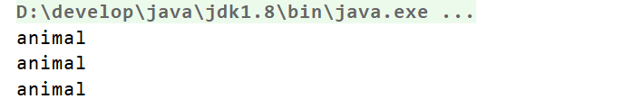
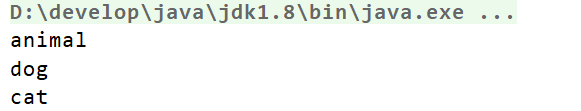

# 6，行为型模式

## 6.5 状态模式

### 6.5.1 概述

【例】通过按钮来控制一个电梯的状态，一个电梯有开门状态，关门状态，停止状态，运行状态。每一种状态改变，都有可能要根据其他状态来更新处理。例如，如果电梯门现在处于运行时状态，就不能进行开门操作，而如果电梯门是停止状态，就可以执行开门操作。

类图如下：


代码如下：

```java
/**
 * @version v1.0
 * @ClassName: ILift
 * @Description: 电梯接口
 * @Author: 黑马程序员
 */
public interface ILift {

    //定义四个电梯状态的常量
    int OPENING_STATE = 1;
    int CLOSING_STATE = 2;
    int RUNNING_STATE = 3;
    int STOPPING_STATE = 4;

    //设置电梯状态的功能
    void setState(int state);

    //电梯操作功能
    void open();

    void close();

    void run();

    void stop();
}
```


```java
/**
 * @version v1.0
 * @ClassName: Lift
 * @Description: 电梯类(ILift的子实现类)
 * @Author: 黑马程序员
 */
public class Lift implements ILift {

    //声明一个记录当前电梯的状态
    private int state;

    public void setState(int state) {
        this.state = state;
    }

    public void open() {
        switch (this.state) { //当前电梯状态
            case OPENING_STATE :
                //什么事都不做
                break;
            case CLOSING_STATE :
                System.out.println("电梯打开了...");
                //设置当前电梯状态为开启状态
                setState(OPENING_STATE);
                break;
            case STOPPING_STATE :
                System.out.println("电梯打开了...");
                //设置当前电梯状态为开启状态
                setState(OPENING_STATE);
                break;
            case RUNNING_STATE :
                //什么事都不做
                break;
        }
    }

    public void close() {
        switch (this.state) {
            case OPENING_STATE:
                System.out.println("电梯关门了。。。");//只有开门状态可以关闭电梯门，可以对应电梯状态表来看
                this.setState(CLOSING_STATE);//关门之后电梯就是关闭状态了
                break;
            case CLOSING_STATE:
                //do nothing //已经是关门状态，不能关门
                break;
            case RUNNING_STATE:
                //do nothing //运行时电梯门是关着的，不能关门
                break;
            case STOPPING_STATE:
                //do nothing //停止时电梯也是关着的，不能关门
                break;
        }
    }

    public void run() {
        switch (this.state) {
            case OPENING_STATE://电梯不能开着门就走
                //do nothing
                break;
            case CLOSING_STATE://门关了，可以运行了
                System.out.println("电梯开始运行了。。。");
                this.setState(RUNNING_STATE);//现在是运行状态
                break;
            case RUNNING_STATE:
                //do nothing 已经是运行状态了
                break;
            case STOPPING_STATE:
                System.out.println("电梯开始运行了。。。");
                this.setState(RUNNING_STATE);
                break;
        }
    }

    public void stop() {
        switch (this.state) {
            case OPENING_STATE: //开门的电梯已经是是停止的了(正常情况下)
                //do nothing
                break;
            case CLOSING_STATE://关门时才可以停止
                System.out.println("电梯停止了。。。");
                this.setState(STOPPING_STATE);
                break;
            case RUNNING_STATE://运行时当然可以停止了
                System.out.println("电梯停止了。。。");
                this.setState(STOPPING_STATE);
                break;
            case STOPPING_STATE:
                //do nothing
                break;
        }
    }
}
```


```java
/**
 * @version v1.0
 * @ClassName: Client
 * @Description: TODO(一句话描述该类的功能)
 * @Author: 黑马程序员
 */

public class Client {
    public static void main(String[] args) {
         //创建电梯对象
        Lift lift = new Lift();
        lift.setState(ILift.STOPPING_STATE);//电梯是停止的
        lift.open();//开门
        lift.close();//关门
        lift.run();//运行
        lift.stop();//停止
    }
}
```

问题分析：

* 使用了大量的switch…case这样的判断（if…else也是一样)，使程序的可阅读性变差。
* 扩展性很差。如果新加了断电的状态，我们需要修改上面判断逻辑


**定义：**

对有状态的对象，把复杂的“判断逻辑”提取到不同的状态对象中，允许状态对象在其内部状态发生改变时改变其行为。


### 6.5.2 结构

状态模式包含以下主要角色。

* 环境（Context）角色：也称为上下文，它定义了客户程序需要的接口，**维护一个当前状态**，**并将与状态相关的操作委托给当前状态对象来处理**。
* 抽象状态（State）角色：定义一个接口，用以封装环境对象中的特定状态所对应的行为。
* 具体状态（Concrete  State）角色：实现抽象状态所对应的行为。

懂了 把类拆开  类中的方法分别实现各自状态的方法 在Context 设置状态类 再通过状态类去调用类中方法

### 6.5.3 案例实现

对上述电梯的案例使用状态模式进行改进。类图如下：


代码如下：

```java
/**
 * @version v1.0
 * @ClassName: LiftState
 * @Description: 抽象状态类
 * @Author: 黑马程序员
 */
public abstract class LiftState {

    //声明环境角色类变量 组合进来
    protected Context context;

    public void setContext(Context context) {
        this.context = context;
    }

    //电梯开启操作
    public abstract void open();

    //电梯关闭操作
    public abstract void close();

    //电梯运行操作
    public abstract void run();

    //电梯停止操作
    public abstract void stop();
}
```

 ClosingState 

```java
/**
 * @version v1.0
 * @ClassName: OpeningState
 * @Description: 电梯关闭状态类
 * @Author: 黑马程序员
 */
public class ClosingState extends LiftState {
    @Override
    //电梯门关闭，这是关闭状态要实现的动作
    public void close() {
        System.out.println("电梯门关闭...");
    }

    //电梯门关了再打开，逗你玩呢，那这个允许呀
    @Override
    public void open() {
        super.context.setLiftState(Context.OPENING_STATE);
        super.context.open();
    }


    //电梯门关了就跑，这是再正常不过了
    @Override
    public void run() {
        super.context.setLiftState(Context.RUNNING_STATE);
        super.context.run();
    }

    //电梯门关着，我就不按楼层
    @Override
    public void stop() {
        super.context.setLiftState(Context.STOPPING_STATE);
        super.context.stop();
    }
}
```

OpeningState

```java
/**
 * @version v1.0
 * @ClassName: OpeningState
 * @Description: 电梯开启状态类
 * @Author: 黑马程序员
 */
public class OpeningState extends LiftState {
    //当前状态要执行的方法
    public void open() {
        System.out.println("电梯开启。。。");
    }

    public void close() {
        //修改状态
        super.context.setLiftState(Context.CLOSING_STATE);
        //调用当前状态中的context中的close方法
        super.context.close();
    }

    public void run() {
        //什么都不做
    }

    public void stop() {
        //什么都不做
    }
}
```

RunningState

```java
/**
 * @version v1.0
 * @ClassName: OpeningState
 * @Description: 电梯运行状态类
 * @Author: 黑马程序员
 */
public class RunningState extends LiftState {
    //运行的时候开电梯门？你疯了！电梯不会给你开的
    @Override
    public void open() {
        //do nothing
    }

    //电梯门关闭？这是肯定了
    @Override
    public void close() {//虽然可以关门，但这个动作不归我执行
        //do nothing
    }

    //这是在运行状态下要实现的方法
    @Override
    public void run() {
        System.out.println("电梯正在运行...");
    }

    //这个事绝对是合理的，光运行不停止还有谁敢做这个电梯？！估计只有上帝了
    @Override
    public void stop() {
        super.context.setLiftState(Context.STOPPING_STATE);
        super.context.stop();
    }
}
```

StoppingState 

```java
/**
 * @version v1.0
 * @ClassName: OpeningState
 * @Description: 电梯停止状态类
 * @Author: 黑马程序员
 */
public class StoppingState extends LiftState {
    //停止状态，开门，那是要的！
    @Override
    public void open() {
        //状态修改
        super.context.setLiftState(Context.OPENING_STATE);
        //动作委托为CloseState来执行，也就是委托给了ClosingState子类执行这个动作
        super.context.getLiftState().open();
    }

    @Override
    public void close() {//虽然可以关门，但这个动作不归我执行
        //状态修改
        super.context.setLiftState(Context.CLOSING_STATE);
        //动作委托为CloseState来执行，也就是委托给了ClosingState子类执行这个动作
        super.context.getLiftState().close();
    }

    //停止状态再跑起来，正常的很
    @Override
    public void run() {
        //状态修改
        super.context.setLiftState(Context.RUNNING_STATE);
        //动作委托为CloseState来执行，也就是委托给了ClosingState子类执行这个动作
        super.context.getLiftState().run();
    }

    //停止状态是怎么发生的呢？当然是停止方法执行了
    @Override
    public void stop() {
        System.out.println("电梯停止了...");
    }
}
```

Context 

```java
/**
 * @version v1.0
 * @ClassName: Context
 * @Description: 环境角色类
 * @Author: 黑马程序员
 */
public class Context {

    //定义对应状态对象的常量
    public final static OpeningState OPENING_STATE = new OpeningState();
    public final static ClosingState CLOSING_STATE = new ClosingState();
    public final static RunningState RUNNING_STATE = new RunningState();
    public final static StoppingState STOPPING_STATE = new StoppingState();

    //定义一个当前电梯状态变量  组合
    private LiftState liftState;

    public LiftState getLiftState() {
        return liftState;
    }

    //设置当前状态对象
    public void setLiftState(LiftState liftState) {
        this.liftState = liftState;
        //设置当前状态对象中的Context对象
        this.liftState.setContext(this);
    }
	//调用状态的方法
    public void open() {
        this.liftState.open();
    }
	//调用状态的方法
    public void close() {
        this.liftState.close();
    }
	//调用状态的方法
    public void run() {
        this.liftState.run();
    }
	//调用状态的方法
    public void stop() {
        this.liftState.stop();
    }
}

```

尚硅谷案例：

状态（State）模式：对有状态的对象，把复杂的“判断逻辑”提取到不同的状态对象中，允许状态对象在其内部状态发生改变时改变其行为。


状态模式包含以下主要角色。

- 环境类（Context）角色：也称为上下文，它定义了客户端需要的接口，内部维护一个当前状态，并负责具体状态的切换。
- 抽象状态（State）角色：定义一个接口，用以封装环境对象中的特定状态所对应的行为，可以有一个或多个行为。
- 具体状态（Concrete State）角色：实现抽象状态所对应的行为，并且在需要的情况下进行状态切换。

```java
// TODO 抽象状态
public interface TeamState {

    //玩游戏
    void playGame();

    //TODO 状态模式的核心 切换到下一个状态
    TeamState next();
}
```

MatchState

```java
/**
 * 竞赛状态
 */
public class MatchState implements TeamState{
    @Override
    public void playGame() {
        System.out.println("全力以赴打比赛....");
    }


    //TODO 状态模式的核心  BeafNodleState->MatchState->VocationState
    @Override
    public TeamState next() {
        return new VocationState();
    }
}
```

 BeafNodleState 

```java
/**
 * 吃牛肉面状态
 */
public class BeafNodleState implements TeamState {

    @Override
    public void playGame() {
        System.out.println("饱饱的一顿牛肉面......中了诅咒，输了");
    }

    //TODO 状态模式的核心 切换到下一个状态 BeafNodleState->MatchState->VocationState
    @Override
    public TeamState next() {
        return new MatchState();
    }
}
```

 VocationState 

```
/**
 * 休假状态
 */
public class VocationState implements TeamState {
    @Override
    public void playGame() {
        System.out.println("三亚旅游真舒服....饿了...不玩游戏");
        //状态流转
    }

    //TODO 状态模式的核心 切换到下一个状态 BeafNodleState->MatchState->VocationState
    @Override
    public TeamState next() {
        return new BeafNodleState();
    }
}
```

SKTTeam

```java
//TODO 环境类  也可以理解为上下文
public class SKTTeam {

    private TeamState teamState;

    public void setTeamState(TeamState teamState) {
        this.teamState = teamState;
    }

    //开始游戏
    public void startGame(){
        //状态不同会导致不同的游戏结果
        this.teamState.playGame();
    }


    //TODO  与策略模式不同 要有状态的流转
    // 切换下一个状态
    void nextState(){
       this.teamState = teamState.next();
    }
}
```

MainTest

```java
/**
 * 状态切换
 */
public class MainTest {
    public static void main(String[] args) {
        SKTTeam sktTeam = new SKTTeam();
        TeamState state = new VocationState();
        sktTeam.setTeamState(state);
        sktTeam.startGame();


        sktTeam.startGame();
        sktTeam.nextState();

        sktTeam.startGame();
        sktTeam.nextState();
        sktTeam.startGame();


        state = state.next();
        sktTeam.setTeamState(state);
        sktTeam.startGame();


        //TODO 状态需要维护自己的切换逻辑
        state = state.next();
        sktTeam.setTeamState(state);
        sktTeam.startGame();
    }
}
```

### 6.5.4 优缺点

**1，优点：**

* 将所有与某个状态有关的行为放到一个类中，并且可以方便地增加新的状态，只需要改变对象状态即可改变对象的行为。
* 允许状态转换逻辑与状态对象合成一体，而不是某一个巨大的条件语句块。

**2，缺点：**

* 状态模式的使用必然会增加系统类和对象的个数。 
* 状态模式的结构与实现都较为复杂，如果使用不当将导致程序结构和代码的混乱。
* 状态模式对"开闭原则"的支持并不太好。


### 6.5.5 使用场景

- 当一个对象的行为取决于它的状态，并且它必须在运行时根据状态改变它的行为时，就可以考虑使用状态模式。
- 一个操作中含有庞大的分支结构，并且这些分支决定于对象的状态时。


什么场景用到？

- 策略模式和状态模式是一样的？
- 状态模式核心需要具体状态类能在必要的时候切换状态
- 流程框架与状态机
- ......


## 6.6 观察者模式

### 6.6.1 概述

**定义：**

又被称为发布-订阅（Publish/Subscribe）模式，它定义了一种一对多的依赖关系，让多个观察者对象同时监听某一个主题对象。这个主题对象在状态变化时，会通知所有的观察者对象，使他们能够自动更新自己。


### 6.6.2 结构

在观察者模式中有如下角色：

* Subject：抽象主题（抽象被观察者），**抽象主题角色把所有观察者对象保存在一个集合里(不能定义在接口)**，每个主题都可以有任意数量的观察者，抽象主题提供一个接口，可以增加和删除观察者对象。
* ConcreteSubject：具体主题（具体被观察者），该角色将有关状态存入具体观察者对象，在具体主题的内部状态发生改变时，给所有注册过的观察者发送通知。
* Observer：抽象观察者，是观察者的抽象类，它定义了一个更新接口，使得在得到主题更改通知时更新自己。
* ConcrereObserver：具体观察者，实现抽象观察者定义的更新接口，**以便在得到主题更改通知时更新自身的状态。**


### 6.6.3 案例实现

【例】微信公众号

在使用微信公众号时，大家都会有这样的体验，当你关注的公众号中有新内容更新的话，它就会推送给关注公众号的微信用户端。我们使用观察者模式来模拟这样的场景，微信用户就是观察者，微信公众号是被观察者，有多个的微信用户关注了程序猿这个公众号。

类图如下：


代码如下：

定义抽象观察者类，里面定义一个更新的方法

```java
/**
 * @version v1.0
 * @ClassName: Observer
 * @Description: 抽象观察者类
 * @Author: 黑马程序员
 */
public interface Observer {

    void update(String message);
}
```

定义具体观察者类，微信用户是观察者，里面实现了更新的方法

```java
/**
 * @version v1.0
 * @ClassName: WeiXinUser
 * @Description: 具体的观察者角色类
 * @Author: 黑马程序员
 */
public class WeiXinUser implements Observer {

    private String name;

    public WeiXinUser(String name) {
        this.name = name;
    }

    public void update(String message) {
        System.out.println(name + "-" + message);
    }
}

```

定义抽象主题类，提供了attach、detach、notify三个方法

```java
/**
 * @version v1.0
 * @ClassName: Subject
 * @Description: 抽象主题角色类
 * @Author: 黑马程序员
 */
public interface Subject {

    //添加订阅者（添加观察者对象）
    void attach(Observer observer);

    //删除订阅者
    void detach(Observer observer);

    //通知订阅者更新消息
    void notify(String message);
}

```

微信公众号是具体主题（具体被观察者），里面存储了订阅该公众号的微信用户，并实现了抽象主题中的方法

```java
/**
 * @version v1.0
 * @ClassName: SubscriptionSubject
 * @Description: 具体主题角色类
 * @Author: 黑马程序员
 */
public class SubscriptionSubject implements Subject {

    //定义一个集合，用来存储多个观察者对象
    private List<Observer> weiXinUserList = new ArrayList<Observer>();

    public void attach(Observer observer) {
        weiXinUserList.add(observer);
    }

    public void detach(Observer observer) {
        weiXinUserList.remove(observer);
    }

    public void notify(String message) {
        //遍历集合
        for (Observer observer : weiXinUserList) {
            //调用观察者对象中的update方法
            observer.update(message);
        }
    }
}

```

客户端程序

```java
/**
 * @version v1.0
 * @ClassName: Client
 * @Description: TODO(一句话描述该类的功能)
 * @Author: 黑马程序员
 */
public class Client {
    public static void main(String[] args) {
        //1,创建公众号对象
        SubscriptionSubject subject = new SubscriptionSubject();

        //2,订阅公众号
        subject.attach(new WeiXinUser("孙悟空"));
        subject.attach(new WeiXinUser("猪悟能"));
        subject.attach(new WeiXinUser("沙悟净"));

        //3,公众号更新，发出消息给订阅者（观察者对象）
        subject.notify("传智黑马的专栏更新了！");
    }
}

```

尚硅谷案例：

观察者模式(Observer Pattern)：定义对象间的一种一对多依赖关系，使得每当一个对象状态发生改变时，其相关依赖对象皆得到通知并被自动更新。观察者模式又叫做发布-订阅（Publish/Subscribe）模式、模型-视图（Model/View）模式、源-监听器（Source/Listener）模式或从属者（Dependents）模式。对象行为型模式


Subject: 目标

ConcreteSubject: 具体目标

Observer: 观察者

ConcreteObserver: 具体观察者

```java
/**
 * 抽象观察者
 */
public abstract class AbstractFans {
    //TODO  想要 主播观察粉丝 那么 要有一个主播列表
    List<AbstractTikToker> tikTokers;

    //TODO 粉丝要有一个接收消息的方法
    abstract void acceptMsg(String msg);

    //TODO 关注主播的方法
    void follow(AbstractTikToker tikToker){
        //TODO 主播增粉了  调用主播的添加粉丝方法
        tikToker.addFans(this);
    }

}
```

AbstractTikToker

```java
/**
 * 抖音主播
 *
 * TODO 也可以实现粉丝观察主播....
 */
public abstract class AbstractTikToker {

    //TODO 添加粉丝
    abstract void addFans(AbstractFans fans);

    //TODO 通知粉丝
    abstract void notifyFans(String msg);
}
```

MMTikToker

```java
/**
 * 主播 被关注者
 * 也可以实现 双向观察
 */
public class MMTikToker  extends AbstractTikToker{

    //TODO 1、观察者的核心1
    List<AbstractFans> fansList = new ArrayList<>();

    //TODO 主播自己的方法
    void startSell() {
        System.out.println("雷丰阳... 开始卖货...源码设计课");
        notifyFans("我开始卖东西了，是源码设计课，只要666");
    }
    void endSell() {
        System.out.println("雷丰阳... 结束卖货...源码设计课");
        notifyFans("课已经卖完了，记得五星好评...");
    }


    @Override
    void addFans(AbstractFans fans) {
        fansList.add(fans);
    }

    //TODO 通知所有观察者 也是观察者的核心方法
    @Override
    void notifyFans(String msg) {
        //TODO 1、所有粉丝拿来通知
        for (AbstractFans fans : fansList) {
            //TODO 粉丝要有一个接收消息的方法
            fans.acceptMsg(msg);
        }
    }
}
```

RobotFans

```java
public class RobotFans extends AbstractFans {
    @Override
    void acceptMsg(String msg) {
        System.out.println("呸....");
    }
}
```

HumanFans

```java
public class HumanFans extends AbstractFans {
    @Override
    void acceptMsg(String msg) {
        System.out.println("主播说："+msg);
    }
}
```

MainTest

```java
public class MainTest {
    public static void main(String[] args) {
        MMTikToker lei = new MMTikToker();

        lei.startSell();

        RobotFans fans1 = new RobotFans();
        RobotFans fans2 = new RobotFans();
        RobotFans fans3 = new RobotFans();
        fans1.follow(lei);
        fans2.follow(lei);
        fans3.follow(lei);

        HumanFans humanFans = new HumanFans();
        humanFans.follow(lei);

        System.out.println("=====>");


        lei.endSell();
    }
}
```

### 6.6.4 优缺点

**1，优点：**

* 降低了目标与观察者之间的耦合关系，两者之间是抽象耦合关系。
* 被观察者发送通知，所有注册的观察者都会收到信息【可以实现广播机制】

**2，缺点：**

* 如果观察者非常多的话，那么所有的观察者收到被观察者发送的通知会耗时
* 如果被观察者有循环依赖的话，那么被观察者发送通知会使观察者循环调用，会导致系统崩溃


### 6.6.5 使用场景

* 对象间存在一对多关系，一个对象的状态发生改变会影响其他对象。
* 当一个抽象模型有两个方面，其中一个方面依赖于另一方面时。


什么场景用到？

- Spring事件机制如何实现？
- Vue的双向绑定核心
- 响应式编程核心思想
- ......


### 6.6.6 JDK中提供的实现

在 Java 中，通过 java.util.Observable 类和 java.util.Observer 接口定义了观察者模式，只要实现它们的子类就可以编写观察者模式实例。

**1，Observable类**

Observable 类是抽象目标类（被观察者），它有一个 Vector 集合成员变量，用于保存所有要通知的观察者对象，下面来介绍它最重要的 3 个方法。

* void addObserver(Observer o) 方法：用于将新的观察者对象添加到集合中。

* void notifyObservers(Object arg) 方法：调用集合中的所有观察者对象的 update方法，通知它们数据发生改变。通常越晚加入集合的观察者越先得到通知。

* void setChange() 方法：用来设置一个 boolean 类型的内部标志，注明目标对象发生了变化。当它为true时，notifyObservers() 才会通知观察者。

**2，Observer 接口**

Observer 接口是抽象观察者，它监视目标对象的变化，当目标对象发生变化时，观察者得到通知，并调用 update 方法，进行相应的工作。

【例】警察抓小偷

警察抓小偷也可以使用观察者模式来实现，警察是观察者，小偷是被观察者。代码如下：

小偷是一个被观察者，所以需要继承Observable类

```java
public class Thief extends Observable {

    private String name;

    public Thief(String name) {
        this.name = name;
    }
    
    public void setName(String name) {
        this.name = name;
    }

    public String getName() {
        return name;
    }

    public void steal() {
        System.out.println("小偷：我偷东西了，有没有人来抓我！！！");
        super.setChanged(); //changed  = true
        super.notifyObservers();
    }
}

```

警察是一个观察者，所以需要让其实现Observer接口

```java
public class Policemen implements Observer {

    private String name;

    public Policemen(String name) {
        this.name = name;
    }
    public void setName(String name) {
        this.name = name;
    }

    public String getName() {
        return name;
    }

    @Override
    public void update(Observable o, Object arg) {
        System.out.println("警察：" + ((Thief) o).getName() + "，我已经盯你很久了，你可以保持沉默，但你所说的将成为呈堂证供！！！");
    }
}
```

客户端代码

```java
public class Client {
    public static void main(String[] args) {
        //创建小偷对象
        Thief t = new Thief("隔壁老王");
        //创建警察对象
        Policemen p = new Policemen("小李");
        //让警察盯着小偷
        t.addObserver(p);
        //小偷偷东西
        t.steal();
    }
}
```


## 6.7 中介者模式

### 6.7.1 概述

一般来说，同事类之间的关系是比较复杂的，多个同事类之间互相关联时，他们之间的关系会呈现为复杂的网状结构，这是一种过度耦合的架构，即不利于类的复用，也不稳定。例如在下左图中，有六个同事类对象，假如对象1发生变化，那么将会有4个对象受到影响。如果对象2发生变化，那么将会有5个对象受到影响。也就是说，同事类之间直接关联的设计是不好的。

如果引入中介者模式，那么同事类之间的关系将变为星型结构，从下右图中可以看到，任何一个类的变动，只会影响的类本身，以及中介者，这样就减小了系统的耦合。**一个好的设计，必定不会把所有的对象关系处理逻辑封装在本类中，而是使用一个专门的类来管理那些不属于自己的行为。**


**定义：**

又叫调停模式，定义一个中介角色来封装一系列对象之间的交互，使原有对象之间的耦合松散，且可以独立地改变它们之间的交互。


### 6.7.2 结构

中介者模式包含以下主要角色：

* 抽象中介者（Mediator）角色：它是中介者的接口，**提供了同事对象注册与转发同事对象信息的抽象方法。**

* 具体中介者（ConcreteMediator）角色：实现中介者接口，定义一个 List 来管理同事对象，协调各个同事角色之间的交互关系，因此它依赖于同事角色。
* 抽象同事类（Colleague）角色：定义同事类的接口，保存中介者对象，提供同事对象交互的抽象方法，实现所有相互影响的同事类的公共功能。
* 具体同事类（Concrete Colleague）角色：是抽象同事类的实现者，当需要与其他同事对象交互时，由中介者对象负责后续的交互。


### 6.7.3 案例实现

【例】租房

现在租房基本都是通过房屋中介，房主（同事类）将房屋托管给房屋中介，而租房者（同事类）从房屋中介获取房屋信息。房屋中介充当租房者与房屋所有者之间的中介者。

类图如下：


代码如下：

```java
/**
 * @version v1.0
 * @ClassName: Mediator
 * @Description: 抽象中介者类
 * @Author: 黑马程序员
 */
public abstract class Mediator {

    public abstract void constact(String message,Person person);
}
```

Person

```java
/**
 * @version v1.0
 * @ClassName: Person
 * @Description: 抽象同事类
 * @Author: 黑马程序员
 */
public abstract class Person {

    protected String name;
    //把中介者组合进来
    protected Mediator mediator;

    public Person(String name, Mediator mediator) {
        this.name = name;
        this.mediator = mediator;
    }
}
```

HouseOwner

```java
/**
 * @version v1.0
 * @ClassName: HouseOwner
 * @Description: 具体的同事角色类
 * @Author: 黑马程序员
 */
public class HouseOwner extends Person {

    public HouseOwner(String name, Mediator mediator) {
        super(name, mediator);
    }

    //和中介联系（沟通）
    public void constact(String message) {
        mediator.constact(message,this);
    }

    //从中介者获取信息
    public void getMessage(String message) {
        System.out.println("房主" + name + "获取到的信息是：" + message);
    }
}
```

 Tenant

```java
/**
 * @version v1.0
 * @ClassName: Tenant
 * @Description: 具体的同事角色类
 * @Author: 黑马程序员
 */
public class Tenant extends Person {
    public Tenant(String name, Mediator mediator) {
        super(name, mediator);
    }

    //和中介联系（沟通）
    public void constact(String message) {
        mediator.constact(message,this);
    }

    //获取信息
    public void getMessage(String message) {
        System.out.println("租房者" + name + "获取到的信息是：" + message);
    }
}
```

 MediatorStructure 

```java
/**
 * @version v1.0
 * @ClassName: MediatorStructure
 * @Description: 具体的中介者角色类
 * @Author: 黑马程序员
 */
public class MediatorStructure extends Mediator {
	//首先中介结构必须知道所有房主和租房者的信息
    //聚合房主和租房者对象 ==> 聚合同事类对象
    private HouseOwner houseOwner;
    private Tenant tenant;

    public HouseOwner getHouseOwner() {
        return houseOwner;
    }

    public void setHouseOwner(HouseOwner houseOwner) {
        this.houseOwner = houseOwner;
    }

    public Tenant getTenant() {
        return tenant;
    }

    public void setTenant(Tenant tenant) {
        this.tenant = tenant;
    }

    public void constact(String message, Person person) {
        if(person == houseOwner) {  //如果是房主，则租房者获得信息
            tenant.getMessage(message);
        } else { //反正则是房主获得信息
            houseOwner.getMessage(message);
        }
    }
}
```

Client 

```java

//测试类
public class Client {
    public static void main(String[] args) {
        //一个房主、一个租房者、一个中介机构
        MediatorStructure mediator = new MediatorStructure();

        //房主和租房者只需要知道中介机构即可
        HouseOwner houseOwner = new HouseOwner("张三", mediator);
        Tenant tenant = new Tenant("李四", mediator);

        //中介结构要知道房主和租房者
        mediator.setHouseOwner(houseOwner);
        mediator.setTenant(tenant);

        tenant.constact("需要租三室的房子");
        houseOwner.constact("我这有三室的房子，你需要租吗？");
    }
}
```

尚硅谷案例：


中介者模式(Mediator Pattern)：用一个中介对象来封装一系列的对象交互，中介者使各对象不需要显式地相互引用，减少对象间混乱的依赖关系，从而使其耦合松散，而且可以独立地改变它们之间的交互。对象行为型模式。

Mediator: 抽象中介者
ConcreteMediator: 具体中介者
Colleague: 抽象同事类
ConcreteColleague: 具体同事类


```
/**
 * 抽象机长
 */
public abstract class Captain {

    //起飞
    abstract void fly();
    //降落
    abstract void land();
    //完成
    abstract void success();

}
```

HU8778 

```
/**
 * 海南8778
 */
public class HU8778 extends Captain{

    //TODO 把中介者 组合进来
    ControlTower controlTower;

    public void setControlTower(ControlTower controlTower) {
        this.controlTower = controlTower;
    }

    @Override
    void fly() {
        System.out.println("HU8778请求起飞......");
        //TODO 问每个机长能否起飞？
        controlTower.acceptRequest(this,"fly");
    }

    @Override
    void land() {
        System.out.println("HU8778请求降落......");
        //TODO 问每个机长能否降落？
        controlTower.acceptRequest(this,"land");
    }

    @Override
    void success() {
        System.out.println("完成......");
        controlTower.acceptRequest(this,"success");
    }
}
```

 SC8633 

```
/**
 * 四川8633机长
 */
public class SC8633 extends Captain{

    //TODO 把中介者 组合进来
    ControlTower controlTower ;

    public void setControlTower(ControlTower controlTower) {
        this.controlTower = controlTower;
    }

    @Override
    void fly() {
        System.out.println("SC8633 请求起飞......");
        //TODO 问每个机长能否起飞？
        controlTower.acceptRequest(this,"fly");

    }

    @Override
    void land() {

        System.out.println("SC8633 请求降落......");
        //TODO 问每个机长能否降落？
        controlTower.acceptRequest(this,"land");
    }

    @Override
    void success() {
        System.out.println("SC8633 完成......");
        //TODO
        controlTower.acceptRequest(this,"success");
    }
}
```

XC9527

```
/**
 * 星星9527
 */
public class XC9527  extends Captain{
    @Override
    void fly() {
        System.out.println("XC9527请求起飞....");
    }

    @Override
    void land() {
        System.out.println("XC9527请求降落....");
    }

    @Override
    void success() {
        System.out.println("XC9527请求降落....");
    }
}
```

ControlTower

```java
/**
 *TODO
 *  塔台：中介者
 *  网状变为星状
 */
public class ControlTower {
    //TODO 是否可以使用跑道
    private boolean canDo = true;

    //接受请求...
    public void acceptRequest(Captain captain,String action){
        if("fly".equals(action)||"land".equals(action)){
            if(canDo == true){
                System.out.println("允许......");
                canDo = false;
            }else {
                System.out.println("不允许.....");
            }
        }
        if("success".equals(action)){
            canDo = true;
        }
    }
}
```

MainTest

```java

public class MainTest {
    public static void main(String[] args) {
        HU8778 hu8778 = new HU8778();
        SC8633 sc8633 = new SC8633();

        ControlTower tower = new ControlTower();
        //TODO 所有的机长 共用一个塔台
        hu8778.setControlTower(tower);
        sc8633.setControlTower(tower);

        hu8778.fly();

        hu8778.success();

        sc8633.fly();
    }
}
```

什么场景用到？

- SpringMVC 的 DispatcherServlet是一个中介者，他会提取Controller、Model、View来进行调用。而无需controller直接调用view之类的渲染方法
- 分布式系统中的网关
- 迪米特法则的一个典型应用
- 中介者和外观（门面）模式区别？
- 中介者双向操作，门面偏向于封装某一方
- .......

### 6.7.4 优缺点

**1，优点：**

* 松散耦合

  中介者模式通过把多个同事对象之间的交互封装到中介者对象里面，从而使得同事对象之间松散耦合，基本上可以做到互补依赖。这样一来，同事对象就可以独立地变化和复用，而不再像以前那样“牵一处而动全身”了。

* 集中控制交互

  多个同事对象的交互，被封装在中介者对象里面集中管理，使得这些交互行为发生变化的时候，只需要修改中介者对象就可以了，当然如果是已经做好的系统，那么就扩展中介者对象，而各个同事类不需要做修改。

* 一对多关联转变为一对一的关联

  没有使用中介者模式的时候，同事对象之间的关系通常是一对多的，引入中介者对象以后，中介者对象和同事对象的关系通常变成双向的一对一，这会让对象的关系更容易理解和实现。

**2，缺点：**

当同事类太多时，中介者的职责将很大，它会变得复杂而庞大，以至于系统难以维护。


### 6.7.5 使用场景

* 系统中对象之间存在复杂的引用关系，系统结构混乱且难以理解。
* 当想创建一个运行于多个类之间的对象，又不想生成新的子类时。


## 6.8 迭代器模式

### 6.8.1 概述

**定义：**

提供一个对象来顺序访问聚合对象中的一系列数据，而不暴露聚合对象的内部表示。 


### 6.8.2 结构

迭代器模式主要包含以下角色：

* 抽象聚合（Aggregate）角色：定义存储、添加、删除聚合元素以及创建迭代器对象的接口。

* 具体聚合（ConcreteAggregate）角色：实现抽象聚合类，返回一个具体迭代器的实例。
* 抽象迭代器（Iterator）角色：定义访问和遍历聚合元素的接口，通常包含 hasNext()、next() 等方法。
* 具体迭代器（Concretelterator）角色：实现抽象迭代器接口中所定义的方法，完成对聚合对象的遍历，记录遍历的当前位置。


### 6.8.3 案例实现

【例】定义一个可以存储学生对象的容器对象，将遍历该容器的功能交由迭代器实现，涉及到的类如下：


代码如下：

定义迭代器接口，声明hasNext、next方法

```java
public interface StudentIterator {
    boolean hasNext();
    Student next();
}
```

定义具体的迭代器类，重写所有的抽象方法

```java
public class StudentIteratorImpl implements StudentIterator {
    private List<Student> list;
    private int position = 0;

    public StudentIteratorImpl(List<Student> list) {
        this.list = list;
    }

    @Override
    public boolean hasNext() {
        return position < list.size();
    }

    @Override
    public Student next() {
        Student currentStudent = list.get(position);
        position ++;
        return currentStudent;
    }
}
```

定义抽象容器类，包含添加元素，删除元素，获取迭代器对象的方法

```java
public interface StudentAggregate {
    void addStudent(Student student);

    void removeStudent(Student student);

    StudentIterator getStudentIterator();
}
```

定义具体的容器类，重写所有的方法

```java
public class StudentAggregateImpl implements StudentAggregate {

    private List<Student> list = new ArrayList<Student>();  // 学生列表

    @Override
    public void addStudent(Student student) {
        this.list.add(student);
    }

    @Override
    public void removeStudent(Student student) {
        this.list.remove(student);
    }

    @Override
    public StudentIterator getStudentIterator() {
        return new StudentIteratorImpl(list);
    }
}
```

尚硅谷案例：

迭代器（Iterator）模式：提供一个对象(迭代器)来顺序访问聚合对象(迭代数据)中的一系列数据，而不暴露聚合对象的内部表示。对象行为型模式

抽象聚合（Aggregate）角色：

定义存储、添加、删除聚合对象以及创建迭代器对象的接口。

具体聚合（ConcreteAggregate）角色：

实现抽象聚合类，返回一个具体迭代器的实例。

抽象迭代器（Iterator）角色：

定义访问和遍历聚合元素的接口，通常包含 hasNext()、first()、next() 等方法。

具体迭代器（Concretelterator）角色：

实现抽象迭代器接口中所定义的方法，完成对聚合对象的遍历，记录遍历的当前位置。


Itr

```java
// 抽象迭代器，写在外部该怎么写？
interface Itr {
    //有没有下一个
    boolean hasNext();
    //返回下一个
    String next();

    //返回初恋（第一个）
    String firstLove();

    //返回现任（最后一个女朋友）
    String current();
}
```

Iterator

```java
//具体迭代器
class Iterator implements Itr{
   private int cursor = 0; //当前指针

   public boolean hasNext(){
       return cursor < girlFriends.size();
   }

   public String next(){
       //第一次调用返回第一个数据
       //下一次再调用自动访问下一个数据
       String s = girlFriends.get(cursor);
       cursor++;
       return s;
   }

    @Override
    public String firstLove() {
        return girlFriends.get(0);
    }

    @Override
    public String current() {
        return girlFriends.get(girlFriends.size()-1);
    }
}
```

BeautifulMan

```java
/**
 * 抽象聚合类
 */
public abstract class BeautifulMan {

    //TODO 不方便暴露给外界的集合。只允许外界获取而不可以操作
    private List<String> girlFriends = new ArrayList<>();
    //TODO 降到女朋友
    void likeYou(String name){
        girlFriends.add(name);
    };
    //TODO 分手
    void sayBye(String name){
        girlFriends.remove(name);
    };

    // 获取迭代器
    public Itr getIterator(){
        return new Iterator();
    }

}
```

 Man 

```java
//实现类
public class Man extends BeautifulMan{
    
}
```

MainTest

```java
public class MainTest {
    public static void main(String[] args) {

        Man cheng = new Man();

        cheng.likeYou("王刚");
        cheng.likeYou("李强");
        cheng.likeYou("赵根");

        BeautifulMan.Itr itr = cheng.getIterator();
        String s = itr.firstLove();
        System.out.println(s);

        String current = itr.current();
        System.out.println(current);

        System.out.println("=================");
        while (itr.hasNext()){
            String next = itr.next();
            System.out.println(next);
        }
    }
}
```

### 6.8.4 优缺点

**1，优点：**

* 它支持以不同的方式遍历一个聚合对象，在同一个聚合对象上可以定义多种遍历方式。在迭代器模式中只需要用一个不同的迭代器来替换原有迭代器即可改变遍历算法，我们也可以自己定义迭代器的子类以支持新的遍历方式。
* 迭代器简化了聚合类。由于引入了迭代器，在原有的聚合对象中不需要再自行提供数据遍历等方法，这样可以简化聚合类的设计。
* 在迭代器模式中，由于引入了抽象层，增加新的聚合类和迭代器类都很方便，无须修改原有代码，满足 “开闭原则” 的要求。

**2，缺点：**

增加了类的个数，这在一定程度上增加了系统的复杂性。


### 6.8.5 使用场景

* 当需要为聚合对象提供多种遍历方式时。
* 当需要为遍历不同的聚合结构提供一个统一的接口时。
* 当访问一个聚合对象的内容而无须暴露其内部细节的表示时。


什么场景用到？

- jdk容器接口的Iterator定义
- 现实开发中，我们几乎无需编写迭代器，基本数据结构链表、树、图的迭代器已经都有了。除非要重写迭代逻辑
- ......


### 6.8.6 JDK源码解析

迭代器模式在JAVA的很多集合类中被广泛应用，接下来看看JAVA源码中是如何使用迭代器模式的。

```java
List<String> list = new ArrayList<>();
Iterator<String> iterator = list.iterator(); //list.iterator()方法返回的肯定是Iterator接口的子实现类对象
while (iterator.hasNext()) {
    System.out.println(iterator.next());
}
```

看完这段代码是不是很熟悉，与我们上面代码基本类似。单列集合都使用到了迭代器，我们以ArrayList举例来说明

- List：抽象聚合类
- ArrayList：具体的聚合类
- Iterator：抽象迭代器
- list.iterator()：返回的是实现了 `Iterator` 接口的具体迭代器对象

具体的来看看 ArrayList的代码实现

```java
public class ArrayList<E> extends AbstractList<E>
        implements List<E>, RandomAccess, Cloneable, java.io.Serializable {
    
    public Iterator<E> iterator() {
        return new Itr();
    }
    
    private class Itr implements Iterator<E> {
        int cursor;       // 下一个要返回元素的索引
        int lastRet = -1; // 上一个返回元素的索引
        int expectedModCount = modCount;

        Itr() {}
		
        //判断是否还有元素
        public boolean hasNext() {
            return cursor != size;
        }

        //获取下一个元素
        public E next() {
            checkForComodification();
            int i = cursor;
            if (i >= size)
                throw new NoSuchElementException();
            Object[] elementData = ArrayList.this.elementData;
            if (i >= elementData.length)
                throw new ConcurrentModificationException();
            cursor = i + 1;
            return (E) elementData[lastRet = i];
        }
        ...
}
```

这部分代码还是比较简单，大致就是在 `iterator` 方法中返回了一个实例化的 `Iterator` 对象。Itr是一个内部类，它实现了 `Iterator` 接口并重写了其中的抽象方法。

> 注意： 
>
> ​	当我们在使用JAVA开发的时候，想使用迭代器模式的话，只要让我们自己定义的容器类实现`java.util.Iterable`并实现其中的iterator()方法使其返回一个 `java.util.Iterator` 的实现类就可以了。


## 6.9 访问者模式

### 6.9.1 概述

**定义：**

封装一些作用于某种数据结构（就是对象结构）中的各元素的操作，它可以在不改变这个数据结构的前提下定义作用于这些元素的新的操作。


### 6.9.2 结构

访问者模式包含以下主要角色:

* 抽象访问者（Visitor）角色：定义了对每一个元素`（Element）`访问的行为**（方法）**，它的参数就是可以访问的元素，它的方法个数理论上来讲与元素类个数（Element的实现类个数）是一样的，从这点不难看出，访问者模式要求元素类的个数不能改变。
* 具体访问者（ConcreteVisitor）角色：给出对每一个元素类访问时所产生的具体行为。
* 抽象元素（Element）角色：定义了一个接受访问者的方法（`accept`），其意义是指，每一个元素都要可以被访问者访问。
* 具体元素（ConcreteElement）角色： 提供接受访问方法的具体实现，而这个具体的实现，通常情况下是使用访问者提供的访问该元素类的方法。
* 对象结构（Object Structure）角色：定义当中所提到的对象结构，对象结构是一个抽象表述，具体点可以理解为一个具有容器性质或者复合对象特性的类，它会含有一组元素（`Element`），并且可以迭代这些元素，供访问者访问。


### 6.9.3 案例实现

【例】给宠物喂食

现在养宠物的人特别多，我们就以这个为例，当然宠物还分为狗，猫等，要给宠物喂食的话，主人可以喂，其他人也可以喂食。

- 访问者角色：给宠物喂食的人
- 具体访问者角色：主人、其他人
- 抽象元素角色：动物抽象类
- 具体元素角色：宠物狗、宠物猫
- 结构对象角色：主人家

类图如下：


代码如下：

创建抽象访问者接口

```java
/**
 * @version v1.0
 * @ClassName: Person
 * @Description: 抽象访问者角色类
 * @Author: 黑马程序员
 */
public interface Person {
	//TODO 有几个元素 就有几个方法
    //喂食宠物狗
    void feed(Cat cat);
    //喂食宠物猫
    void feed(Dog dog);
}

```

创建不同的具体访问者角色（主人和其他人），都需要实现 `Person`接口

```java
/**
 * @version v1.0
 * @ClassName: Owner
 * @Description: 具体访问者角色类(自己)
 * @Author: 黑马程序员
 */
public class Owner implements Person {
	//给出对每一个元素类访问时所产生的具体行为。
    
    public void feed(Cat cat) {
        System.out.println("主人喂食猫");
    }

    public void feed(Dog dog) {
        System.out.println("主人喂食狗");
    }
}
```

Someone

```java
/**
 * @version v1.0
 * @ClassName: Owner
 * @Description: 具体访问者角色类(其他人)
 * @Author: 黑马程序员
 */
public class Someone implements Person {
    //给出对每一个元素类访问时所产生的具体行为。

    public void feed(Cat cat) {
        System.out.println("其他人喂食猫");
    }

    public void feed(Dog dog) {
        System.out.println("其他人喂食狗");
    }
}

```

定义抽象节点 -- 宠物

```java
/**
 * @version v1.0
 * @ClassName: Animal
 * @Description: 抽象元素角色类
 * @Author: 黑马程序员
 */
public interface Animal {

    //接受访问者访问的功能
    void accept(Person person);
}

```

定义实现`Animal`接口的 具体节点（元素）

```java
/**
 * @version v1.0
 * @ClassName: Cat
 * @Description: 具体元素角色类（宠物狗）
 * @Author: 黑马程序员
 */
public class Dog implements Animal {

    public void accept(Person person) {
        person.feed(this); //访问者给宠物猫喂食
        System.out.println("好好吃，汪汪汪。。。");
    }
}
```

Cat

```java
/**
 * @version v1.0
 * @ClassName: Cat
 * @Description: 具体元素角色类（宠物猫）
 * @Author: 黑马程序员
 */
public class Cat implements Animal {

    public void accept(Person person) {
        person.feed(this); //访问者给宠物猫喂食
        System.out.println("好好吃，喵喵喵。。。");
    }
}

```

定义对象结构，此案例中就是主人的家

```java
public class Home {
    private List<Animal> nodeList = new ArrayList<Animal>();

    public void action(Person person) {
        for (Animal node : nodeList) {
            node.accept(person);
        }
    }

    //添加操作
    public void add(Animal animal) {
        nodeList.add(animal);
    }
}

```

测试类

```java
/**
 * @version v1.0
 * @ClassName: Client
 * @Description: TODO(一句话描述该类的功能)
 * @Author: 黑马程序员
 */
public class Client {
    public static void main(String[] args) {
        //创建Home对象
        Home home = new Home();
        //添加元素到Home对象中
        home.add(new Dog());
        home.add(new Cat());

        //创建主人对象
        Owner owner = new Owner();
        //让主人喂食所有的宠物
        home.action(owner);
    }
}

```

尚硅谷案例：

访问者（Visitor）模式：将作用于某种数据结构（类）中的各元素（属性）的操作分离出来封装成独立的类，使其在不改变数据结构的前提下可以添加作用于这些元素的新的操作，为数据结构中的每个元素提供多种访问方式。它将对数据的操作与数据结构进行分离，是行为类模式中最复杂的一种模式。

抽象访问者（Visitor）角色：

定义一个访问具体元素的接口，为每个具体元素类对应一个访问操作 visit() ，该操作中的参数类型标识了被访问的具体元素。

具体访问者（ConcreteVisitor）角色：

实现抽象访问者角色中声明的各个访问操作，确定访问者访问一个元素时该做什么。

抽象元素（Element）角色：

声明一个包含接受操作 accept() 的接口，被接受的访问者对象作为 accept() 方法的参数。

具体元素（ConcreteElement）角色：

实现抽象元素角色提供的 accept() 操作，其方法体通常都是 visitor.visit(this) ，另外具体元素中可能还包含本身业务逻辑的相关操作。

对象结构（Object Structure）角色：

是一个包含元素角色的容器，提供让访问者对象遍历容器中的所有元素的方法，通常由 List、Set、Map 等聚合类实现。


```java
/**
 * 硬件   抽象元素类
 */
public  abstract class Hardware {
    String command;//封装硬件的处理指令

    public Hardware(String command){
        this.command = command;
    }
    
    //TODO 收到命令以后进行工作
    abstract public void work();

    //TODO 定义接受软件升级包的方法。这个方法应该具体硬件去实现
     abstract public void accept(Vistor vistor);
}
```

Vistor

```java
/**
 * TODO 升级包的接口  抽象访问者（Visitor）角色
 */
public interface Vistor {

    //访问者能访问元素。
    void visitDisk(Disk disk);

    void visitCPU(CPU cpu);

    void visitFoot(Foot foot);
}
```

UpdatePackage 

```java
/**
 * TODO 升级包可以更改指令 具体访问者（ConcreteVisitor）角色
 */
public class UpdatePackage implements Vistor{

    private String ext;
    
    public  UpdatePackage(String ext){
        this.ext = ext;
    }

    @Override
    public void visitDisk(Disk disk) {
        //TODO 访问Disk 修改其属性
        disk.command += " >>> "+ext;
    }

    @Override
    public void visitCPU(CPU cpu) {
        //TODO 访问cpu 修改其属性
        cpu.command += ">>>> "+ext;
        //装饰模式。改方法
    }

    @Override
    public void visitFoot(Foot foot) {
        foot.command += " >>>> "+ext;
    }
}
```

CPU

```java
public class CPU  extends Hardware{
    public CPU(String command) {
        super(command);
    }

    @Override
    public void work() {
        System.out.println("CPU处理指令："+command);
    }

    @Override
    public void accept(Vistor vistor) {
        //TODO 给升级包提供一个改CPU指令等信息的办法
        vistor.visitCPU(this);
    }

}
```

Disk

```java
public class Disk extends Hardware{
    public Disk(String command) {
        super(command);
    }

    @Override
    public void work() {
        System.out.println("Disk保存指令的历史记录："+command);
    }


    @Override
    public void accept(Vistor vistor) {
        vistor.visitDisk(this);
    }

}
```

 Foot

```java
public class Foot extends Hardware{
    public Foot(String command) {
        super(command);
    }

    @Override
    public void work() {
        System.out.println("脚处理指令："+command);
    }
    
    //元素需要接受一个访问者的访问
    @Override
    public void accept(Vistor vistor) {
        vistor.visitFoot(this);
    }
}
```

XiaoAi

```java
/**
 * 小爱机器人 对象结构（Object Structure）角色
 */
public class XiaoAi {

    private CPU cpu = new CPU("武汉天气");
    private Disk disk = new Disk("武汉天气");
    private Foot foot = new Foot("武汉天气");

    void answerQuestion(){
        cpu.work();
        disk.work();
        foot.work();
    }

    //TODO 接受升级包
    public void acceptUpdate(Vistor aPackage) {
		//升级CPU disk foot
        //访问模式 调用访问的方法
        aPackage.visitCPU(cpu);
        aPackage.visitDisk(disk);
        aPackage.visitFoot(foot);

    }
}
```

 MainTest

```java
public class MainTest {
    public static void main(String[] args) {

        XiaoAi xiaoAi = new XiaoAi();

        xiaoAi.answerQuestion();

        //TODO 升级。cpu联网处理指令
        //TODO 升级。disk保存到云存储
        UpdatePackage aPackage = new UpdatePackage("联网增强功能");
        xiaoAi.acceptUpdate(aPackage);

        //访问者
        xiaoAi.answerQuestion();

    }
}
```

### 6.9.4 优缺点

**1，优点：**

* 扩展性好

  在不修改对象结构中的元素的情况下，为对象结构中的元素添加新的功能。

* 复用性好

  通过访问者来定义整个对象结构通用的功能，从而提高复用程度。

* 分离无关行为

  通过访问者来分离无关的行为，把相关的行为封装在一起，构成一个访问者，这样每一个访问者的功能都比较单一。

**2，缺点：**

* 对象结构变化很困难

  在访问者模式中，每增加一个新的元素类，都要在每一个具体访问者类中增加相应的具体操作，这违背了“开闭原则”。

* 违反了依赖倒置原则

  访问者模式依赖了具体类，而没有依赖抽象类。


### 6.9.5  使用场景

* 对象结构相对稳定，但其操作算法经常变化的程序。

* 对象结构中的对象需要提供多种不同且不相关的操作，而且要避免让这些操作的变化影响对象的结构。

  

### 6.9.6 扩展

访问者模式用到了一种双分派的技术。

**1，分派：**

变量被声明时的类型叫做变量的静态类型，有些人又把静态类型叫做明显类型；而变量所引用的对象的真实类型又叫做变量的实际类型。比如 `Map map = new HashMap()` ，map变量的静态类型是 `Map` ，实际类型是 `HashMap` 。根据对象的类型而对方法进行的选择，就是分派(Dispatch)，分派(Dispatch)又分为两种，即静态分派和动态分派。

**静态分派(Static Dispatch)** 发生在编译时期，分派根据静态类型信息发生。静态分派对于我们来说并不陌生，方法重载就是静态分派。

**动态分派(Dynamic Dispatch)** 发生在运行时期，动态分派动态地置换掉某个方法。Java通过方法的重写支持动态分派。

**2，动态分派：**

通过方法的重写支持动态分派。

```java
public class Animal {
    public void execute() {
        System.out.println("Animal");
    }
}

public class Dog extends Animal {
    @Override
    public void execute() {
        System.out.println("dog");
    }
}

public class Cat extends Animal {
     @Override
    public void execute() {
        System.out.println("cat");
    }
}

public class Client {
   	public static void main(String[] args) {
        Animal a = new Dog();
        a.execute();
        
        Animal a1 = new Cat();
        a1.execute();
    }
}
```

上面代码的结果大家应该直接可以说出来，这不就是多态吗！运行执行的是子类中的方法。

Java编译器在编译时期并不总是知道哪些代码会被执行，因为编译器仅仅知道对象的静态类型，而不知道对象的真实类型；而方法的调用则是根据对象的真实类型，而不是静态类型。

**3，静态分派：**

通过方法重载支持静态分派。

```java
public class Animal {
}

public class Dog extends Animal {
}

public class Cat extends Animal {
}

public class Execute {
    public void execute(Animal a) {
        System.out.println("Animal");
    }

    public void execute(Dog d) {
        System.out.println("dog");
    }

    public void execute(Cat c) {
        System.out.println("cat");
    }
}

public class Client {
    public static void main(String[] args) {
        Animal a = new Animal();
        Animal a1 = new Dog();
        Animal a2 = new Cat();

        Execute exe = new Execute();
        exe.execute(a);
        exe.execute(a1);
        exe.execute(a2);
    }
}
```

运行结果：



这个结果可能出乎一些人的意料了，为什么呢？

**重载方法的分派是根据静态类型进行的，这个分派过程在编译时期就完成了。**

**4，双分派：**

所谓双分派技术就是在选择一个方法的时候，不仅仅要根据消息接收者（receiver）的运行时区别，还要根据参数的运行时区别。

```java
public class Animal {
    public void accept(Execute exe) {
        exe.execute(this);
    }
}

public class Dog extends Animal {
    public void accept(Execute exe) {
        exe.execute(this);
    }
}

public class Cat extends Animal {
    public void accept(Execute exe) {
        exe.execute(this);
    }
}

public class Execute {
    public void execute(Animal a) {
        System.out.println("animal");
    }

    public void execute(Dog d) {
        System.out.println("dog");
    }

    public void execute(Cat c) {
        System.out.println("cat");
    }
}

public class Client {
    public static void main(String[] args) {
        Animal a = new Animal();
        Animal d = new Dog();
        Animal c = new Cat();

        Execute exe = new Execute();
        a.accept(exe);
        d.accept(exe);
        c.accept(exe);
    }
}
```

在上面代码中，客户端将Execute对象做为参数传递给Animal类型的变量调用的方法，这里完成第一次分派，这里是方法重写，所以是动态分派，也就是执行实际类型中的方法，同时也`将自己this作为参数传递进去，这里就完成了第二次分派`，这里的Execute类中有多个重载的方法，而传递进行的是this，就是具体的实际类型的对象。

说到这里，我们已经明白双分派是怎么回事了，但是它有什么效果呢？就是可以实现方法的动态绑定，我们可以对上面的程序进行修改。

运行结果如下：



**双分派实现动态绑定的本质，就是在重载方法委派的前面加上了继承体系中覆盖的环节，由于覆盖是动态的，所以重载就是动态的了。**


## 6.10 备忘录模式

### 6.10.1 概述

备忘录模式提供了一种状态恢复的实现机制，使得用户可以方便地回到一个特定的历史步骤，当新的状态无效或者存在问题时，可以使用暂时存储起来的备忘录将状态复原，很多软件都提供了撤销（Undo）操作，如 Word、记事本、Photoshop、IDEA等软件在编辑时按 Ctrl+Z 组合键时能撤销当前操作，使文档恢复到之前的状态；还有在 浏览器 中的后退键、数据库事务管理中的回滚操作、玩游戏时的中间结果存档功能、数据库与操作系统的备份操作、棋类游戏中的悔棋功能等都属于这类。

**定义：**

又叫快照模式，在不破坏封装性的前提下，捕获一个对象的内部状态，并在该对象之外保存这个状态，以便以后当需要时能将该对象恢复到原先保存的状态。


### 6.10.2 结构

备忘录模式的主要角色如下：

* 发起人（Originator）角色：记录当前时刻的内部状态信息，**提供创建备忘录**和**恢复备忘录数据**的功能，实现其他业务功能，它可以访问备忘录里的所有信息。
* 备忘录（Memento）角色：负责存储发起人的内部状态，在需要的时候提供这些内部状态给发起人。
* 管理者（Caretaker）角色：对备忘录进行管理，提供保存与获取备忘录的功能，但其不能对备忘录的内容进行访问与修改。

> 备忘录有两个等效的接口：
>
> * **窄接口**：管理者(Caretaker)对象（和其他发起人对象之外的任何对象）看到的是备忘录的窄接口(narror Interface)，这个窄接口只允许他把备忘录对象传给其他的对象,但是不能访问备忘录。
> * **宽接口**：与管理者看到的窄接口相反，发起人对象可以看到一个宽接口(wide Interface)，这个宽接口允许它读取所有的数据，以便根据这些数据恢复这个发起人对象的内部状态。


### 6.10.3 案例实现

【例】游戏挑战BOSS

游戏中的某个场景，一游戏角色有生命力、攻击力、防御力等数据，在打Boss前和后一定会不一样的，我们允许玩家如果感觉与Boss决斗的效果不理想可以让游戏恢复到决斗之前的状态。

要实现上述案例，有两种方式：

* “白箱”备忘录模式
* “黑箱”备忘录模式


#### 6.10.3.1 “白箱”备忘录模式

备忘录角色对任何对象都提供一个接口，即宽接口，备忘录角色的内部所存储的状态就对所有对象公开。类图如下：


代码如下：

```java
/**
 * @version v1.0
 * @ClassName: GameRole
 * @Description: 游戏角色类(属于发起人角色)
 * @Author: 黑马程序员
 */
public class GameRole {

    private int vit; //生命力
    private int atk; //攻击力
    private int def; //防御力

    //初始化内部状态
    public void initState() {
        this.vit = 100;
        this.atk = 100;
        this.def = 100;
    }

    //战斗
    public void fight() {
        this.vit = 0;
        this.atk = 0;
        this.def = 0;
    }

    //保存角色状态功能 返回值就是备忘录对象
    public RoleStateMemento saveState() {
        return new RoleStateMemento(vit,atk,def);
    }

    //恢复角色状态
    public void recoverState(RoleStateMemento roleStateMemento) {
        //将备忘录对象中存储的状态赋值给当前对象的成员
        this.vit = roleStateMemento.getVit();
        this.atk = roleStateMemento.getAtk();
        this.def = roleStateMemento.getDef();
    }

    //展示状态功能
    public void stateDisplay() {
        System.out.println("角色生命力：" + vit);
        System.out.println("角色攻击力：" + atk);
        System.out.println("角色防御力：" + def);
    }

    public int getVit() {
        return vit;
    }

    public void setVit(int vit) {
        this.vit = vit;
    }

    public int getAtk() {
        return atk;
    }

    public void setAtk(int atk) {
        this.atk = atk;
    }

    public int getDef() {
        return def;
    }

    public void setDef(int def) {
        this.def = def;
    }
}
```

RoleStateMemento 

```java
/**
 * @version v1.0
 * @ClassName: RoleStateMemento
 * @Description: 备忘录角色类
 * @Author: 黑马程序员
 */
public class RoleStateMemento {

    private int vit; //生命力
    private int atk; //攻击力
    private int def; //防御力

    public RoleStateMemento(int vit, int atk, int def) {
        this.vit = vit;
        this.atk = atk;
        this.def = def;
    }

    public RoleStateMemento() {
    }

    public int getVit() {
        return vit;
    }

    public void setVit(int vit) {
        this.vit = vit;
    }

    public int getAtk() {
        return atk;
    }

    public void setAtk(int atk) {
        this.atk = atk;
    }

    public int getDef() {
        return def;
    }

    public void setDef(int def) {
        this.def = def;
    }
}
```

RoleStateCaretaker

```java
/**
 * @version v1.0
 * @ClassName: RoleStateCaretaker
 * @Description: 备忘录对象管理对象
 * @Author: 黑马程序员
 */
public class RoleStateCaretaker {

    //声明RoleStateMemento类型的变量 组合进来 用来存储备忘录 
    //也可以用其他数据结构
    private RoleStateMemento roleStateMemento;

    public RoleStateMemento getRoleStateMemento() {
        return roleStateMemento;
    }

    public void setRoleStateMemento(RoleStateMemento roleStateMemento) {
        this.roleStateMemento = roleStateMemento;
    }
}
```

 Client

```java
/**
 * @version v1.0
 * @ClassName: Client
 * @Description: TODO(一句话描述该类的功能)
 * @Author: 黑马程序员
 */
public class Client {
    public static void main(String[] args) {
        System.out.println("---------------大战boos前-----------------");
        //创建游戏角色对象
        GameRole gameRole = new GameRole();
        gameRole.initState();//初始化状态操作
        gameRole.stateDisplay();

        //将该游戏角色内部状态进行备份
        //创建管理者对象
        RoleStateCaretaker roleStateCaretaker = new RoleStateCaretaker();
        roleStateCaretaker.setRoleStateMemento(gameRole.saveState());

        System.out.println("---------------大战boos后-----------------");
        //损耗严重
        gameRole.fight();
        gameRole.stateDisplay();

        System.out.println("---------------恢复之前的状态-----------------");
        gameRole.recoverState(roleStateCaretaker.getRoleStateMemento());
        gameRole.stateDisplay();
    }
}

```

> 分析：白箱备忘录模式是破坏封装性的。但是通过程序员自律，同样可以在一定程度上实现模式的大部分用意。


#### 6.10.3.2 “黑箱”备忘录模式

备忘录角色对发起人对象提供一个宽接口，而为其他对象提供一个窄接口。在Java语言中，实现双重接口的办法就是将**备忘录类**设计成**发起人类**的内部成员类。

将 `RoleStateMemento` 设为 `GameRole` 的内部类，从而将 `RoleStateMemento` 对象封装在 `GameRole` 里面；在外面提供一个标识接口 `Memento` 给 `RoleStateCaretaker` 及其他对象使用。这样 `GameRole` 类看到的是 `RoleStateMemento` 所有的接口，而`RoleStateCaretaker`  及其他对象看到的仅仅是标识接口 `Memento` 所暴露出来的接口，从而维护了封装型。类图如下：


代码如下：

窄接口`Memento`，这是一个标识接口，因此没有定义出任何的方法

```java
/**
 * @version v1.0
 * @ClassName: Memento
 * @Description:  备忘录接口，对外提供窄接口
 * @Author: 黑马程序员
 */
public interface Memento {//标识接口 没有任何方法
}

```

定义发起人类 `GameRole`，并在内部定义备忘录内部类 `RoleStateMemento`（该内部类设置为私有的）

```java
/**
 * @version v1.0
 * @ClassName: GameRole
 * @Description: 游戏角色类(属于发起人角色)
 * @Author: 黑马程序员
 */
public class GameRole {

    private int vit; //生命力
    private int atk; //攻击力
    private int def; //防御力

    //初始化内部状态
    public void initState() {
        this.vit = 100;
        this.atk = 100;
        this.def = 100;
    }

    //战斗
    public void fight() {
        this.vit = 0;
        this.atk = 0;
        this.def = 0;
    }

    //保存角色状态功能
    public Memento saveState() {
        return new RoleStateMemento(vit,atk,def);
    }

    //恢复角色状态
    public void recoverState(Memento memento) {
        //强转
        RoleStateMemento roleStateMemento = (RoleStateMemento) memento;
        //将备忘录对象中存储的状态赋值给当前对象的成员
        this.vit = roleStateMemento.getVit();
        this.atk = roleStateMemento.getAtk();
        this.def = roleStateMemento.getDef();
    }

    //展示状态功能
    public void stateDisplay() {
        System.out.println("角色生命力：" + vit);
        System.out.println("角色攻击力：" + atk);
        System.out.println("角色防御力：" + def);
    }

    public int getVit() {
        return vit;
    }

    public void setVit(int vit) {
        this.vit = vit;
    }

    public int getAtk() {
        return atk;
    }

    public void setAtk(int atk) {
        this.atk = atk;
    }

    public int getDef() {
        return def;
    }

    public void setDef(int def) {
        this.def = def;
    }
	//定义私有化类 不让外界接触 实现窄接口
    private class RoleStateMemento implements Memento {
        private int vit; //生命力
        private int atk; //攻击力
        private int def; //防御力

        public RoleStateMemento(int vit, int atk, int def) {
            this.vit = vit;
            this.atk = atk;
            this.def = def;
        }

        public RoleStateMemento() {
        }

        public int getVit() {
            return vit;
        }

        public void setVit(int vit) {
            this.vit = vit;
        }

        public int getAtk() {
            return atk;
        }

        public void setAtk(int atk) {
            this.atk = atk;
        }

        public int getDef() {
            return def;
        }

        public void setDef(int def) {
            this.def = def;
        }
    }
}
```

负责人角色类 `RoleStateCaretaker` 能够得到的备忘录对象是以 `Memento` 为接口的，由于这个接口仅仅是一个标识接口，因此负责人角色不可能改变这个备忘录对象的内容

```java
/**
 * @version v1.0
 * @ClassName: RoleStateCaretaker
 * @Description: 备忘录对象管理对象
 * @Author: 黑马程序员
 */
public class RoleStateCaretaker {

    //声明RoleStateMemento类型的变量
    private Memento memento;

    public Memento getMemento() {
        return memento;
    }

    public void setMemento(Memento memento) {
        this.memento = memento;
    }
}

```

客户端测试类

```java
/**
 * @version v1.0
 * @ClassName: Client
 * @Description: TODO(一句话描述该类的功能)
 * @Author: 黑马程序员
 */
public class Client {
    public static void main(String[] args) {
        System.out.println("---------------大战boos前-----------------");
        //创建游戏角色对象
        GameRole gameRole = new GameRole();
        gameRole.initState();//初始化状态操作
        gameRole.stateDisplay();

        //将该游戏角色内部状态进行备份
        //创建管理者对象
        RoleStateCaretaker roleStateCaretaker = new RoleStateCaretaker();
        roleStateCaretaker.setMemento(gameRole.saveState());

        System.out.println("---------------大战boos后-----------------");
        //损耗严重
        gameRole.fight();
        gameRole.stateDisplay();

        System.out.println("---------------恢复之前的状态-----------------");
        gameRole.recoverState(roleStateCaretaker.getMemento());
        gameRole.stateDisplay();
    }
}
```

尚硅谷案例：

备忘录（Memento）模式：在不破坏封装性的前提下，捕获一个对象的内部状态，并在该对象之外保存这个状态，以便以后当需要时能将该对象恢复到原先保存的状态。该模式又叫快照模式。对象行为型模式


发起人（Originator）角色：记录当前时刻的内部状态信息，提供创建备忘录和恢复备忘录数据的功能，实现其他业务功能，它可以访问备忘录里的所有信息。

备忘录（Memento）角色：负责存储发起人的内部状态，在需要的时候提供这些内部状态给发起人。

管理者（Caretaker）角色：对备忘录进行管理，提供保存与获取备忘录的功能，但其不能对备忘录的内容进行访问与修改。

```java
/**
 * 游戏者： 游戏发起人
 * 当前游戏信息
 */
@Data
public class LeiGamer  {
    Integer coin;//剩余金币
    Integer hp;//血量
    Integer mp;//蓝量
    Integer level;//等级
    //以上的是内部状态，我们需要记录保存的信息

    GameServer gameServer = new GameServer();

    //保存游戏记录
    void saveGameRecord() throws Exception {
        System.out.println("正在保存当前记录....");
        GameRecord gameRecord = new GameRecord();
        //当前游戏信息保存到备忘录
        BeanUtils.copyProperties(gameRecord,this);
    	//备忘录管理者 保存这个记录（备忘录）
        gameServer.add(gameRecord);
    }

    //从备忘录获取游戏历史存档
    LeiGamer getFromMemento(Integer id) throws Exception {
        System.out.println("获取历史存档信息....");
        LeiGamer record = gameServer.getRecord(id);
        return record;
    }

    //玩游戏
    void playGame(){
        int i = new Random().nextInt();
        System.out.println("......(〃'▽'〃)......"+i);

        coin = i;
        hp = i;
        mp = i;
        level = i;
    }

    //退出游戏
    void exitGame() throws Exception {
        System.out.println("退出&存档");
        saveGameRecord();
    }
}
```

GameRecord 

```java
/**
 *TODO
 * 游戏记录。需要保存的内部状态信息，
 * 本质就是 抽取游戏者的核心信息
 *   也叫备忘录信息
 */
@Data
public class GameRecord {
    Integer id; //代表生成记录的id
    Integer coin;//剩余金币
    Integer hp;//血量
    Integer mp;//蓝量
    Integer level;//等级


    //获取当前备忘录信息
    void getCurrent(){
        System.out.println("coin："+coin+"；\t"+"hp："+hp+"；\t mp："+mp);
    }

}
```

GameServer

```java
/**
 * 游戏服务器
 * 管理者
 */
public class GameServer {

    //管理备忘录信息的数据结构
    Map<Integer,GameRecord> records = new HashMap<>();
    int i = 1;

    void add(GameRecord gameRecord){
        gameRecord.setId(i++);
        records.put(gameRecord.id,gameRecord);
    }

    LeiGamer getRecord(Integer id) throws Exception {
        GameRecord gameRecord = records.get(id);
        //获取到备忘录里面的内容以后还要转换
        LeiGamer leiGamer = new LeiGamer();
        //BeanUtils：工具类，属性对拷
        BeanUtils.copyProperties(leiGamer,gameRecord);

        return  leiGamer;
    }
}
```

MainTest

```java
/**
 * 1、备忘录的设计（提取属性）
 * 2、备忘录对象和原对象的互转操作（BeanUtils属性对拷）
 *      序列化
 *      保存数据库
 */
public class MainTest {

    public static void main(String[] args) throws Exception {

        LeiGamer leiGamer = new LeiGamer();

        leiGamer.playGame();
        //第一次保存
        leiGamer.saveGameRecord();

        leiGamer.playGame();

        leiGamer.playGame();

        leiGamer.saveGameRecord();
        
        LeiGamer fromMemento = leiGamer.getFromMemento(1);

        fromMemento.playGame();
    }
}
```

### 6.10.4 优缺点

**1，优点：**

- 提供了一种可以恢复状态的机制。当用户需要时能够比较方便地将数据恢复到某个历史的状态。
- 实现了内部状态的封装。除了创建它的发起人之外，其他对象都不能够访问这些状态信息。
- 简化了发起人类。发起人不需要管理和保存其内部状态的各个备份，所有状态信息都保存在备忘录中，并由管理者进行管理，这符合单一职责原则。

**2，缺点：**

* 资源消耗大。如果要保存的内部状态信息过多或者特别频繁，将会占用比较大的内存资源。


### 6.10.5 使用场景

* 需要保存与恢复数据的场景，如玩游戏时的中间结果的存档功能。

* 需要提供一个可回滚操作的场景，如 Word、记事本、Photoshop，idea等软件在编辑时按 Ctrl+Z 组合键，还有数据库中事务操作。

什么场景用到？

- 游戏存档
- 数据库保存点事务（savepoint）
- session活化钝化
  ......
